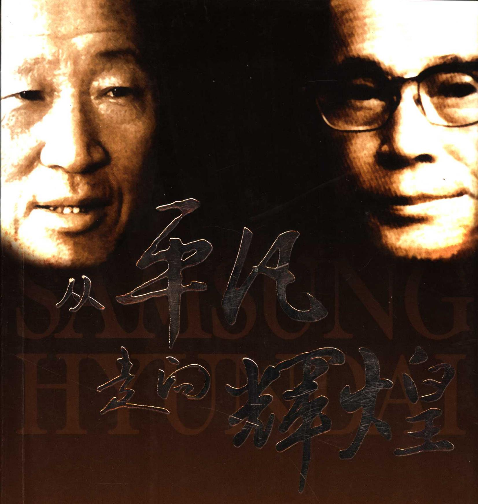
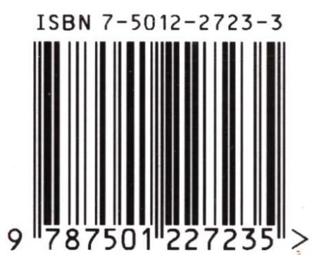
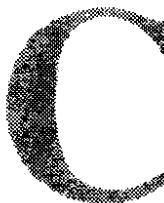

<!--
Stage 4A non-destructive cleaned source. Text comes from full-book MinerU Markdown.
JSON supplies page/block/layout evidence; DOCX supplies images only.
No translation, prose rewriting, OCR correction, factual correction, or unattended footnote recovery.
-->

<!-- FB-P001 | input-pdf-page=1 | printed-page=Unknown -->

<!-- FB-I001 | source-page=FB-P001 | json-block=0 | bbox=0:0:595:628 -->

<!-- FM-P001 -->
[韩] 洪夏祥 / 著 杨磊 / 译

# 三星和现代创始人的传奇历程

<!-- FM-P002 -->
出版社

<!-- FB-P002 | input-pdf-page=2 | printed-page=Unknown -->

# 一代商业巨富的 创业历程 两大世界级企业的 经营宝典

<!-- FB-I002 | source-page=FB-P002 | json-block=1 | bbox=23:681:182:811 -->

<!-- FM-P003 -->
ISBN 7-5012-2723-3/G·1137 

<!-- FM-P004 -->
定价：20.00元

<!-- FB-P003 | input-pdf-page=3 | printed-page=Unknown -->

# 走向辉煌

<!-- FM-P005 -->
[韩] 洪夏祥 / 著 杨磊 / 译

# 三星和现代创始人的传奇历程

<!-- FM-P006 -->
例1：一取月2年00分，即一取月6年00分；实阳实

<!-- FM-P007 -->
發出證券 青商聯盟 4.1.3.2 出版社

<!-- FB-P004 | input-pdf-page=4 | printed-page=Unknown -->

<!-- FM-P008 -->
Copyright © 2004 by Hong Ha Sang 

<!-- FM-P009 -->
Originally Published in Korea Economic Daily & Business Publications Inc.
Chinese translation rights arranged with Korea Economic Daily & Business Publications Inc.
through Shin Won Agency Co., Korea 

<!-- FM-P010 -->
Chinese translation edition © 2006 by World Affairs Press 

## 图书在版编目(CIP)数据

<!-- FM-P011 -->
从平凡走向辉煌:三星和现代创始人的传奇历程/(韩)洪夏祥著;杨磊译.一北京:世界知识出版社,2006.5

<!-- FM-P012 -->
ISBN 7-5012-2723-3 

<!-- FM-P013 -->
I. 从... II. ①洪... ②杨... III. ①李秉哲一生平事迹 ②郑周永一生平事迹 IV. K833.126.538

<!-- FM-P014 -->
中国版本图书馆 CIP 数据核字(2005)第 150160 号

## 图字:01-2004-5369号

<!-- FM-P015 -->
策划编辑: 王瑞晴

<!-- FM-P016 -->
责任编辑：马宁

<!-- FM-P017 -->
责任出版:赵玥

<!-- FM-P018 -->
责任校对: 张琨

<!-- FM-P019 -->
出版发行:世界知识出版社

<!-- FM-P020 -->
地址:北京市东城区干面胡同51号 100010

<!-- FM-P021 -->
网址:www.wap1934.com

<!-- FM-P022 -->
编辑部电话:010-65265950

<!-- FM-P023 -->
发行部电话:010-65265928(外埠);010-65265922(北京)

<!-- FM-P024 -->
经销:各地书店

<!-- FM-P025 -->
印刷:世界知识印刷厂

<!-- FM-P026 -->
开本印张:880 毫米 × 1230 毫米 1/32 7% 印张

<!-- FM-P027 -->
字 数:182 千字

<!-- FM-P028 -->
版次印次:2006年5月第一版 2006年5月第一次印刷

<!-- FM-P029 -->
定 价:20.00 元

<!-- FM-P030 -->
版权所有 盗版必究

<!-- FB-P005 | input-pdf-page=5 | printed-page=1 -->

# 译者序

<!-- FM-P031 -->
oreword 

<!-- FM-P032 -->
杨磊

<!-- FM-P033 -->
2000 年，大学三年级，我初次去韩国。

<!-- FM-P034 -->
当时是作为国家基金委选派的留学生，在庆熙大学进行语言学习。记得是一个阳光明媚的下午，坐在参观蔚山现代造船公司的车上，忽然看到车窗外闪过一片青翠欲滴的竹林，明媚婉约，恍如隔世；亦好像一段午夜幽篁，一阵山风振衣，穿窗入车，令人顿醒。导游介绍说，这便是现代创始人郑周永会长心爱的竹林，他有时会抽闲在此小住。

<!-- FM-P035 -->
2001 年，我在首尔（汉城）国立大学攻读硕士。

<!-- FM-P036 -->
校园中有一座“湖岩会馆”，是教授们开学术讨论会的地方。前后青石绿草，树碧花白。四围是高山排闼，令人望之怡情。这是我两年留学生涯中的难忘之地，后来知道这“湖岩”正是三星集团创始人李秉哲会长的号，而据说首尔（汉城）国立大学的校园也是出自李秉哲会长的捐赠。

<!-- FM-P037 -->
虽事事历历，恍如昨日，但时光飞逝，已然是过了五年。机缘巧合，我恰在这五年之后获得了翻译本书的机会。

<!-- FM-P038 -->
郑周永、李秉哲作为现代和三星这两个世界性知名品牌的创始人，他们不仅创造了20世纪韩国的商业神话，本身更是承载了一段段发人深省、诱人沉思的传奇与佳话。而人们对于

<!-- FB-P006 | input-pdf-page=6 | printed-page=2 -->

<!-- FM-P039 -->
这些商业巨子的认识总是仅仅停留在他们辉煌灿烂的成功和《福布斯》的名单上那一串令人惊愕的零，却很少有人注意到这无限风光的背后是多少年刻苦创业的积累与酝酿，这看似可以平步青云的康庄大道下面又隐藏着多少满含血泪的坎坷与艰辛。郑周永和李秉哲亦不例外，而这本《从平凡走向辉煌》则正是他们两位在韩国商业史上创造的旷世传奇的见证和记录。

<!-- FM-P040 -->
翻译《从平凡走向辉煌》，让我仿佛亲身体验了韩国20世纪的商业发展历程。而这两位已然被载入史册的人物传奇性的一生更是本书最引人入胜的看点之一。从身无分文的穷学生到腰缠万贯的商业巨头，从默默无闻的庶民之子到呼风唤雨、无所不能的重量级人物，郑周永、李秉哲的创业之路已经成为韩国乃至世界商业领域所共同关注与赞叹的焦点。对此，《从平凡走向辉煌》一书亦有极为详尽的记述。

<!-- FM-P041 -->
然而，与其说《从平凡走向辉煌》是一本传记，我认为它倒是更像一本励志的精英教材。书中通过丰富翔实而又具体生动的案例在潜移默化中告诉读者怎样在绝望中寻找希望，怎样面对困难、通过自信和智慧对困难发起挑战，最终成为生活的强者。

<!-- FM-P042 -->
狄更斯在《双城记》的开头说到：“这是最好的时代，也是最坏的时代。”而真正站在时代变迁的风口浪尖的人才能成为最后的赢家。但是，尽管刹那间就是斗转星移，转瞬间就是沧海桑田，可是，在这世界上总有那么一些东西是沉淀下来，永恒不变的；也总有那么一些东西，是值得我们为之在无怨无悔中苦苦追寻，并且奉献终生的。这便是《从平凡走向辉煌》所带给我们的，在这个风起云涌、瞬息万变的时代中，那些真正的，英雄的故事。

<!-- FB-P007 | input-pdf-page=7 | printed-page=3 -->

# 前言

<!-- FM-P043 -->
reface 

<!-- FM-P044 -->
每次抵达法国巴黎的夏尔·戴高乐机场，都有一件事让我感到非常高兴。机场里运行李的手推车上印着“SAMSUNG”（三星）的字样。而且还不只是一两辆，大部分的手推车上都印着这几个字母。也得益于此，每次到夏尔·戴高乐机场我都不会感觉身处国外。在异国的陌生与不安都会因为这几个字母一扫而光。

<!-- FM-P045 -->
金融城市伦敦的黄金地段皮卡地里圆环大街上，也可以看得到印有“SAMSUNG”的霓虹灯，与旁边那些印着世界知名品牌的霓虹灯一起转动。

<!-- FM-P046 -->
身为韩国人的自豪感在那时油然而生。

<!-- FM-P047 -->
有一次，我驱车行驶在瑞士的山间公路上，有一辆车以极快的速度超越了过去。我当时非常生气，紧紧追赶过去。走近一看是一辆非常豪华的红色跑车。车里面坐的是一对二十多岁的西方青年男女。车虽然不是很新，但对我来说却很眼熟。仔细一看原来是现代牌的“鲨鱼”（Tiburon）跑车。

<!-- FM-P048 -->
看清楚是“鲨鱼”（Tiburon）后，我的怒气全消。马上向他们作出请先行的手势。

<!-- FM-P049 -->
去年秋天我去过一次中国的大连，遇到了一位企业界人士，他开的是现代集团的索纳塔。我询问他车的性能如何，他连连竖起大拇指。

<!-- FB-P008 | input-pdf-page=8 | printed-page=4 -->

<!-- FM-P050 -->
在北京，写有“现代汽车”的广告牌常常会映入眼帘。那就是韩国的现代牌汽车。

<!-- FM-P051 -->
那是同世界其他名牌产品一起悬挂的现代车广告。我仿佛从中看到了韩国的影响力。

<!-- FM-P052 -->
近来韩国有些举步维艰。政府面临着困境，企业也面临着困境，人民也面临着困境。特别是生活困难的上班族们，他们焦虑不安的心情在上涨。因为大企业都宣布下半年会有大规模的裁员。

<!-- FM-P053 -->
下半年将要实行的企业结构调整更是助长了这种不安的心理。结构调整是一个企业为了生存不得已而为之的一种选择。如果一个人在结构调整中失去工作，那么面临的将是为了生存而不断奔波。

<!-- FM-P054 -->
摆摊也好，开饭馆也好，使用退休金开意大利馅饼店也罢，总之必须要想方设法寻找出路。

<!-- FM-P055 -->
虽然现在让上班族们感到焦虑的是失去工作后如何生活，事实上比这种焦虑更为严重的是他们对前途失去了自信。因为他们面临的是改变长期以来保持的生活方式，从现在开始走向另一种生活模式。

<!-- FM-P056 -->
无论是经商还是办企业，人们都缺乏自信。对于这个问题，我是这样考虑的。

<!-- FM-P057 -->
韩国是从什么时候开始获得发展契机的呢？40 岁以上的人都知道，我们曾经有过一日三餐都不保的年代。而现在，不管面积大小，一般的上班族们都拥有一套住房，一辆汽车。

<!-- FM-P058 -->
我在20世纪六七十年代的时候，从来没有奢望过有朝一日韩国能够像美国那样每个家庭都能拥有一辆汽车。然而，经历了20世纪60年代的“新村运动”，70年代的出口年代，80年代的经济高速增长期，到了90年代，已经实现了全国人民都拥有汽车。

<!-- FM-P059 -->
书的开头写得如此冗长，目的在于强调一定都要保持自信

<!-- FB-P009 | input-pdf-page=9 | printed-page=5 -->

<!-- FM-P060 -->
与勇气。

<!-- FM-P061 -->
为了保持住勇气就需要一个榜样。仔细想一想，韩国建国后涌现出最有勇气的人非现代集团会长郑周永莫属。

<!-- FM-P062 -->
郑周永会长生于贫寒的农家，只有小学学历，却创立了一个年销售额达百兆韩元①以上的大企业。

<!-- FM-P063 -->
他在逆境中从不屈服，缔造了世界知名的现代集团。

<!-- FM-P064 -->
他曾经说过这样一句话：

<!-- FM-P065 -->
“所有的事情都由我承担，没有自信的人回家躺着去吧”

<!-- FM-P066 -->
这句话是 1976 年，他在进行堪称世界最大的土木工程项目朱拜勒港的建设时说的。

<!-- FM-P067 -->
工程的规模极大，他构想使用驳船运送89个钢铁构件，每个重达550吨，距离是从韩国的蔚山到沙特阿拉伯。当时很多人对于这个想法提出异议。他在批评这些缺乏自信的人时说出了上面的话。

<!-- FM-P068 -->
经过了世界最深的菲律宾港，越过了台风肆虐的东南亚海域，经过了印度洋，他往返八次将那些庞然大物运送到了目的港。

<!-- FM-P069 -->
无论是从当时还是现在来看，那依靠的绝非特殊的技术，而是他惊人的勇气。

<!-- FM-P070 -->
他的创业史就是他把勇气和实践结合在一起的辉煌历史。

<!-- FM-P071 -->
从勇气和实践来看，郑周永堪称大韩民国的第一人，当下属职员们畏缩不前的时候他能够挺身而出，具有超强的魄力。哪怕是别人都心怀畏惧的事情，他也能勇于承担起来。

<!-- FM-P072 -->
韩国经历了亚洲金融危机，原本形势大好的半导体业也急转直下，国内经济经历了巨大的危机。我们只有相信并依靠勇气才能渡过难关。

<!-- FM-P073 -->
在这一点上，个人如此，企业如此，国家亦然。

<!-- FB-F001 | source-page=FB-P009 | marker=① | status=manual-review-required -->

<!-- FB-P010 | input-pdf-page=10 | printed-page=6 -->

<!-- FM-P074 -->
大韩民国另外一位极具代表性的杰出人物是三星集团的会长李秉哲。

<!-- FM-P075 -->
他买来了世界上所有质量最好的衬衣之后，要求下属的纺织公司研制生产出与其质量一模一样的产品，以此推动了企业的发展。

<!-- FM-P076 -->
现在韩国的半导体已经打入美国、日本的半导体市场，使得韩国成为世界上最大的半导体生产国的人正是李秉哲会长。

<!-- FM-P077 -->
他出生时就拥有年产300石米的土地，然而这跟他日后创建的三星公司相比，当时的财产不过是九牛一毛而已。

<!-- FM-P078 -->
“如果无法创造出一流的产品，那么只有死路一条。”

<!-- FM-P079 -->
李秉哲就是凭借着这样的理念构筑起了三星帝国。

<!-- FM-P080 -->
他是一个“笔记狂”，从一早起床，他就开始记下一天要做的事情，到公司上班，还在不断地记录，然后一一确认每一项内容。

<!-- FM-P081 -->
平时，他六点起床，记录，6点40洗澡，早餐，8点上班——他就像一个精密的钟表那样运转，每一根头发都梳理得整整齐齐，身上的着装都整理得细致入微。他以这种生活方式建立了三星精神，把三星创造成为世界知名的企业。

<!-- FM-P082 -->
他的这种精神构成了三星的企业文化，影响到了每一个员工。在被称为“御前会议”的公司经理会议上，他凭借详细的笔记，一旦发现经理们出现漏洞，就会毫不留情地申斥他们。

<!-- FM-P083 -->
他通过这种严谨科学的理念运营着三星，堪称是一个具有领导才能的人物。

<!-- FM-P084 -->
李秉哲和郑周永，郑周永和李秉哲，在任何人看来，都堪称是大韩民国建国50年来最高的企业家，具有最高领袖气质的企业家。

<!-- FM-P085 -->
他们的勇气和领导才能，缜密的思维以及实践能力，都是一部韩国式企业经营的教科书，也是开拓世界市场的经营学教科书。

<!-- FB-P011 | input-pdf-page=11 | printed-page=7 -->

<!-- FM-P086 -->
团队式的经营也是由他们引入韩国的一种独特的经营方式。

<!-- FM-P087 -->
虽然被批评铺得摊子太大，但是考虑到当时韩国的企业过于零碎，如果不是采用这种经营方式，就不可能拥有同世界知名的大型企业竞争的实力。

<!-- FM-P088 -->
近来，这种经营理念受到了更为猛烈的抨击。那么如果这样说的话，日本的三井、三菱公司，德国的西门子公司也应得到同样的批判。

<!-- FM-P089 -->
每一个国家都需要一种同本国国情相适合的企业文化。欧美强国什么时候对自己国家的企业经营没有关注过？在国际货币基金组织管理体制下受益最多的不还是欧洲和美国吗？

<!-- FM-P090 -->
美国的商业杂志《福布斯》在韩国企业价值不断下跌的时候，于1998年3月22日公布：比尔·盖茨的资产价值增长为461亿美元，沃尔顿增长为404亿美元，沃伦巴菲特增长为299亿美元。与此相对应的是现代与三星的企业资产下降了25亿美元，亚洲企业的资产共减少了610亿美元。

<!-- FM-P091 -->
亚洲国家在进行结构调整，而欧美企业的资产却不断增加的原因何在？

<!-- FM-P092 -->
其根本原因在于，韩国应该以韩国式的经营理念管理企业。

<!-- FM-P093 -->
所谓的韩国式经营理念，简单地说，就是郑周永和李秉哲的经营方式。

## 领导才能 + 勇气 + 实践精神

<!-- FM-P094 -->
李秉哲会长和郑周永会长在过去的50年中，在这片连一辆自行车都无法生产的不毛之地上，缔造了世界知名的大企业。

<!-- FM-P095 -->
他们的经营理念需要再用 50 年的时间去领会，去评价。更进一步的话，可以说，他们的经营理念是突破当前危机的灵丹妙药。

<!-- FM-P096 -->
这也就是我们今天重新回味50年来领导韩国经济的两位巨擘——郑周永和李秉哲生平的意义所在。

<!-- FB-P012 | input-pdf-page=12 | printed-page=9 -->

<!-- FB-I003 | source-page=FB-P012 | json-block=1 | bbox=135:207:194:280 -->

## 目录

<!-- FM-P097 -->
contents 

<!-- FM-P098 -->
1. 大地主的儿子和贫农的儿子 …… 1
2. “海归”和离家出走的少年 …… 5
3. 年轻的米店老板和二十出头的大地主 …… 13
4. 星标面条和阿道汽车修理厂 …… 21
5. 三星物产公司和现代汽车工业公司 …… 29
6. 理发师的启示 …… 37
7. 大麦草坪和白糖 …… 41
8. 高级布料和高灵桥工程 …… 53
9. 先发制人和后发制人 …… 61
10. 汉江大桥和东京构想 …… 71
11. 权利面前的两个人 …… 79
12. 开办工厂和对外出口 …… 85
13. 越战工程和韩国肥料公司 …… 97
14. Pony（小马）汽车和东洋电视台 …… 107
15. 郑周永的船和李秉哲的彩色电视 …… 123
16. 中东特运和三星电子 …… 133
17. 先想后做和先做后想 …… 149
18. 李秉哲、郑周永在半导体业的较量 …… 153
19. 对属下的爱与培养 …… 165
20. 优秀的企业家具有识人的慧眼 …… 171

<!-- FB-P013 | input-pdf-page=13 | printed-page=10 -->

<!-- FM-P099 -->
21. 信任与考察 …… 175
22. 玩出名堂 …… 179
23. 正规的高尔夫和红色的高尔夫 …… 185
24. 李秉哲和郑周永的节俭 …… 191
25. 两位巨人的最后时日 …… 197
26. 王子之乱和接班人们 …… 209
27. 王国的功臣们 …… 215
28. 巨人的时代结束后 …… 225
后记 …… 227
