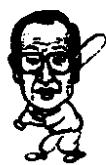
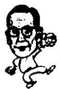

<!--
Stage 4A non-destructive cleaned source. Text comes from full-book MinerU Markdown.
JSON supplies page/block/layout evidence; DOCX supplies images only.
No translation, prose rewriting, OCR correction, factual correction, or unattended footnote recovery.
-->

<!-- FB-P018 | input-pdf-page=18 | printed-page=Unknown -->

<!-- FB-H-CH02 | source-page=FB-P018 -->
# 2 “海归”和离家出走的少年

<!-- FB-I006 | source-page=FB-P018 | json-block=2 | bbox=161:322:199:381 -->

<!-- CH02-P001 -->
20世纪30年代初，李秉哲中断留学生活回国，郑周永四次离家出走后终于找到了第一份有稳定收入的工作。

<!-- FB-I007 | source-page=FB-P018 | json-block=4 | bbox=400:321:442:383 -->

<!-- CH02-P002 -->
如果说那时在世界性经济大恐慌笼罩着的日本东京街头，李秉哲亲历了滔滔的历史潮流，那么郑周永则在背井离乡为谋生而进行着大胆的冒险。

<!-- FB-P019 | input-pdf-page=19 | printed-page=6 -->

<!-- CH02-P003 -->
1929 年 10 月李秉哲正值弱冠之年，赴日本留学。

<!-- CH02-P004 -->
他自釜山出发，乘三千吨的“釜关”（韩国的釜山—日本的下关）号轮船前往日本的下关。

<!-- CH02-P005 -->
船接近玄海滩附近，海浪非常强烈，位于船底的二等船舱摇晃得很厉害。李秉哲晕船越来越严重，于是想换到晃动轻微一些的一等舱去。但是船舱门口的日本警察拦住了他，说朝鲜人能有什么钱，居然妄想进一等舱。之后开始追根究底地盘查李秉哲的身份。那时的李秉哲真正深切感受到“亡国奴的悲惨”。

<!-- CH02-P006 -->
当时的朝鲜是所谓的四无国家。四无国家是指“无国、无主权、无企业、无富人”。

<!-- CH02-P007 -->
李秉哲从日本警察那受到了屈辱，立志无论如何，也要使得自己的国家国力强大，生活富足。

<!-- CH02-P008 -->
他从下关乘了二十多个小时的火车到了日本的首都东京。在东京边上找了一间按月交租的房子住了下来，第二年，也就是1930年春天，李秉哲进入了早稻田大学政治经济系。

<!-- CH02-P009 -->
就在那时，美国华尔街正在发生着金融恐慌。

<!-- CH02-P010 -->
1929 年 10 月 24 日。

<!-- CH02-P011 -->
股市暴跌，纽约的美国银行陷于无法支取的境地，银行破产也随之发生。破产的银行达到1300家，爆发了世界级的恐慌。

<!-- CH02-P012 -->
美国的失业者突然间增至 1200 万。与此同时，德国的失业者达到了 600 万，经济开始呈现出萧条的趋势，澳大利亚中央银行破产。经济恐慌随后在英国发生，英格兰银行也陷于无法提取现钞的窘境。

<!-- CH02-P013 -->
金融危机瞬时间席卷全球。

<!-- CH02-P014 -->
1923 年关东大地震之后本来已经萧条的日本经济一下子又受到了这次世界金融危机的影响。工业产值跌落 70 个百分点，出口额减少 37%，进口额锐减 40%。随之发生了物价下跌，大米价格在几个月之间下跌了一半。

<!-- FB-P020 | input-pdf-page=20 | printed-page=7 -->

<!-- CH02-P015 -->
日本产业界也受到经济大恐慌的影响，开始裁员。随之而来的是工厂倒闭。瞬时间数十万名失业者涌上街头，和失去工作返乡的人加起来，足有三百余万人。工厂出现连日的罢工，即使大学毕业也无法找到工作。讽刺这一现实的电影《哪怕是大学毕业》成为了人们谈论的话题。

<!-- CH02-P016 -->
日本社会变得气氛异常。

<!-- CH02-P017 -->
左翼思想的青年连续几天跑到街上示威游行，马克思和恩格斯的书籍大受欢迎。

<!-- CH02-P018 -->
李秉哲也在当时加入示威队伍，被关进拘留所两天，但他自己并不是无产阶级思想的追随者。就在那时，李秉哲得了严重的脚气，虽然精心调养却没什么好转，他下决心回国。那是他在早稻田大学二年级秋天的事。日本发动了“九一八事变”，也可能是促成他回国的一个原因。

<!-- CH02-P019 -->
李秉哲的留学以退学告终。在短短的两年多留学生活中，他目睹了经济危机的惨状，也感受到了由此引发的社会急速倒退。

<!-- CH02-P020 -->
世界经济的变动，其影响会波及普通百姓，并对其产生深刻的影响，李秉哲对于这些有着切身的体会。

<!-- CH02-P021 -->
1930 年，当李秉哲在日本留学时，郑周永从松田小学毕业。

<!-- CH02-P022 -->
那是他一生当中第一次，也是最后一次接受正规的教育。

<!-- CH02-P023 -->
15 岁才从小学毕业，他接下来要做的事只有农活儿。

<!-- CH02-P024 -->
小小的年纪便干起艰辛的农活儿，乡下的生活日复一日。早上吃小米饭，中午就只能饿肚子，晚上只有靠野菜粥充饥。

<!-- CH02-P025 -->
到了春天，原来吃草根和树根的农民为了找活路，需要背井离乡到“满洲国”北间岛①去谋生。

<!-- CH02-P026 -->
郑周永十分讨厌农活儿。因为农活儿即使累死累活地干，

<!-- FB-F004 | source-page=FB-P020 | marker=① | status=manual-review-required -->

<!-- FB-P021 | input-pdf-page=21 | printed-page=8 -->

<!-- CH02-P027 -->
一日三餐还是没有保证。

<!-- CH02-P028 -->
在那时，对于小学毕业的郑周永来说，生活中给他带来最大希望的就是李光洙写的小说《泥土》。《泥土》在《东亚日报》上连载。区长家订了《东亚日报》，为了能看到《泥土》，郑周永每天晚上都要跑到两公里外的区长家去看。

<!-- CH02-P029 -->
郑周永也想像《泥土》中的主人公一样，成为律师。为了想要到首尔出人头地，他决定离家出走。

<!-- CH02-P030 -->
第一次出走是往清津 $^{①}$ 方向。

<!-- CH02-P031 -->
他曾经在报纸上阅读到过清津正在大规模兴建制铁厂和港口的消息。在他头脑中有这样一个信念：只要拥有体力和自信，就没有办不成的事情。

<!-- CH02-P032 -->
在去往清津的路上，他经过一个修建铁路的工地。他决定先在那里赚些钱，开始用小推车运泥土的工作。在那儿吃住，每天可以赚4角5分钱，可每天吃饭要花去3角2分，每天拼命干活除去饭钱就只能剩下1角3分钱。就是那1角3分也都没有保证。因为如果下雨停工的话，一分钱也赚不到。结果，落得有时候连饭费都要拖欠。另外，工地艰苦的工作对一个尚未成年的少年来说也是难以承受的。即便如此，他感受到了自己动手赚钱吃饭的充实感。

<!-- CH02-P033 -->
他在工地干了两个月左右的活，父亲经过一番打听找到了他。他只得跟父亲重新回到了家乡。

<!-- CH02-P034 -->
第一次离家出走以此告终。

<!-- CH02-P035 -->
第二次离家出走是去往金刚山，在路上被骗子把路费骗走，结果又被父亲找到带回了家。

<!-- CH02-P036 -->
第三次离家出走更是大胆，把家里卖牛的钱偷走离家。

<!-- CH02-P037 -->
用这笔钱他来到了首尔，进入财务学院速成班学习会计，结果又被找到首尔的父亲带回了家。

<!-- CH02-P038 -->
用现在的眼光来看，接连三次离家出走的郑周永，很像是一个问题少年，不过他并不是问题少年。为什么这么说呢？因为他偷出来卖牛的钱丝毫没有胡花乱用。

<!-- FB-F005 | source-page=FB-P021 | marker=① | status=manual-review-required -->

<!-- FB-P022 | input-pdf-page=22 | printed-page=9 -->

<!-- CH02-P039 -->
1933 年，郑周永 19 岁，第四次离家出走。开始的时候在仁川码头做搬运工和一些重体力劳动，之后去了首尔。

<!-- CH02-P040 -->
据他说，他在那里找到了第一份稳定的工作——在米店福兴商会当上了送货员。

<!-- CH02-P041 -->
20 世纪 30 年代初，李秉哲中断留学生活回国，郑周永四次离家出走后终于找到了第一份有稳定收入的工作。

<!-- CH02-P042 -->
如果说那时在世界性经济大恐慌笼罩着的日本东京街头，李秉哲亲历了滔滔的历史潮流，那么郑周永则在背井离乡为谋生而进行着大胆的冒险。

<!-- CH02-P043 -->
郑周永的一生中贯穿着永不言退的勇气。

<!-- CH02-P044 -->
这种勇气的根源何在？

<!-- CH02-P045 -->
郑周永曾做过回顾。

<!-- CH02-P046 -->
他在铁路工地干活被父亲找到后，步行300里的路程回家，在路上，曾途经安边 $^{①}$ 附近的一个果园。在那里，他父亲买了几个苹果，准备给奶奶带回去。可是，那几个苹果并不新鲜，看起来也不好看，是那种非常便宜的腐烂苹果。

<!-- CH02-P047 -->
几个烂了的苹果。

<!-- CH02-P048 -->
郑周永虽然在他的自传中称这件事“在记忆中印象很深”，但这并没有完全说出他内心的伤痛。

<!-- CH02-P049 -->
那种只能买便宜的腐烂苹果的农民生活。如果是一般人，当时或许会为此感到伤心、郁闷、绝望，但是郑周永却把那种绝望看作是发展的原动力。

<!-- CH02-P050 -->
郑周永偷出父亲卖牛的钱离家出走，事隔七十余年，他赶着500头牛的牛群送到朝鲜。

<!-- CH02-P051 -->
如果是一个了解他小时候离家出走历史的人，就可以知道他把父亲的一头牛变成了500头牛，赶着回到故乡的行为，是

<!-- FB-F006 | source-page=FB-P022 | marker=① | status=manual-review-required -->

<!-- FB-P023 | input-pdf-page=23 | printed-page=10 -->

<!-- CH02-P052 -->
出于对这段往事的多少悔恨啊。

<!-- CH02-P053 -->
偷走了父亲辛辛苦苦养牛卖牛的钱，到了首尔财务学院交了学费和住宿费，他现在想要以500倍，不，哪怕是任何东西来弥补自己的不孝。

<!-- CH02-P054 -->
几个腐烂的苹果，一头牛的钱，从早干到晚也无法吃饱肚子的农民生活。那就是20世纪30年代郑周永生活的写照。

<!-- CH02-P055 -->
这里还有一件事值得一提：郑周永从臭虫那里获得的启示。

<!-- CH02-P056 -->
那是他第四次离家出走，在仁川埠头做苦力时候的事情。那时工人住的工棚是臭虫的乐园。虽然干了一天的活儿，人人都累得筋疲力尽，但是晚上由于臭虫的叮咬根本无法入睡。这是一种长得不起眼，却让人痛苦不堪的家伙。郑周永有一天想出了一个办法。盖着被子睡在床上容易挨臭虫叮咬，于是他睡在了饭桌上。正如他所料，那里没有了臭虫的袭击。

<!-- CH02-P057 -->
可是，那也不过是暂时的。臭虫开始顺着桌子腿爬到上面叮咬他。

<!-- CH02-P058 -->
郑周永又想了一个好主意。他把四条桌子腿浸在四个盛满水的搪瓷盆里。臭虫如果想爬上桌子腿就会掉进水里溺死。果然，那些想要爬上桌子腿的臭虫掉进水盆中淹死了。然而，死掉的仅仅是几只而已。臭虫们也找到了新的办法。为了吸到人血，它们顺着墙壁爬到了天花板上，之后下落到人的身上。

<!-- CH02-P059 -->
那个时候郑周永领悟出了一个道理：

<!-- CH02-P060 -->
微不足道的臭虫为了越过水盆，进行了不懈的努力最终达到了目的。那么身为万物灵长的人还有什么做不到的呢？

<!-- CH02-P061 -->
“有志者事竟成。”

<!-- CH02-P062 -->
那就是郑周永从臭虫身上获得的启示。

<!-- CH02-P063 -->
这种启示日后在他的企业面临困境时发挥了巨大的力量。

<!-- CH02-P064 -->
不管是他拿着印有“龟船”图案的纸币，为建立造船工厂获得了数千万美元的订单；还是在隆冬白雪覆盖的高尔夫球场，用红色的高尔夫球打球；抑是冬天时因找不到草坪，于是移植大麦来完成了工程，全都得益于此。

<!-- FB-P024 | input-pdf-page=24 | printed-page=11 -->

<!-- CH02-P065 -->
第四次离家出走，他从臭虫那里得到了巨大的启迪。

<!-- CH02-P066 -->
这种启迪使得他日后只要一遇到困难，不论什么困难肯定都会找出解决的办法。

<!-- CH02-P067 -->
李秉哲是到过日本早稻田大学留学的精英，如果说对于他创建了三星集团人们觉得不足为奇的话，那么郑周永却只是小学毕业，人们对于他缔造了现代这样的大企业必定会无不感到惊异。

<!-- CH02-P068 -->
其他国家也存在相似的例子。

<!-- CH02-P069 -->
首先来看日本。日立集团的创始人小源浪平，日本索尼创始人盛田昭夫，本田汽车集团的创始人本田宗一郎。

<!-- CH02-P070 -->
这三个人当中，小源浪平在小学四年级的时候就退了学，本田就根本没有上过学，只有盛田昭夫拥有经营学博士学位。

<!-- CH02-P071 -->
很有意思的是小源浪平、本田宗一郎和郑周永的相似之处都很多。

<!-- CH02-P072 -->
首先来看小源浪平（1894—1989），小学四年级是他的全部学历，家境也是非常贫寒。

<!-- CH02-P073 -->
在他 10 岁的时候，到别人家照看小孩儿，之后在一家自行车店学会了修理自行车。后来转行到电器产业，奠定了今天世界级的家电制造商——日立集团的基础。

<!-- CH02-P074 -->
缔造本田汽车集团的本田宗一郎（1906—1991），他的父亲是一名铁匠。由于家境贫寒未能读书，很小的时候就在自行车店干活。从16岁开始，他就在东京做汽车修理的见习工人。那对于他的一生具有重大的意义。

<!-- CH02-P075 -->
本田宗一郎将自己的一生投入了汽车事业，在很多方面和郑周永都有相似之处。

<!-- CH02-P076 -->
让人感到奇怪的是：比起高学历者创业，低学历者创业的现象更多。

<!-- CH02-P077 -->
美国福特公司的创始人亨利·福特（1863—1947），也只读到小学毕业。福特的父亲也是希望福特务农，能够帮帮自

<!-- FB-P025 | input-pdf-page=25 | printed-page=12 -->

## 己，而福特却离家出走到机械工厂做了实习工。

<!-- CH02-P078 -->
福特的父亲也是找到儿子，要他和自己一起回家，可是福特却坚持走自己的路，到底特律的造船公司工作。结果父亲向儿子做了让步。这和郑周永的情况非常相似。

<!-- CH02-P079 -->
堪称日本汽车之王的丰田喜一郎（1867—1930）也是如此。丰田喜一郎缔造了足以代表日本的品牌丰田汽车。

<!-- CH02-P080 -->
丰田喜一郎的父亲是一名木工，他在丰田喜一郎初中一毕业就教他木工活儿。

<!-- CH02-P081 -->
开始的时候丰田喜一郎还安心学习，可是到了19岁的时候，他就不辞而别步行去了东京，之前也没有向父母打招呼。他无法抑止住对外面世界的好奇与向往。最终，他发明了棉织机，并在汽车领域取得了巨大的成功。这一点和郑周永也是非常相似。

<!-- CH02-P082 -->
这样看来，创建事业，自我发展和学历并无太多关系。反倒是在实际工作中获得的知识比起在学校学到的知识更具实用价值。

<!-- CH02-P083 -->
围棋大师赵治勋曾经说过这样的话：“学校会使人变傻。”

<!-- CH02-P084 -->
他也是在高中一年级的时候退的学。

<!-- CH02-P085 -->
反过来看李秉哲的情况，生为大地主的儿子，在良好的环境下成长，接受良好的教育，创建了大企业，这样的例子反倒很少。

<!-- CH02-P086 -->
从这点上来看，李秉哲的创业过程更值得研究。为什么这么说呢？因为一般在富足环境下生活的人容易安于现状，不思进取。
