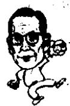

<!--
Stage 4A non-destructive cleaned source. Text comes from full-book MinerU Markdown.
JSON supplies page/block/layout evidence; DOCX supplies images only.
No translation, prose rewriting, OCR correction, factual correction, or unattended footnote recovery.
-->

<!-- FB-P026 | input-pdf-page=26 | printed-page=Unknown -->

<!-- FB-H-CH03 | source-page=FB-P026 -->
# 3 年轻的米店老板和二十出头的大地主

<!-- FB-I008 | source-page=FB-P026 | json-block=2 | bbox=160:334:198:392 -->

<!-- CH03-P001 -->
郑周永在庆一商会关门之后得到了“世上无难事，只怕有心人”的朴素结论；

<!-- FB-I009 | source-page=FB-P026 | json-block=4 | bbox=399:329:441:392 -->

<!-- CH03-P002 -->
而李秉哲却在经历了那个时期后总结和分析了诸多经验教训。

<!-- CH03-P003 -->
李秉哲总结出的教训如下：

<!-- CH03-P004 -->
1. 办企业，一定要纵观全国的行情。

<!-- CH03-P005 -->
2. 不要盲目追求，一定要对自己的能力和水平有冷静的判断。

<!-- CH03-P006 -->
3. 不要凭侥幸心理搞投机生意。

<!-- CH03-P007 -->
4. 在重视自己直觉的同时，也不要忘记第二条和第三条。

<!-- CH03-P008 -->
5. 如果大势所趋，过去的判断已经证明失败了的时候，就不要再有任何留恋，一定要另谋出路。

<!-- FB-P027 | input-pdf-page=27 | printed-page=14 -->

<!-- CH03-P009 -->
郑周永在22岁的时候开了一家名叫庆一商会的米店。那是1936年的事情。韩国运动员孙基祯在柏林奥运会上获得冠军的那一年。

<!-- CH03-P010 -->
经过了四次的离家出走，郑周永在福兴商会米店打工，后来继承了米店，更名为庆一商会。郑周永全凭信用继承了福兴商会，这都是得益于他的诚实。

<!-- CH03-P011 -->
他虽然是为别人打工，可是每天比谁都起得早，把米店门前打扫得一干二净，洒上水。给客人送米的时候从来不惜力，勤奋地称米、运米。

<!-- CH03-P012 -->
米店主人的儿子是一个酒色之徒，他对自己的儿子感到非常失望。郑周永在米店工作六个月后，就获得了米店主人的绝对信任，负责管理福兴商会的全部账目。他管理米店账目的时候仍然兢兢业业，每天将仓库整理得井井有条，大米、杂粮堆放得一目了然。后来，米店主人对游手好闲的儿子再也不抱任何希望，将米店、供应商和客户的业务一起交付给了郑周永。

<!-- CH03-P013 -->
米店主人的女儿李美顺（时年85岁）从京畿女高毕业后，就读于京城师范大学，是著名才女。在她眼中郑周永身强力壮，总是能轻松扛起米袋子，晚上的时候，其他工人有的下象棋，有的抽烟，而他总是在抱着书本，是一个很与众不同的人。他当时看的书有赛珍珠（Pearl S. Buck，1892—1973）的《大地》，沈熏的《常绿树》，李光洙的《泥土》等。他还是做米店送货员的时候，也没有放弃自己做律师的想法，保持秉烛夜读的习惯。

<!-- CH03-P014 -->
他在新堂洞经营庆一商会，忙得没有一点空闲，即便如此，他还在原有的顾客以外，联系到了很多顾客，甚至包括培花女子高中，弘济洞的首尔女子商务学校等，成为一名成功的米商。

<!-- CH03-P015 -->
然而，厄运却找上了他。1937年，日本在中国发动“卢沟桥事变”，两国开始了全面的战争。总督府 $^{①}$ 颁布了“战时体制令”。总督府颁布的“谷米统制”对郑周永造成了很大影响。因为要进行粮食配给制度，所以全韩国的米店全都关门了。而那时，郑周永成功地经营庆一商会不过经历了两年而已。郑周永那时候受到的打击不小。他苦心经营了两年的米店被迫关门，但是他第一次用自己的行动证明了只要诚实劳动就能够成功的道理。

<!-- FB-P028 | input-pdf-page=28 | printed-page=15 -->

<!-- CH03-P016 -->
郑周永和李秉哲都差一点在二十几岁的时候获得商业上的成功，但都由于外部的原因事业上遭到失败。这一点很是相似。

<!-- CH03-P017 -->
当郑周永因为中日战争米店关门的时候，李秉哲也遭遇了和他相似的破产。

<!-- CH03-P018 -->
李秉哲在他 26 岁的时候决心投资做一番事业。他从富川获得了年产 300 石米的土地的资金。

<!-- CH03-P019 -->
300 石米的土地。

<!-- CH03-P020 -->
虽然李秉哲在他的自传中写到，作为创业资本，那些土地根本不算什么。而实际情况并非如此。

<!-- CH03-P021 -->
因为在当时，拥有产粮300石土地的地主在一个面②里也不一定有一两个。

<!-- CH03-P022 -->
李秉哲获得这笔财产的那一年，郑周永正在福兴商会米店里面当送货员，有生以来第一次有了稳定的工作。

<!-- CH03-P023 -->
李秉哲获得这笔资产后，考虑用它来做什么。开始的时候他打算在首尔做一番事业，可选择的空间广，还有朋友可以帮上忙。但是去首尔的话，资金却好像有些不足。

<!-- CH03-P024 -->
他也考虑过大邱、釜山和平壤，而当时那三座城市的商业都是由日本人把持着，凭他当时的财力似乎很难插足。

<!-- CH03-P025 -->
最后他选择了距离家乡很近的马山作为创办事业的地点。

<!-- CH03-P026 -->
当时的马山是一个水源清澈、气候温暖的港口城市。庆尚

<!-- FB-F007 | source-page=FB-P028 | marker=② | status=manual-review-required -->
<!-- FB-F008 | source-page=FB-P028 | marker=② | status=manual-review-required -->

<!-- FB-P029 | input-pdf-page=29 | printed-page=16 -->

<!-- CH03-P027 -->
南道一带的农产品都会合到那里，光是大米每年就达数百万石，几乎全都运往日本。

<!-- CH03-P028 -->
李秉哲判断：马山市对百万石大米的加工能力远远不够。

<!-- CH03-P029 -->
日本人经营的加工厂规模巨大，韩国人的加工厂却很微不足道。当时的商人都是先交付加工费，然后等待好久才能加工好，由此可见加工能力的不足。不管是哪一个加工厂，等待加工的稻谷堆得都像山一样。

<!-- CH03-P030 -->
李秉哲和好友郑亨荣、朴正源各自投资一万元，在北马山创建了协同加工厂。加工厂主要是加工稻米，即：购入稻谷，去掉外壳，加工成大米。

<!-- CH03-P031 -->
加工厂的工作很简单，就是不停地加工出大米来。尽管如此，干了一年后结账，发现亏损掉了本金的2/3。这很出人意料。

<!-- CH03-P032 -->
分析结果后找到了问题的所在：原来购入稻谷的时候正值米价上升，而加工后往外卖的时候，米价已经下跌。当时米的价格虽然是由仁川谷米交易所决定，但是首尔等其他城市的业主们却流行米的期货交易。而李秉哲当时是在地方购买稻谷进行加工，认为米价的走势毫不重要，不断地开转机器加工才是事业的根本。结果，由于购入稻谷和加工售出大米时候市价发生的变化，他蒙受了很大的损失。

<!-- CH03-P033 -->
当时他主要是根据米价变动的传闻，做出判断后进行买卖。就如同现代社会的股市投资一样，总是听到传闻而动，就会出现损失。

<!-- CH03-P034 -->
进行了分析后，他就和传闻反向而动。当米价上升的时候，很多人都期待着会有更高的价格出现，于是购入大米，而这时，他往外抛售。当米价下跌的时候，很多人都担心会继续下跌，纷纷卖出，而这时，他反倒是买入。他的策略很是有效。再次结算的时候，3万元的本钱全部回来以外，还净赚了2万元。他的第一次创业很是成功。

<!-- FB-P030 | input-pdf-page=30 | printed-page=17 -->

<!-- CH03-P035 -->
李秉哲得知马山的运输工具——卡车数量不足。卡车的运费很高，如果购入几辆卡车，成立一家运输谷物的运输公司的话，前景会很不错。

<!-- CH03-P036 -->
李秉哲将日本人的马山日出汽车公司买下，这家公司原有10辆卡车，他又买入10辆，开始了又一次创业。结果和预想的一样。日进斗金。加工厂、运输公司齐头并进。

<!-- CH03-P037 -->
李秉哲开始把闲暇的时间花在吃喝上。当时在马山共有八九家饭馆，李秉哲是每一家的常客。出入如此频繁，以致在那里工作的八九十名歌妓全都认识他。

<!-- CH03-P038 -->
李秉哲又开始谋划创建第三份产业。他决定购买土地。金海附近的农田很多都在出售。那是因为日本帝国主义的掠夺政策日渐强化，农民被迫出卖自己的土地。李秉哲对金海平原上的可耕水田和正在出售的水田进行了一番调查。当时日本人天野的40万坪 $^{①}$ 的水田正在出售。

<!-- CH03-P039 -->
同当时水田的产出收入相比，银行的贷款利息算是低的了，如果主要到银行贷款购地的话，就等于坐着赚钱了。

<!-- CH03-P040 -->
他拿着收支预算书到殖产银行马山分行申请贷款。他在殖产银行的分行行长平田头脑中早已树立起了守信的形象，所以贷款很容易就办理下来了。

<!-- CH03-P041 -->
之后他又以40万坪的土地作为贷款担保，进一步购买土地。他购买下金海附近的全部农田。仅一年之后，他就成为了拥有年产1万石，共200万坪的大地主。

<!-- CH03-P042 -->
到了秋收结束的时候，卖掉谷米后，除了还给银行的全部利息，还有剩余。

<!-- CH03-P043 -->
李秉哲在他 20 多岁的时候就成了庆尚南道一带最大的地主。

<!-- FB-F009 | source-page=FB-P030 | marker=① | status=manual-review-required -->

<!-- FB-P031 | input-pdf-page=31 | printed-page=18 -->

<!-- CH03-P044 -->
就在他怀着更远大的梦想准备更大作为的时候，中日战争爆发了。

<!-- CH03-P045 -->
由于 1937 年爆发的中日战争，日本政府采取了终止银行向外贷款的非常措施。李秉哲把那时的感受称为“晴天霹雳”。

<!-- CH03-P046 -->
日本政府下令，韩国人经营的米店全部关门。和郑周永一样，李秉哲也面临着破产的危机。

<!-- CH03-P047 -->
在这一方面，两个人有很多相似之处。两个人都经历了由于国际政局变化而导致的个人事业破产。

<!-- CH03-P048 -->
在事隔多年以后，有记者问八十几岁的郑周永：“您认为在这个世界上最可怕的事情是什么？”

<!-- CH03-P049 -->
郑周永回答：“政治变革。”

<!-- CH03-P050 -->
政治变革对于郑周永的事业有过两次巨大的影响。

<!-- CH03-P051 -->
第一次就是因为中日战争导致他的米店关门。第二次是1980年根据全斗焕新军部“国保委①”要求进行的企业调整，即：化学重工业的合并调整。其实，1980年的结构调整不过是大宇汽车和现代重工业之间的交换，算不上影响到现代集团整体的政治变革。郑周永由于政治变革而抛弃了全部事业，主要还是因中日战争把庆一商会关门这一次。

<!-- CH03-P052 -->
日本帝国主义的非常措施一实施，水田的行情急转直下。完全依靠向银行贷款投资土地的李秉哲意识到无法凭借自己一人的力量支撑局面。他把之前购人的所有水田低于市价卖了出去，加工厂和运输公司也都转让给了别人。用这笔钱还上了购买200万坪水田时向殖产银行贷的款。之后，他只剩下了2万元现金和10万坪水田。

<!-- CH03-P053 -->
一夜之间，李秉哲又回到了出发点。

<!-- CH03-P054 -->
李秉哲回忆那个时候说：“有三利就有三害。”

<!-- CH03-P055 -->
说的是如果有三件好事发生，就会有三件坏事随之而来。

<!-- FB-F010 | source-page=FB-P031 | marker=① | status=manual-review-required -->

<!-- FB-P032 | input-pdf-page=32 | printed-page=19 -->

<!-- CH03-P056 -->
李秉哲在年轻的时候非常顺利地从殖产银行贷款，买入了200万坪的农田成为了大地主。农田年产大米达1万石。用那笔钱他甚至在釜山和大邱购买了修建住宅的土地。然而，由于中日战争的爆发，一切都成了泡影。

<!-- CH03-P057 -->
郑周永在庆一商会关门之后得到了“世上无难事，只怕有心人”的朴素结论；而李秉哲却在经历了那个时期后总结和分析了诸多经验教训。

<!-- CH03-P058 -->
李秉哲总结出的教训如下：

<!-- CH03-P059 -->
1. 办企业，一定要纵观全国的行情。

<!-- CH03-P060 -->
2. 不要盲目追求，一定要对自己的能力和水平有冷静的判断。

<!-- CH03-P061 -->
3. 不要凭侥幸心理搞投机生意。

<!-- CH03-P062 -->
4. 在重视自己直觉的同时，也不要忘记第二条和第三条。

<!-- CH03-P063 -->
5. 如果大势所趋，过去的判断已经证明失败了的时候，就不要再有任何留恋，一定要另谋出路。

<!-- CH03-P064 -->
李秉哲尽管在生平第一次创业的时候经历了巨大的失败，却丝毫没有灰心丧气。

<!-- CH03-P065 -->
他用俾斯麦时代普鲁士陆军元帅冯·莫特克的名言来安慰自己：“我常常饶有兴趣地看着青年人犯错。他们的失败才是判断他们是否能够在日后取得成功的尺度。他们是如何看待失败的，他们是如何面对失败的，灰心丧气还是畏缩不前，或者是从中获取勇气继续前进。这些对他们的一生起到决定性的作用。”

<!-- CH03-P066 -->
那个时候他得到的教训成为了他日后获得更大成功的基础。在他准备投资数十亿美元到半导体产业的时候，他对国内外的市场进行了非常细致的调查之后才开始正式投资的。

<!-- CH03-P067 -->
在形势已经证明判断失败，畏缩不前的情况也有。

<!-- CH03-P068 -->
1961 年 5·16 军事革命后，他曾在日本大仓饭店召开记者招待会，宣布将全部财产退还社会。韩国肥料事件发生后，他把肥料工厂捐献给了国家。

<!-- FB-P033 | input-pdf-page=33 | printed-page=20 -->

<!-- CH03-P069 -->
在那以后的岁月里，纵观李秉哲新办企业，几乎没有出于盲目追求利益而创办的。20世纪70年代，他本来很想进军电话交换器产业，可是几名下属专家列举了一些理由加以反对，他就完全放弃了最初的构想。

<!-- CH03-P070 -->
直到今天，三星集团也不经营那些投机性的产业。也就是说，李秉哲在那时总结的教训，成了他一生规范行为的坐标。
