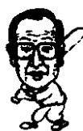

<!--
Stage 4A non-destructive cleaned source. Text comes from full-book MinerU Markdown.
JSON supplies page/block/layout evidence; DOCX supplies images only.
No translation, prose rewriting, OCR correction, factual correction, or unattended footnote recovery.
-->

<!-- FB-P034 | input-pdf-page=34 | printed-page=Unknown -->

<!-- FB-H-CH04 | source-page=FB-P034 -->
# 4 星标面条和阿道汽车修理厂

<!-- FB-I010 | source-page=FB-P034 | json-block=1 | bbox=161:334:198:392 -->

<!-- CH04-P001 -->
对三星集团从起步阶段到今天进行考察总结，可以得出以下经营理念：

<!-- FB-I011 | source-page=FB-P034 | json-block=3 | bbox=401:332:439:394 -->

<!-- CH04-P002 -->
经过细致的事前调查后进入市场，以质量取胜，充分赋予职员决定权。

<!-- CH04-P003 -->
这许多年来，三星在开拓任何领域的市场时都没有违背过这几点原则。

<!-- CH04-P004 -->
郑周永又去借钱的胆量很是让人感到惊讶，而吴胤根老人能够再借钱给他也让人感到意外。那是出于对郑周永的信任。郑周永就是那样一个诚实守信的人。日后成了商界巨擘的他也始终在强调信用的重要性。

<!-- FB-P035 | input-pdf-page=35 | printed-page=22 -->

<!-- CH04-P005 -->
在金海投资 200 万坪土地失败了的李秉哲，振作精神重新开始了创业之路。

<!-- CH04-P006 -->
1938 年 3 月 1 日，他 29 岁的时候，用 3 万元的资金创建了三星商会，即今天三星集团的前身。

<!-- CH04-P007 -->
在郑周永开始第一次创业的那一年，李秉哲创建了三星商会。

<!-- CH04-P008 -->
三星商会创建在现在的大邱市，仁桥洞61-1，也就是现在的西门市场附近。

<!-- CH04-P009 -->
这座建筑一直保留到现在，只是因为年头太长，地基下沉，才决定拆除。可是三星商会创建的时候，它地上4层，地下1层，在当时来说是相当不错的一座木质建筑物。然而，当时的李秉哲并不具备买下这座楼的财力。当时这座楼的总价是2万，李秉哲是以首付1万，剩下的1万两年之内还清的方式买下的。

<!-- CH04-P010 -->
李秉哲选择在大邱创业的理由是那里交通方便。当时的大邱不仅仅是京釜铁路（首尔—釜山）线上的主要车站，还是岭南①的中心，全部物产的集散地。

<!-- CH04-P011 -->
时至今日，三星集团在海外修建工厂的时候还是非常重视地理位置。需要把汽车、地铁、火车等各种交通方式，从港口到工厂的时间，机场到工厂的时间一一计算清楚，经过比较后再确定工厂的位置。

<!-- CH04-P012 -->
当时三星商会的经营范围是把大邱附近新产的苹果等蔬菜水果以及浦项出产的干鱼运往中国东北和北京等地销售，另外还生产和销售面条。购置了面粉机和面条机之后直接生产面条销售。

<!-- CH04-P013 -->
李秉哲从面条水果买卖开始创建三星集团，现在想起来都是经营史上的成功典范。

<!-- CH04-P014 -->
虽然只是一家把水果卖往中国，制做和销售面条的小公司，可是李秉哲却曾在事前做过一番极为细致的调查。他从釜山出发，经平壤、新义州、元山、兴南、中国东北的长春、沈阳、青岛，直到上海，全程进行市场调查。

<!-- FB-F011 | source-page=FB-P035 | marker=① | status=manual-review-required -->

<!-- FB-P036 | input-pdf-page=36 | printed-page=23 -->

<!-- CH04-P015 -->
现在看来，到北京或是上海坐飞机不过是两三个小时的路程，可是当时经中国东北到北京、上海却是无法想像的艰难之旅。

<!-- CH04-P016 -->
哪怕是现在，从北京坐火车到上海一般都需要 14 个小时左右，中国东北地区的交通比京沪之间历时更长。

<!-- CH04-P017 -->
在当时的情况下，旅途中的痛苦是无法言表的，为什么他要做那样一次常人无法想像的艰难之旅呢？

<!-- CH04-P018 -->
那是一次为了清醒头脑，重新思考新起点的旅行。他在经营地产失败后，品尝到了噬脐莫及的后悔。决心以后再也不会从事为了一己之得而牺牲别人的事情。从某个角度来说，地产也算是一种靠别人的损失来发家的产业。

<!-- CH04-P019 -->
李秉哲在地产上失败了，北上首尔，经平壤、新义州、元山、兴南、长春、沈阳，过华北的山海关，到了北京。在途中，他始终在考虑的是“既能造福他人，又能使自己获益的事业”。

<!-- CH04-P020 -->
一路上，李秉哲很是留意经商的人。当时中国东北一带苹果和干鱼很是紧缺。他想，如果把大邱和东海的苹果和干鱼运过去销售的话，好像能赚很多钱。

<!-- CH04-P021 -->
那样的话，对于大邱的果农和东海的渔民来说是件好事，对于中国东北的居民来说也不错。

<!-- CH04-P022 -->
李秉哲经过了两个月艰苦卓绝的市场调查，得出结论：向中国输出水果蔬菜和干鱼市场前景不错。并且他还看到，当时几乎没有专门从朝鲜运输商品到中国的公司。

<!-- CH04-P023 -->
李秉哲和一般人不同的地方正在于此。

<!-- CH04-P024 -->
能够进行平常人无法想像的中国之行需要勇气，在一个完全陌生的国度进行细致入微的市场调查需要观察力。回国后李秉哲认真调查了可以往中国市场出售的苹果的收成情况及鱼产

<!-- FB-P037 | input-pdf-page=37 | printed-page=24 -->

<!-- CH04-P025 -->
品的情况。

<!-- CH04-P026 -->
像这样非凡的勇气和细致的调查，直到现在也都是三星集团重要的无形资产。日后李秉哲在进军半导体领域的时候，也是通过详细的调查后才最终决定的。李秉哲的经营理念在这方面是极具科学性的。依靠的不是粗略估算或侥幸。

<!-- CH04-P027 -->
由于对中国市场做过细致的调查，得出值得一做的结论，他创办了三星商会进军商界。他还建立了面条工厂，创办了“星标面条”的品牌。随着日本帝国主义对粮食掠夺的加重，粮食极度匮乏。李秉哲目睹了这些，开办了一家面条工厂。从大邱附近购买苹果，从浦项附近买入鱿鱼干一类的干鱼销往中国东北和北京地区。

<!-- CH04-P028 -->
按照他的预测，水果不仅仅在中国，在日本也同样会有良好的销路。面条也非常畅销。1捆1角，每箱60捆，当时一天可以卖出100箱以上。顾客主要是来自丹东、沈阳等地的批发商们。

<!-- CH04-P029 -->
当时大邱面条工厂一共有五家，三星商会制作的星标牌面条价格高，销路却很好。那是因为星标面条味道好的缘故。那时李秉哲依靠的是以质量取胜的战略。

<!-- CH04-P030 -->
在那个粮食匮乏，填饱肚子都成问题的年代里，走高价位高质量的路线，在当时来说是一个很让人感到意外的经营方法。

<!-- CH04-P031 -->
首尔银行大邱分行是李秉哲主要的业务伙伴，由于他买卖成功，在开业之初，从大邱分行获得了10万元的贷款，一年之后贷款额就飙升至20万。

<!-- CH04-P032 -->
李秉哲思维缜密，判断总能得到验证。

<!-- CH04-P033 -->
还有值得一提的就是他聘任了一名叫李顺根的经理。

<!-- CH04-P034 -->
今天三星集团的一个特征就是通过专职的经理管理公司。即：信任专门的管理人才委以重任。“疑人不用，用人不疑”的经营方针从那个时候已经确立。

<!-- CH04-P035 -->
对三星集团从起步阶段到今天进行考察总结，可以得出以

<!-- FB-P038 | input-pdf-page=38 | printed-page=25 -->

<!-- CH04-P036 -->
下经营理念：

<!-- CH04-P037 -->
经过细致的事前调查后进入市场，以质量取胜，充分赋予职员决定权。

<!-- CH04-P038 -->
这许多年来，三星在开拓任何领域的市场时都没有违背过这几点原则。

<!-- CH04-P039 -->
在建立“第一毛纺”的时候如此，在建立三星电子的时候如此，在进军堪称三星核心的半导体产业时亦是如此，李秉哲经过严密的调查后进入市场，实行高品质战略，引入必要的管理者和技术人才，赋予其在企业中的领导权。

<!-- CH04-P040 -->
三星电子已经退休了的姜晋求会长，三星半导体的金光镐会长都属于这种情况。现在的三星集团已经确立了专职管理者的体制，在文件上，不存在三星集团所有者李健熙会长做决策签字的一栏。三星商会时代，李秉哲也是除了一些极为重大的决策外，其余事宜全部信任地交由李顺根经理。然而信任和委以重任并不代表他本人对公司毫不关心。

<!-- CH04-P041 -->
在做事情专心方面，郑周永也好，李秉哲也好，都堪称冠绝天下的企业家。

<!-- CH04-P042 -->
根据李秉哲长子李孟熙的回忆，当时星标面条厂24小时机器不停地运转，生意非常好。可是李秉哲一家全都住在工厂的小房子里，李秉哲把全部的收入都投入工厂的运营当中。李秉哲甚至还在工厂的纸箱子里面睡过。看三星如今的面貌，那个时候的痛苦简直是无法想像的。

<!-- CH04-P043 -->
作为如此辛劳的回报，李秉哲在不到两年的时间里就还清了购买三星商会大楼时拖欠的1万元钱。

<!-- CH04-P044 -->
三星商会在迅速成长。李秉哲又开始寻找新的投资对象。凭借他敏锐的洞察力，他在观察哪一类产业的前景广阔。

<!-- CH04-P045 -->
当时大邱一共有八家酿造厂。日本人经营的四家，韩国人经营的四家。日本人当时生产清酒。韩国酿造厂生产米酒或药酒。李秉哲考虑生产清酒。

<!-- CH04-P046 -->
那个时候，一个叫做栋居的日本人要出售他经营的朝鲜酿

<!-- FB-P039 | input-pdf-page=39 | printed-page=26 -->

<!-- CH04-P047 -->
造厂。朝鲜酿造厂当时在大邱是首屈一指，年产7000石①，不过由于领导集团内部的原因准备出售。当时禁止私人酿酒，酿造厂的数量要由日本人决定。李秉哲认为如果购买下朝鲜酿造厂，会有利可图。

<!-- CH04-P048 -->
由于中日战争的原因，各个行业都处于停滞状态，酿造业算是惟一一个只要生产就能够销路畅通的产业。当时石油、电石、大米等主要的生活必需品全由日本人统一管理，如果能够获得经营酿造厂的资格，生产酒还是不会受到统制的。

<!-- CH04-P049 -->
李秉哲用了12万韩元收购了朝鲜酿造厂。他任命李再韶为酿造厂社长，李昌业为总监，金再明为厂长，委以全部的权限。那个时候已经确立了专职管理者的制度。

<!-- CH04-P050 -->
李秉哲对酿造业的投资是非常正确的。朝鲜酿造厂在李秉哲收购之后，生产量大增，由原来的年产7000石飙升至年产1万石。1941年6月3日，三星公司注册为“三星商会贸易公司”。这是由个人企业向现代化企业型态的递进。

<!-- CH04-P051 -->
当李秉哲经营三星商会，开转面条机，并凭借酿造厂取得巨大成功的时候，郑周永正在车轮飞转的首尔市内转悠。他正在寻找新的商机。

<!-- CH04-P052 -->
就在那时，他在路上偶遇原来米店的老顾客李乙鹤。李乙鹤是一家叫做京城汽车修理厂的职工。他告诉郑周永在阿岘洞②有一家名叫“阿道”的汽车修理厂正在出售，劝他不妨去试一试。当时有钱人开的是美国产轿车，首尔的大街上刚刚可以看到木炭汽车。郑周永经过了几天的深思熟虑，买下了阿道汽车修理厂。一共花了5000元，其中4500元是借来的。从过去米店常客吴胤根那里借来3000元，从好友那里借来1500元。他自己能够拿出的仅仅是500元，总数的1/10。

<!-- CH04-P053 -->
郑周永在他的自传里写道，他当时对汽车的知识一片空白，其实并非如此。郑周永所不知道的只不过是汽车的构造而已，可他却深知人类已经进入了汽车时代。

<!-- FB-F012 | source-page=FB-P039 | marker=①|② | status=manual-review-required -->
<!-- FB-F013 | source-page=FB-P039 | marker=①|② | status=manual-review-required -->

<!-- FB-P040 | input-pdf-page=40 | printed-page=27 -->

<!-- CH04-P054 -->
郑周永在 1941 年开始经营阿道汽车修理厂，由于当时处于日本帝国主义统治下，无法获知汽车的数量，不过根据一部分数字来看，1931 年韩国汽车数量为 4331 辆，1945 年解放的时候，私家车、火车、公共汽车合在一起一共是 7386 辆，其中的 70%~80% 都在首尔。

<!-- CH04-P055 -->
韩国的出租车从 1912 年出现，但直到 20 年代中期，“出租车”这个名字才开始被大众认知。到了韩国 1945 年解放的时候，首尔一共有 54 家出租车公司，共计 949 辆出租车。

<!-- CH04-P056 -->
公共汽车也在20世纪30年代成为主要的交通工具。郑周永的阿道汽车修理厂开张的时候，首尔的汽车最少也有4000辆。看到首尔4000辆汽车熙熙攘攘的景象，郑周永感觉到汽车时代已经来到。他在福兴商会做送货员的时候骑自行车送货。他从小是在农村长大的，用手推车运米。到了首尔他熬夜学习骑自行车。世界上从手推车到自行车，从自行车到摩托车，从摩托车又到汽车，一般人都会感觉到这些变化。否则郑周永也不会借4500元去收购一家汽车修理厂，那是购厂所需金额的90%。

<!-- CH04-P057 -->
郑周永由骑自行车送货到开汽车修理厂，最后创建了现代汽车集团，这一点和号称日本商界三大神话之一的日本本田技研工业株式会社创始人本田宗一郎很是相似。本田也是在小的时候做过自行车修理店的修理工，1922年他16岁的时候到东京学习汽车修理。22岁的时候他自己开了一家汽车修理厂，后来发展为生产本田摩托，本田汽车的大企业。两个人走的路非常相似，这也是那个时代的趋势。自行车时代过后，汽车时代到来，这在日本已经获得了证明，出现了像本田宗一郎那样的人物。

<!-- CH04-P058 -->
郑周永的汽车修理厂在开业之初很是顺利。但是，遇到一场大火，把在工厂里面修理日本氮肥厂的两辆卡车，一辆掉进

<!-- FB-P041 | input-pdf-page=41 | printed-page=28 -->

<!-- CH04-P059 -->
过临津江的私人卡车，社会权贵尹德英家的一辆奥兹莫比尔，以及两辆别的卡车烧毁。

<!-- CH04-P060 -->
火灾是由于一个职工想要烧开水洗手，把稀释剂倒入火里所致。这导致了待修的汽车乃至工厂都被付之一炬。可以说实在是时运不佳。

<!-- CH04-P061 -->
如果是一般人的话，把顾客那种难得一见的外国车烧毁，肯定会万念俱灭，一蹶不振。

<!-- CH04-P062 -->
郑周永一夜变得赤贫，他又去了曾借给他3000元的吴胤根老人那里，向他借了3500元。郑周永又去借钱的胆量很是让人感到惊讶，而吴胤根老人能够再借钱给他也让人感到意外。那是出于对郑周永的信任。郑周永就是那样一个诚实守信的人。日后成了商界巨擘的他也始终在强调信用的重要性。

<!-- CH04-P063 -->
郑周永把工厂搬到新设洞，和50名员工一起又开始了汽车修理厂的工作。由于新设洞修理厂的生意兴隆，在三年后，郑周永不但还上了所有的欠款，还积累了可观的财产。可是，他的厄运还没有结束。

<!-- CH04-P064 -->
日本挑起太平洋战争后，郑周永的汽车修理厂被其他公司强行吞并了。停止了汽车修理厂的郑周永买了三辆卡车，到金矿运矿石，最后以5万多元的价格把卡车卖给了矿山，离开了那里。之后，又过了三个月，日本战败，韩国解放。
