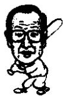

<!--
Stage 4A non-destructive cleaned source. Text comes from full-book MinerU Markdown.
JSON supplies page/block/layout evidence; DOCX supplies images only.
No translation, prose rewriting, OCR correction, factual correction, or unattended footnote recovery.
-->

<!-- FB-P050 | input-pdf-page=50 | printed-page=Unknown -->

<!-- FB-H-CH06 | source-page=FB-P050 -->
# 6 理发师的启示

<!-- FB-I014 | source-page=FB-P050 | json-block=1 | bbox=171:328:209:386 -->

<!-- CH06-P001 -->
李秉哲赞叹的是理发师的敬业精神。让他感动的也是理发师的敬业精神。尽管

<!-- FB-I015 | source-page=FB-P050 | json-block=3 | bbox=409:327:449:389 -->

<!-- CH06-P002 -->
理发是一种微不足道的工作，可是理发师却希望能够子承父业，让李秉哲感动的正是这种执著的精神。

<!-- CH06-P003 -->
李秉哲从中看到了日本的精神。尽管日本在第二次世界大战中被夷为废墟，可是李秉哲已经预感到这个国家必将会再次崛起。

<!-- CH06-P004 -->
今天三星的企业精神和日本的“职业精神”，即所谓的“匠人精神”很是相似。日本的“匠人精神”，就是为一件事情付出自己的全部心血，要在自己从事的领域达到最高水平。

<!-- FB-P051 | input-pdf-page=51 | printed-page=38 -->

<!-- CH06-P005 -->
1950 年 2 月，李秉哲访问日本。全泽、薛卿东等 15 人同行。那正是日本经济开始复苏的时候。

<!-- CH06-P006 -->
当时，日本希望同韩国之间进行贸易往来实现经济复兴。韩国的商界人士通过日本同行的邀请访问日本。

<!-- CH06-P007 -->
那个时候个人旅行是不可能的。李秉哲也不例外。因为李承晚总统对日本恨之入骨，他反对同日本间的一切商贸往来。

<!-- CH06-P008 -->
然而，时代也是在悄然发生着变化。告别早稻田大学的留学生活回韩国之后，李秉哲首次重新踏上日本的土地。战败国日本的经济非常艰难。从羽田机场到东京市中心，沿途都是破旧的木板房，没有大的建筑物。第二次世界大战时，日本生产各式武器的川崎重工业也因受到轰炸只剩下残垣断壁，里面空荡无物。由于错误地发动战争，国家被夷为了废墟。

<!-- CH06-P009 -->
韩国经济访问团三个月期间不辞劳苦地奔走于日本各地。李秉哲在短时间内感觉到应该同日本重新建立贸易往来。在他看来这是现实的需要。在访问即将结束的时候，他到东京的赤阪后面一条路上散步。如今赤阪已经是东京一条具有代表性的商业街，到了晚上俱乐部、酒吧、饭店霓虹闪烁，俨然是一座不夜城。可在当时不过是一条荒凉的街道而已。

<!-- CH06-P010 -->
有一天傍晚，在一条连路灯都没有的路上走着走着，我进了一家理发店。破旧的店铺门口挂着写有“森田”的招牌。理发店的主人看起来年纪在四十上下，我和他闲聊了起来。

<!-- CH06-P011 -->
“您从什么时候开始理发的？”

<!-- CH06-P012 -->
“我是第三代了，祖传下来的店一共经营60年左右了，要是孩子能继续干下去就好了……”

<!-- CH06-P013 -->
虽然只是闲谈，但是听起来并不寻常。本来那位理发师作为一个战败国的国民，内心本应有很大的受挫感，但是他却在自强不息地奋斗，我被他那种敬业精神震撼。

<!-- FB-P052 | input-pdf-page=52 | printed-page=39 -->

<!-- CH06-P014 -->
这是李秉哲自传《湖岩自传》中的一段话。

<!-- CH06-P015 -->
李秉哲作为成功的企业家，他可写的故事数不胜数，把遇到理发师的经历写到他自传里的寓意何在呢？

<!-- CH06-P016 -->
如果李秉哲是在 1950 年到的那家理发店，那么就是他 41 岁的时候。是在 “第一制糖”、毛纺织、物产、电子、半导体等公司创立之前，也就是说是他创业的准备阶段。

<!-- CH06-P017 -->
李秉哲赞叹的是理发师的敬业精神。让他感动的也是理发师的敬业精神。尽管理发是一种微不足道的工作，可是理发师却希望能够子承父业，让李秉哲感动的正是这种执着的精神。

<!-- CH06-P018 -->
李秉哲从中看到了日本的精神。尽管日本在第二次世界大战中被夷为废墟，可是李秉哲已经预感到这个国家必将会再次崛起。

<!-- CH06-P019 -->
今天三星的企业精神和日本的“职业精神”，即所谓的“匠人精神”很是相似。日本的“匠人精神”，就是为一件事情付出自己的全部心血，要在自己从事的领域达到最高水平。

<!-- CH06-P020 -->
不知道是真是假，据说这位理发师在李秉哲会长生前收到了一份礼物——日本产的一套理发工具。一份很符合李秉哲做事方式的礼物。

<!-- CH06-P021 -->
李秉哲在日本赤阪森田理发师那里获得的启示正是日本的“匠人精神”，正是日本能够再次崛起的原因。

<!-- CH06-P022 -->
的确如此。日本是一个做事极为认真的民族。比如说，第二次世界大战时日本陆军要为驻扎在中国满洲的100万关东军提供米糕。

<!-- CH06-P023 -->
在日本国内寻找合适的糕点店的时候，得知伊势新宫旁边的一家米糕店做的米糕很不错。日本陆军向那家米糕店下订单，要每周提供100万块米糕。然而，米糕店却拒绝了这份订单。

<!-- CH06-P024 -->
每周100万的话，只要能够按时交货，肯定就可以转眼暴富，可是米糕店却拒绝了。拒绝的原因是：在制作100万块米糕的时候无法保证每一块米糕质量都能达到要求。100万块的大规模生产，没有自信保证每一块都能过关。由此可见日本人

<!-- FB-P053 | input-pdf-page=53 | printed-page=40 -->

<!-- CH06-P025 -->
做事的精细和责任心。

<!-- CH06-P026 -->
不仅如此。在日本，百年老店随处可见。长崎的蛋糕店文明堂生产一种蛋糕，保持了百年之久。在奈良的一家旅馆神堂屋于16世纪开业，迄今已经营业了400余年。在大阪的一家名为金刚组的寺庙建筑公司创于公元587年，到现在已经拥有1400年的历史，历经40代人，仍在从事着修建寺庙的工作。这家公司，据我所知是世界上历史最长的一家公司。如果前往东京的银座，会看到那里的银座百货商场。百年老店，汇聚了来自各地的商品。

<!-- CH06-P027 -->
今天能够代表日本的三井、三菱集团，也都是历史悠久的公司。三井集团创于1876年，也常以历时百年而自傲。三菱集团由岩崎弥太郎于1870年创建，拥有130多年的历史。

<!-- CH06-P028 -->
这些集团数百年不倒的原因何在？用一句话概括是：质量至上主义。为了生产出质量最优的产品，数百年，代代人都在苦心钻研。始终在为提高质量而不断努力。就连理发店都在代代相传，其他的行业更不必说。日本征服世界的动力正在于此：敬业精神。

<!-- CH06-P029 -->
在日本走一圈的话，看到的面包店、米糕店、盒饭店、生鱼片店、酱油厂、旅馆，总会让你产生都是专家在经营的感觉。公司的每一个职工也都是自己领域的专家。

<!-- CH06-P030 -->
李秉哲看到了这一点。李秉哲的直觉很准确。尽管20世纪50年代的日本由于战败是一片废墟。但是30年后日本凭借那种敬业精神成为世界的第二经济强国。日本的钢铁、家电、半导体、造船、汽车等征服了世界。

<!-- CH06-P031 -->
李秉哲为了三星能够走得更久更远，认为需要保持质量至上的精神。在那以后三星一直以质量至上为目标不断前行。

<!-- CH06-P032 -->
质量至上主义。如果想要保持贯彻这一点，必须要选拔人才，以人才至上主义作为基础。今天三星除了在一部分领域之外，在全国范围内都保持着国内第一的位置。
