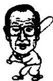

<!--
Stage 4A non-destructive cleaned source. Text comes from full-book MinerU Markdown.
JSON supplies page/block/layout evidence; DOCX supplies images only.
No translation, prose rewriting, OCR correction, factual correction, or unattended footnote recovery.
-->

<!-- FB-P074 | input-pdf-page=74 | printed-page=Unknown -->

<!-- FB-H-CH09 | source-page=FB-P074 -->
# 9 先发制人和后发制人

<!-- FB-I020 | source-page=FB-P074 | json-block=1 | bbox=173:333:210:390 -->

<!-- CH09-P001 -->
李秉哲会长在工作时间以外基本不和下属见面，而郑周永会长却常和下属打成一片。

<!-- FB-I021 | source-page=FB-P074 | json-block=3 | bbox=411:331:451:393 -->

<!-- CH09-P002 -->
郑周永说：“我不是什么成功的企业家，而只是一个有钱的工人而已。”

<!-- CH09-P003 -->
他不注重外在的形式，而更在乎实干。在他的眼中，职员们不是他的属下而是子女。

<!-- CH09-P004 -->
而李秉哲却是一个很重视儒家传统的人，所以在他看来，上级和属下之间应该严格遵守长幼有序的义理。

<!-- FB-P075 | input-pdf-page=75 | printed-page=62 -->

<!-- CH09-P005 -->
李秉哲会长曾经向日本商界巨擘之一朝日啤酒的广口太郎询问企业经营的要缔。

<!-- CH09-P006 -->
朝日啤酒现在销售额已经突破1兆日元，最近刚刚取代了麒麟啤酒成为日本市场占有率第一的啤酒公司。

<!-- CH09-P007 -->
广口太郎会长现在已经退休，他当时告诉李秉哲会长一定要选好一个经理，也就是专门的企业经营者。光口会长认为这是企业经营的核心。

<!-- CH09-P008 -->
当然李秉哲在广口会长说出这番感受之前已经在那样做了。比如说，他任命的三星物产副会长赵洪济，前面提到的保管3亿元的李昌业，都是如此。

<!-- CH09-P009 -->
但是随着事业的不断扩大，三星已经到了不是一两个经理能够管理全部事务的规模。

<!-- CH09-P010 -->
李秉哲为了选拔人才，在韩国历史上第一次进行了公开的人才招聘。

<!-- CH09-P011 -->
非常巧的是，三星和现代，两个企业在培养专门的企业经营者方面是从同一个时期开始的。三星在1957年，现代在第二年1958年。

<!-- CH09-P012 -->
1957 年，在韩国战后开始了一场特殊的竞争。那一年国家的大工程如雨后春笋一样。工程增多，对职员的需求量也就增大。

<!-- CH09-P013 -->
三星的李秉哲在招聘职工的时候，一改之前流行的任人惟亲的风气，采取任人惟贤的标准。

<!-- CH09-P014 -->
他当时想的是“三星的人才由我来选拔”，因为只有人才才能使公司得以发展，李秉哲一直遵循的就是“人才第一”的经营理念。

<!-- CH09-P015 -->
在选拔人才上非常苛刻的李秉哲从第一次公开招聘就亲自面试。之后每次三星的面试李秉哲都要直接把关。

<!-- CH09-P016 -->
三星的第一次公开招聘是1957年1月30日，在当时首尔城北区钟岩洞首尔大学商学院的礼堂。那天正逢零下15摄氏度的酷寒。来自各地的500余名人才一边搓着被冻僵了的手一边考试。考试的科目是英语、专业课和常识知识。

<!-- FB-P076 | input-pdf-page=76 | printed-page=63 -->

<!-- CH09-P017 -->
由于这是第一次不分学校学历，也不论出身地区的人才选拔考试，所以聚集了全国各地充满自信的大批人才。

<!-- CH09-P018 -->
考完笔试两个星期后，在半岛饭店的五层，即三星物产的本部进行了面试。面试共有两轮：第一轮主要考察的是学术性、专门性的知识。第二轮则由三星李秉哲会长亲自面试。

<!-- CH09-P019 -->
李秉哲提出的问题有：

<!-- CH09-P020 -->
“结婚了没有？”

<!-- CH09-P021 -->
“老家在哪里？”

<!-- CH09-P022 -->
“共有兄弟几人？”等等。

<!-- CH09-P023 -->
这些情况在应征者的求职书上已经写得很详细了，可是李秉哲会长又一次提出来了。

<!-- CH09-P024 -->
他之所以提出这些简单的问题，与其说有其深意，不如说他是为了观察对方说话的态度，以及出入时的举止等细节来看这个人的人品。

<!-- CH09-P025 -->
当时李秉哲评判应征者的标准是那些不张扬，相貌端正，平凡的人。

<!-- CH09-P026 -->
面试后的结果出乎很多人的意料之外。那些被提了很多问题，以为自己肯定通过的人落选了，而那些只回答了一句就出来的考生却品尝到了成功的喜悦。

<!-- CH09-P027 -->
最终被录取的人有：首尔大学工学院13名，首尔大学商学院7名，首尔大学文学院3名，首尔大学法学院1名，延世大学2名，高丽大学2名。

<!-- CH09-P028 -->
其中，有日后成了三星最高经营者的景周铉会长，秘书室长宋世昌等人。

<!-- CH09-P029 -->
在五百余人应聘者中，经过了激烈的竞争最终有28人被录取。李秉哲首先安排在“第一制糖”3名，“三星物产”2名。剩下的23人，都派到“第一毛纺”的工厂进行一个月的实习。这也就是让他们体验三星公司氛围的过程。

<!-- CH09-P030 -->
抽丝车间、织布车间、染色车间、熨烫车间和“布料美

<!-- FB-P077 | input-pdf-page=77 | printed-page=64 -->

<!-- CH09-P031 -->
容车间”，这些刚刚进入三星的职员学习完全陌生的机械、词汇，对生产的了解大大加深了。

<!-- CH09-P032 -->
当时这些新职工每天都要深入基层学习，并且提交报告书。这也是让他们迅速熟悉业务的方法。

<!-- CH09-P033 -->
之后李秉哲又把这些结束了在“第一毛纺”实习的职工派到了“第一制糖”，进行了三个月的现场实习。

<!-- CH09-P034 -->
让他们到制糖原料仓库装卸麻袋，搬运重重的白糖，从中学习到知识。

<!-- CH09-P035 -->
这是因为对公司第一次公开招聘来的职工期待实在太高的缘故。

<!-- CH09-P036 -->
李秉哲对他们常常给予一些个别的指导和劝告：“你们应该创造三星的未来”，“得改改你的坏脾气了”，“你要再加把劲学习”等。

<!-- CH09-P037 -->
对于这些职工来说，与其说李秉哲像上级，不如说像父亲。

<!-- CH09-P038 -->
李秉哲从第一次公开招聘开始，就在职工教育上下如此大的工夫，这是出于他“人才第一”的理念。他意识到每一个人才都会给公司带来巨大的发展。

<!-- CH09-P039 -->
现在，三星已经确立起了公开招聘人才的制度。可是在当时，有很多人通过关系送孩子到三星。来求李秉哲的人很多。特别是来自政府高官的请求很难拒绝。李秉哲全部答应了他们的请求。

<!-- CH09-P040 -->
但是有一点：通过公开招聘进来的职员和通过走关系进来的职员，他们的提升以及工资水平是有区别的。

<!-- CH09-P041 -->
如果是公开招聘的职工，他们的提升和加薪要优于走关系进来的职工。

<!-- CH09-P042 -->
当时正规大学的毕业生进到公司六个月就可以升到三级，而走关系的职员则需要一年才会升到三级。在工资待遇上也存在差距。最后，走关系的人越来越少。

<!-- CH09-P043 -->
这是李秉哲具有的独特经营方式。

<!-- FB-P078 | input-pdf-page=78 | printed-page=65 -->

<!-- CH09-P044 -->
李秉哲 “人才第一” 的经营理念完全被他的儿子李健熙继承了。

<!-- CH09-P045 -->
李健熙常说一个人才足以养活20万、30万的人。

<!-- CH09-P046 -->
“人才第一”的理念是和培养人才相连接的。三星对人才的投资从不吝啬，这从职员的受教育经费和福利待遇上可以看出来。

<!-- CH09-P047 -->
三星一名员工的受教育经费是日本公司的两倍，美国公司的三倍，欧洲公司的四倍。之所以能够投入如此大的经费，就是因为把人才教育看成是一项长期的投资。

<!-- CH09-P048 -->
三星在培训职工上的经费如此之多的原因是发达国家公司的职员进入公司之后，都会有老职员传帮带，可是韩国企业的历史非常短，公司里没有能够向新职员传授业务知识的人。

<!-- CH09-P049 -->
李秉哲对人才的重视，吸引了优秀的人才，也由此创造出了高质量的产品。

<!-- CH09-P050 -->
李秉哲的用人哲学可以通过下面这句话概括出来：

<!-- CH09-P051 -->
“疑人不用，用人不疑”。

<!-- CH09-P052 -->
这是李秉哲最喜欢用的一句成语。

<!-- CH09-P053 -->
1982 年，三星在京畿道龙仁建立了韩国最早的综合培训中心，开始了对职员长期性、系统性的培训。

<!-- CH09-P054 -->
在今天，从招聘开始，到雇佣、选拔、教育、培训、再培训以及评价等管理方面，韩国没有任何一家公司能够和三星媲美。

<!-- CH09-P055 -->
在人才方面的投资上，三星每年给一个人投入8000千万韩元，共投入1600亿韩元给两千余名职员提供到世界各地学习的机会，由此可以看出对人才的重视。李秉哲不惜余力地培养人才，信任人才。

<!-- CH09-P056 -->
有一段时期，李秉哲对收集和欣赏唱片非常感兴趣。1965年和1970年，他曾经两次委派职员们对建立唱片公司进行市场调查。

<!-- CH09-P057 -->
可是，秘书室提供的报告结果却是否定的。根据调查结果

<!-- FB-P079 | input-pdf-page=79 | printed-page=66 -->

<!-- CH09-P058 -->
来看，唱片公司不会有太大的收益。

<!-- CH09-P059 -->
李秉哲感到非常惋惜，尽管他是一个自尊心极强的人，但是他接受了属下的意见，因为他充分相信职员的判断。

<!-- CH09-P060 -->
在公开招聘人才上，现代比三春晚一年，在1958年开始实行。

<!-- CH09-P061 -->
据说当时只是招聘了 10 名技术型和管理型的人才。现在这 10 人年事已高，都已不在岗位上了。

<!-- CH09-P062 -->
郑周永在选拔人才的时候也是非常慎重。在他看来，资源匮乏的韩国，人才是惟一的财富。因为技术革新也好，实现产业自动化也好，需要的都是人才的力量。

<!-- CH09-P063 -->
人们都知道，郑周永在选拔人才的时候，有“三顾茅庐”那种对人才的渴望，并像挑女婿一样慎重。

<!-- CH09-P064 -->
所以，他一旦选择好了人才，就会赋予他最大的权限，同时也是最大的责任。

<!-- CH09-P065 -->
如此公开选拔上来的现代集团具有代表性的人物是：1963年进入公司的沈铉荣（曾任仁川制铁首席代表），1965年进入现代建设的李明博，1966年的阴龙基（现任现代综合木材社长），1967年的朴世勇（曾任仁川制铁和现代商船的首席代表等），还有现在为韩朝合作忙于奔波的金润规（现代峨山会长）和李炳规（现代百货商场社长），金在洙（现任构造调整总部副社长），等等。

<!-- CH09-P066 -->
这些通过公开招聘进入现代集团的职员，不把郑周永会长称为“会长”，而是称为“父亲”。

<!-- CH09-P067 -->
这个拥有 20 余万名职工的世界性大企业，就像是一家人一样，用着同一个像是对家长的称呼。

<!-- CH09-P068 -->
郑周永始终遵循着这样一句话，“不是对立的关系，而是具有同在一个屋檐下生活的亲情。”他不是以公司老板的身份，而是作为这个大家庭的大哥来对待每一个职员。和职员们一起摔跤，和职员们一起通宵喝酒，这都可以看出他和职员亲如一家。因为他自己曾经亲身做过重体力劳动，他知道职员们非常辛苦。

<!-- FB-P080 | input-pdf-page=80 | printed-page=67 -->

<!-- CH09-P069 -->
在这一点现代和三星是截然不同的。

<!-- CH09-P070 -->
以前李秉哲召开的集团董事会被称作“御前会议”。

<!-- CH09-P071 -->
也就是说：如果说现代萦绕的是一种父子氛围的话，那么三星则是一种帝王和臣民的君臣关系。

<!-- CH09-P072 -->
李秉哲会长是那种极少说话的人，哪怕别人做得再好也不过是一句“不错”。而郑周永会长采用的则是更为直接和积极的方式。

<!-- CH09-P073 -->
1995 年，现代集团开办了现代卫星电视台，郑周永设晚餐在城北区的迎宾馆招待所有的员工。

<!-- CH09-P074 -->
那时郑周永有一句嘱托：

<!-- CH09-P075 -->
“大家好好工作，多多赚钱！”

<!-- CH09-P076 -->
作为一个企业家，他非常直白地表达了自己的心境。

<!-- CH09-P077 -->
对于企业家来说，创造出最大的利润就是最终的目标，他没有拖泥带水地表达了这个命题。

<!-- CH09-P078 -->
郑周永会长批评下属的时候有一种特殊的方式。

<!-- CH09-P079 -->
如果下属的职位是常务，郑周永会突然称之为理事或者是部长。开始的时候，下属还以为是他记错了。可是过了一段时间发现那是对下属能力不足的一种批评。

<!-- CH09-P080 -->
也就是说：“尽管你担任的职务是常务，可是创造力只能达到理事或者部长的水平”，以此来提出自己的批评。

<!-- CH09-P081 -->
郑周永会长最讨厌的一件事是职员做错了事却不愿承认。被叫到郑会长那里的时候，如果承认自己的错误，并保证下次一定会做好，那么就不会有什么严重的后果。但是如果始终为自己辩解，就会招来一顿痛斥。

<!-- CH09-P082 -->
李秉哲会长在工作时间以外基本不和下属见面，而郑周永会长却常和下属打成一片。

<!-- CH09-P083 -->
郑周永说：“我不是什么成功的企业家，而只是一个有钱的工人而已。”

<!-- FB-P081 | input-pdf-page=81 | printed-page=68 -->

<!-- CH09-P084 -->
他不注重外在的形式，而更在乎实干。在他的眼中，职员们不是他的属下而是子女。这跟他在家中是6男2女中长子的身份以及成长经历很有关系。因为他要始终照顾弟弟妹妹，实际上他也帮助兄弟们进入现代集团，或者分给他们公司经营。

<!-- CH09-P085 -->
而李秉哲是家中最小的孩子，始终在别人的关爱下成长。而李秉哲却是一个很重视儒家传统的人，所以在他看来，上级和属下之间应该严格遵守长幼有序的义理。

<!-- CH09-P086 -->
在朴正熙总统集权的时候，他以不去给朴总统拜年而闻名。他不去拜年的理由是因为自己比朴正熙总统的年纪大七岁。也就是说，朴正熙尽管贵为总统，可是在年纪上要小七岁，自己不能去给他拜年的。尽管我们也可以推测这是因为在韩国肥料事件之后他不再相信朴正熙总统的原因，但是好像更重要的原因由于他头脑中浓厚的儒家思想。

<!-- CH09-P087 -->
郑周永不在乎外在的形式。他到了政府机关中，见到比自己年纪小的官员，哪怕是一个办事员也都会毕恭毕敬，这也是他非常出名的一点。

<!-- CH09-P088 -->
当然，这可以说是作为一个企业家，不想在事业上受到不必要的损失，也可以说是因为他从自身的经历出发，对别人体现出应有的尊重。

<!-- CH09-P089 -->
郑周永非常讨厌说“领导着谁工作”这句话。尽管自己是企业的老板，但是在他看来，和同事只是一起工作的关系，而不能说是因为付给了工资就说是领导着别人。

<!-- CH09-P090 -->
他常常到基层工人的家里去看望他们。总是到工人租的房子里面亲眼看他们的生活状况。因为他自己也曾经有过一天只能吃两顿饭，晚上只能喝粥饿肚子的生活，他也曾经在仁川码头、高丽大学建筑工地、丰田麦芽糖工厂和铁路工地做过重体力劳动，所以他比任何人都了解工人的疾苦。

<!-- CH09-P091 -->
李秉哲也是在职员生活上比任何人都要用心关怀的企业家。

<!-- CH09-P092 -->
今天，三星是没有工会的公司。

<!-- FB-P082 | input-pdf-page=82 | printed-page=69 -->

<!-- CH09-P093 -->
私下里和三星的职员交谈，他们表现出对自己的职业满意程度是相当高的，都认为这是一个非常好的公司。

<!-- CH09-P094 -->
然而李秉哲会长却从来不会到基层工人家里去做客，去和他们一起用餐，也不会和他们去交谈。这和李秉哲的性格也很有关系。

<!-- CH09-P095 -->
李健熙会长不喜欢在众人前露面，李秉哲会长也是非常不喜欢到很多人面前发言。

<!-- CH09-P096 -->
可是郑周永会长却能够在几千名职工之前高唱他拿手的歌曲《真是的》。

<!-- CH09-P097 -->
郑周永会长喜欢职员的单纯和率直。因为他自己的性格就是如此。

<!-- CH09-P098 -->
年轻的时候，喜欢和职工们一起摔跤，打排球，从没有缺席过新职工的培训大会。甚至到了和年轻职工摔跤把肋骨折断的程度。

<!-- CH09-P099 -->
在他眼中，重视职员，就是能够生产出具有竞争力产品的最佳途径。

<!-- CH09-P100 -->
李秉哲是把“人才第一”奉为至上信条的企业家，也是勇于把自己的想法付诸实践的企业家。

<!-- CH09-P101 -->
郑周永和李秉哲都是非常重视、关爱下属员工的企业家，只是他们的方式不同而已。

<!-- FB-P083 | input-pdf-page=83 | printed-page=Unknown -->

<!-- TODO(QA): no Markdown/JSON semantic payload; blank-page visual confirmation required. -->
