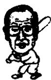
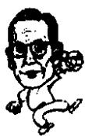

<!--
Stage 4A non-destructive cleaned source. Text comes from full-book MinerU Markdown.
JSON supplies page/block/layout evidence; DOCX supplies images only.
No translation, prose rewriting, OCR correction, factual correction, or unattended footnote recovery.
-->

<!-- FB-P084 | input-pdf-page=84 | printed-page=Unknown -->

<!-- FB-H-CH10 | source-page=FB-P084 -->
# 10 汉江大桥和东京构想

<!-- FB-I022 | source-page=FB-P084 | json-block=1 | bbox=165:333:202:391 -->

<!-- CH10-P001 -->
尽管李秉哲创立的大多数产业都是从日本获得灵感，并且从日本的企业获得了很

<!-- FB-I023 | source-page=FB-P084 | json-block=3 | bbox=404:330:443:392 -->

<!-- CH10-P002 -->
多技术上的支持。但是像半导体，他超越了很多日本企业，显示出了他的创造性。

<!-- CH10-P003 -->
日本企业的优点也在于，能够代表日本的汽车、造船、电子和半导体等产业的技术是从欧美发达国家学来的最终却超越了它们。

<!-- CH10-P004 -->
李秉哲也是如此，尽管从日本那里获得了技术，就像半导体领域那样，他最终却超越了日本，所以他的创造性必须得到肯定。

<!-- FB-P085 | input-pdf-page=85 | printed-page=72 -->

<!-- CH10-P005 -->
郑周永由于高灵桥工程蒙受了巨大的损失，之后一直在寻找着东山再起的机会。

<!-- CH10-P006 -->
机会总是赋予那些有准备的人。韩国政府准备修建汉江大桥，开始招标。机会终于来了。

<!-- CH10-P007 -->
汉江大桥是韩国战后最大的一项工程。

<!-- CH10-P008 -->
原来的汉江大桥在6·25战争的时候被炸断。之所以搁置七年才重修，就是因为实在工程浩大，预算太大。政府为了筹款焦头烂额几年，终于开始公开招标了。

<!-- CH10-P009 -->
本来这项工程是准备交与朝兴土建和兴华工程所两家公司中的一家的。但是出现了问题。

<!-- CH10-P010 -->
当时的内务部部长想要把工程交给朝兴土建，而拥有赋予权的财务部却想把工程交给兴华工程所。两家公司毫不让步，针锋相对，超过了预算时间一年还没有结果，最后实在无法妥协，采用了招标的办法。

<!-- CH10-P011 -->
一开始招标，各大公司都提出自己的预算。那个时候出现了一个变故。

<!-- CH10-P012 -->
当时最大的建筑公司之一的兴华工程所提出了1000元的预算竞标。当时的1000元，是从市内到汉江出租车费的1/4，相当于要白做这项工程。在竞标的时候，当然是要把标给预算最低的公司。来竞标的各个公司都是苦笑着退避三舍。

<!-- CH10-P013 -->
这件事在社会上引起了相当大的反响。于是出现了变故。接到标书的内务部部长发表声明说：兴华工程所提出的1000元预算，毫无竞标诚意，哪怕是捐赠的性质也无法接受。也就是说，这根本不算是正常的商业行为。

<!-- CH10-P014 -->
结果，决定把工程交给提出预算居于第二低的公司。这家公司就是提出2.3亿元的郑周永的现代建设。

<!-- CH10-P015 -->
那是 1957 年 9 月的事情。

<!-- CH10-P016 -->
兴华工程所和朝兴建设两家公司对峙争斗，最终让郑周永获得渔翁之利。对郑周永来说是又一次机会。

<!-- CH10-P017 -->
郑周永这次不想重演高灵桥的噩梦。如果想顺利地完成汉江大桥的工程，设备是关键。郑周永在他经营的现代汽车修理厂里建立了重型机械厂。

<!-- FB-P086 | input-pdf-page=86 | printed-page=73 -->

<!-- CH10-P018 -->
当出了新产品之后，美国第八军就会把原来的旧设备低价处理掉。

<!-- CH10-P019 -->
现代建设由于联合国军墓地铺草坪（大麦）的工程获得了美国驻军的信任，所以郑周永从美军那里低价购置了他们处理的设备。

<!-- CH10-P020 -->
郑周永买下了他们不用的重型机械，再到市场上购买所需的配件，在现代重型机械厂翻新。

<!-- CH10-P021 -->
有的时候干脆搜集配件，重新造出新的机器。这一切都出自郑周永的妹夫“机械博士”——金永柱之手。

<!-- CH10-P022 -->
现代完成工程仅用了一年的时间。有鉴于高灵桥历时太长，在完工时背上了巨大的债务，这一次是在最短的时间内完成工程。

<!-- CH10-P023 -->
汉江大桥是一项规模宏大的工程。最终的受益达到了工程款的 40%。

<!-- CH10-P024 -->
通过这项工程，现代建设跻身于韩国五大建筑公司的行列，呈现出强劲的上升态势。很多项目集中到了现代建设。

<!-- CH10-P025 -->
1958 年承担了乌山空军基地的工程。1959 年又承担了号称韩国建国后最大工程的美国军团在仁川港的一号军用船坞。

<!-- CH10-P026 -->
为此，在1960年的时候，现代建设成为了国内一千余家建筑公司的龙头老大。高灵桥噩梦五年后，现代奠定了在建筑业里的位置。

<!-- CH10-P027 -->
1959 年 12 月，韩国第一次自行生产出了国产收音机。第一家生产出收音机的是金星公司。

<!-- CH10-P028 -->
李秉哲在那个时候也在忙于奔波。

<!-- CH10-P029 -->
李秉哲刚刚在日本的羽田机场下飞机，就听到祖国生产出收音机的消息。

<!-- CH10-P030 -->
他是从美国回国，在日本转机，在东京暂作停留。本打算在东京换乘飞机飞回首尔，可是听到了首尔正值下大雪，飞机无法降落的消息。没有办法，他只能在东京盘桓几日。当时他住在日本皇宫对面的帝国饭店。

<!-- FB-P087 | input-pdf-page=87 | printed-page=74 -->

<!-- CH10-P031 -->
位于东京中心的帝国饭店，无论是当时还是现在，都是和大仓饭店、新大谷大饭店并列，堪称最高级的饭店。

<!-- CH10-P032 -->
李秉哲年轻的时候曾经到早稻田大学留学，并且和日本之间有很多贸易往来，所以他对日本非常熟悉。

<!-- CH10-P033 -->
1960 年的日本，正在为步入发达国家全民热火朝天地进行奋斗。

<!-- CH10-P034 -->
1950 年，韩国战争爆发，日本向联合国出售各种物资，赚取了 62 亿美元。一洗自 1945 年战败以来的经济窘境，达到了历史上的最好的经济状况，这就是所谓的“神武景气”。之后，陆续出现了“高天原景气”、“岩户景气”等一连串的繁荣时期。

<!-- CH10-P035 -->
随后生产出了电动洗衣机、冰箱、黑白电视机，这些尖端的家电开始进入家庭。

<!-- CH10-P036 -->
那时的日本人，把这一切称之为“严冬过后的花季”，全日本的国民充满了对未来的希望和憧憬。

<!-- CH10-P037 -->
在这样的的社会氛围下，日本电视台为迎接1960年新年做了一期节目，请权威人士到电视台对各国的政治、经济、军事、社会等进行座谈展望。

<!-- CH10-P038 -->
军事上，主要集中在是否还会使用核武器问题上；经济上，主要谈到了美苏争霸，特别是集中在苏联经济是否会超越美国的问题上。

<!-- CH10-P039 -->
当时美国的经济以每年3%的速度增长，而苏联在以每年7%的速度上升，苏联的竞争力何时会超越美国成为很多人关注的话题。

<!-- CH10-P040 -->
在这些座谈中，李秉哲最为关心的是美国、英国、联邦德国、法国、意大利、加拿大、澳大利亚等10个发达国家，有向一些具有发展潜力的落后国家提供长期低息贷款的意向。

<!-- CH10-P041 -->
当时李秉哲非常想开办肥料工厂，但是一直没有资金，所以这个消息对他来说极为重要。这也是后来李秉哲成功创建肥料工厂的动力。

<!-- FB-P088 | input-pdf-page=88 | printed-page=75 -->

<!-- CH10-P042 -->
每年年初，电视台或报纸上都会刊登经济的预期和信息。

<!-- CH10-P043 -->
李秉哲后来每年年初的时候都会去东京。由此酝酿出了著名的“东京构想”。

<!-- CH10-P044 -->
三星电子的姜晋求会长把“东京构想”的具体内容介绍如下：

<!-- CH10-P045 -->
1. 首先对于日本各大广播传媒公司企划制作的特别节目，特别是日本的知名学者和记者对前一年的经济动向的总结和新一年的展望节目倍加重视，认真观看。

<!-- CH10-P046 -->
2. 之后，设午宴或在晚餐的时候，邀请日本业内德高望重，或是有独特见解的经济方面的记者，和他们进行交谈。

<!-- CH10-P047 -->
采取的方式不是一次性找来很多人，而是一个人一个人地单独会面，请教他们对过去一年经济形势的看法，对新一年的展望，咨询哪一种行业会有发展前途。还有就是向他们咨询发展企业的要缔何在。

<!-- CH10-P048 -->
因为记者们不仅仅是把目光放在表面的数字上，他们对实质的内容也都很清楚，能够很好地解释出内在的原因。

<!-- CH10-P049 -->
3. 通过记者们了解日本经济发展的潮流之后，选择一些感兴趣的行业，主要是邀请一些大学教授和知名学者见面。李秉哲约见的不是那种搞理论研究的，而是对经济发展的动向很有见地的学者。同样，向他们咨询的也是对过去一年新兴产业以及新一年展望的看法。

<!-- CH10-P050 -->
怎样才能发展，因为什么而发展，详细地提出问题。

<!-- CH10-P051 -->
由于学者们对这些都是轻车熟路，所以能够给出明确的答案。

<!-- CH10-P052 -->
4. 之后就是邀请商界著名的企业家。

<!-- CH10-P053 -->
李秉哲在商界交友广泛，他熟识的企业家非常多。同他们见面后，一一询问过去一年当中哪一个产业发展不错，为什么能够发展得不错。

<!-- FB-P089 | input-pdf-page=89 | printed-page=76 -->

<!-- CH10-P054 -->
企业家们都有各自的见解，加之非常详细，所以提供了非常重要的参考。

<!-- CH10-P055 -->
5. 李秉哲了解了日本各界的信息后，把准备引入三星的新产业或经营制度等构想通报给秘书室，进行具体化的处理。

<!-- CH10-P056 -->
特别是在上马一个新的项目时，从最开始的筹备到具体的实施过程他都要亲自指导监督。

<!-- CH10-P057 -->
确认，反复地确认是李秉哲办事的特点。

<!-- CH10-P058 -->
临近回国的时候，他总是会到书店，挑选有参考价值的书，一摞摞地购买回国。

<!-- CH10-P059 -->
6. 李秉哲一回国就马上把自己直接列好的感觉有发展前景的项目整理成表，交给秘书室，指示他们根据韩国的实际情况，考察是否有发展的可能性。

<!-- CH10-P060 -->
通过上述这番相当周密复杂的过程，李秉哲构想了准备开发的领域，他最终选定了保险业、造纸、合成纤维、大众传媒、电子、重工业和石油化工等。

<!-- CH10-P061 -->
也就是说，三星的主要产业，最开始的构想都是在东京萌发的。

<!-- CH10-P062 -->
实际上日本的公司也都是从美国、英国、德国和法国等国家的企业模式本土化的。

<!-- CH10-P063 -->
现在日本的三井、三菱等大企业都是1868年明治维新前后发展起来的集团，都是根据欧美发达国家企业的优势，结合日本团队式的经营方式而形成的。李秉哲也深知这点。

<!-- CH10-P064 -->
他在实践的时候有自己的秘诀。即使在美国获得巨大成功的产业到了韩国也不一定能够成功。可是，在美国很成功的产业，到了日本能够获得成功的话，李秉哲认为在韩国生根壮大的可能性也很大。为什么呢？因为韩国和日本在几个方面都有相似之处。饮食习惯，生活起居的方式和形态都很接近。所以可以说在日本获得成功的产业在韩国获得成功的可能性较大。由此，这类新兴产业一起获得了巨大的成功。

<!-- CH10-P065 -->
这样的话，就会产生李秉哲是模仿日本公司在韩国取得成

<!-- FB-P090 | input-pdf-page=90 | printed-page=77 -->

<!-- CH10-P066 -->
功的说法，实际上并非如此。

<!-- CH10-P067 -->
尽管李秉哲创立的大多数产业都是从日本获得灵感，并且从日本的企业获得了很多技术上的支持。但是像半导体，他超越了很多日本企业，显示出了他的创造性。

<!-- CH10-P068 -->
日本企业的优点也在于，能够代表日本的汽车、造船、电子和半导体等产业的技术是从欧美发达国家学来的最终却超越了它们。

<!-- CH10-P069 -->
李秉哲也是如此，尽管从日本那里获得了技术，就像半导体领域那样，他最终却超越了日本，所以他的创造性必须得到肯定。

<!-- CH10-P070 -->
李秉哲的东京构想方式在今天仍然作为三星集团的传统被保留了下来。

<!-- FB-P091 | input-pdf-page=91 | printed-page=Unknown -->

<!-- TODO(QA): parser/instruction leakage candidate; preserve pending visual review. -->

<!-- CH10-P071 -->
The OCR result should be empty, as the image contains only a stylistic horizontal line which must be ignored according to Rule 2. No text or placeholder characters should be output.
