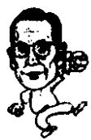

<!--
Stage 4A non-destructive cleaned source. Text comes from full-book MinerU Markdown.
JSON supplies page/block/layout evidence; DOCX supplies images only.
No translation, prose rewriting, OCR correction, factual correction, or unattended footnote recovery.
-->

<!-- FB-P092 | input-pdf-page=92 | printed-page=Unknown -->

<!-- FB-H-CH11 | source-page=FB-P092 -->
# 11 权利面前的两个人

<!-- FB-I024 | source-page=FB-P092 | json-block=1 | bbox=170:323:208:380 -->

<!-- CH11-P001 -->
李秉哲和郑周永在这一点上具有共同点，都是不屈服于任何压力，坚持自己的

<!-- FB-I025 | source-page=FB-P092 | json-block=3 | bbox=409:321:449:383 -->

<!-- CH11-P002 -->
只是李秉哲罗列一条条理由来说服对方，而郑周永性格倔强得像头牛，毫不退让。

<!-- FB-P093 | input-pdf-page=93 | printed-page=80 -->

<!-- CH11-P003 -->
1961 年 5 月 16 日早上 7 点。李秉哲要去打高尔夫球，他在东京帝国饭店前坐上车。

<!-- CH11-P004 -->
李秉哲每晚 10 点就寝，早上 6 点起床，6 点 40 分沐浴用餐后 8 点上班。他一生都是这个习惯。

<!-- CH11-P005 -->
那天也是在他起床后上班的事。

<!-- CH11-P006 -->
日本的司机桑原问道：“您听到韩国发生军事政变的新闻了吗？”

<!-- CH11-P007 -->
李秉哲到那个时候还一点也不知道。

<!-- CH11-P008 -->
听到突如其来的军事政变消息，尽管李秉哲心乱如麻，他还是继续前往高尔夫球场。

<!-- CH11-P009 -->
韩国爆发了5·16军事政变。军政府在政变后以非法敛财的嫌疑逮捕了11名商界人士。

<!-- CH11-P010 -->
根据企业的营业额，第一到第十一的11个人被认定是非法敛财。其中排在首位的就是李秉哲。但是李秉哲人在东京，暂时避免了被拘捕。

<!-- CH11-P011 -->
当时的舆论批评军政府对在日本“非法敛财第一人”李秉哲不闻不问，可是却把有一点罪过的抓进了监狱。

<!-- CH11-P012 -->
军政府派往日本两个人，督促李秉哲回国。了解首尔的形势后，李秉哲决定回国。

<!-- CH11-P013 -->
1961 年 6 月 24 日上午 10 点，他在日本的帝国饭店向美联社、合众社等外电记者发表声明：“为了消除贫困，我有意向把全部财产捐献给国家，回国后根据需要逐步地实现，等待政府的安排。”

<!-- CH11-P014 -->
到达首尔金浦机场的时候已是漆黑的深夜，下着倾盆大雨。

<!-- CH11-P015 -->
李秉哲想自己会被马上带去监狱，他坐上了一辆等待着他的吉普车。

<!-- CH11-P016 -->
车开足马力，可去的不是监狱，而是新世界百货商场的方向。他到的是明洞的麦得龙饭店，他在那里住了一夜。

<!-- CH11-P017 -->
父子情深，李秉哲的长子李孟熙担心父亲是否受到残酷的审问，整整一晚都在麦得龙饭店对面的建筑物用望远镜观察着父亲的一举一动。

<!-- FB-P094 | input-pdf-page=94 | printed-page=81 -->

<!-- CH11-P018 -->
第二天，李秉哲到了国家重建最高委员会的副议长办公室，见到了朴正熙。房间里弥漫着森严的气氛。朴副议长①给人的第一印象是非常刚直。

<!-- CH11-P019 -->
尽管李秉哲身在风雨飘摇中，他还是非常仔细地观察朴正熙是否是一个具有德望的领导人。

<!-- CH11-P020 -->
这天的会见，是大韩民国商界和政界两位最高人物之间的遭遇。

<!-- CH11-P021 -->
“您什么时候回来的？一切都好吧？”

<!-- CH11-P022 -->
出人意外的是朴正熙用非常柔和的口气询问李秉哲。

<!-- CH11-P023 -->
彼此简单的问候之后，朴正熙马上转入军人单刀直入的方式提问：“在您看来，应该如何处理非法敛财的11个人？”

<!-- CH11-P024 -->
非法敛财的 11 个人中有一个就是李秉哲，并且高居首位。

<!-- CH11-P025 -->
“我认为这些人并没有什么罪。”

<!-- CH11-P026 -->
李秉哲如实地按自己的想法回答朴正熙的问题。

<!-- CH11-P027 -->
朴正熙对于这个回答有些感到意外，脸阴沉了下来。

<!-- CH11-P028 -->
李秉哲继续往下说：

<!-- CH11-P029 -->
“就从我的情况来说，如果说我偷税，那么可以算我非法敛财。可是现行的税法规定要上缴销售额120%的税金。如果是按照这种方式纳税的话，就没有一家企业不破产了。如果有不破产的企业，那就一定是奇迹。”

<!-- CH11-P030 -->
尽管是在龙潭虎穴的军政府，在最高的领导人朴正熙面前，李秉哲也是毫不畏惧，摆出了自己的理论。

<!-- CH11-P031 -->
“每一家企业，都是为提高利润，扩大规模而努力。也就是说把企业经营得好，才进入了那11名当中。结果这成为了非法敛财，因为实力不足，或者机遇不佳，不算在11名里面的，这就说他们没有罪。我觉得不能以此作为判定的标准。”

<!-- FB-F017 | source-page=FB-P094 | marker=① | status=manual-review-required -->

<!-- FB-P095 | input-pdf-page=95 | printed-page=82 -->

<!-- CH11-P032 -->
在李秉哲看来，不是根据是否偷税漏税，挪用公款而定罪，却根据企业的排名，把第一到第十一的加上非法敛财的罪名这是非常可笑的。这一下子就指出了军政府政策的软肋。

<!-- CH11-P033 -->
朴正熙点点头，开口说：

<!-- CH11-P034 -->
“那么您觉得应该怎么做？”

<!-- CH11-P035 -->
“企业家要做的就是经营，提供就业机会，为国家纳税，扩大投资。如果要想培养出一个成功的企业家至少需要20至30年的时间。希望您能够充分利用并善待企业家。”

<!-- CH11-P036 -->
身为企业家的李秉哲在权利面前毫不退缩。紧张的气氛中，出现了长时间的沉默。

<!-- CH11-P037 -->
朴正熙说：“那样的话，国民会不答应的。”

<!-- CH11-P038 -->
李秉哲说：“如果对国家发展有好处，就要去说服国民，这不正是所谓的政治吗？”

<!-- CH11-P039 -->
对于如何处理企业家的话题就到此结束了。朴正熙问李秉哲是否以后还能见面以及他的住处。

<!-- CH11-P040 -->
李秉哲回答说正在麦得龙饭店遭到软禁，朴正熙表现出非常惊讶的神情。马上下令第二天释放所有关押的企业家。

<!-- CH11-P041 -->
李秉哲也于几天后的29日从麦得龙饭店出来获得自由。

<!-- CH11-P042 -->
郑周永也曾在1980年的春天，被传唤到刚刚建立的全斗焕集权军部。当时的新军部也是气氛森严。

<!-- CH11-P043 -->
那个时候，新军部以经济产业的再整合为名，进行企业的统一规划。

<!-- CH11-P044 -->
为此，“国保委”找来了现代的郑周永会长，还有他的弟弟现代汽车的经理郑世永，以及现代建设的社长李明博等人。

<!-- CH11-P045 -->
郑周永到了“国保委”，发现大宇集团的金宇中会长也已经被传唤到。“国保委”把两个人一起叫来的意思就是要进行汽车和重工业的整合。

<!-- FB-P096 | input-pdf-page=96 | printed-page=83 -->

<!-- CH11-P046 -->
也就是说，把金字中的大宇汽车和现代集团的昌原①重工业对调。在资本主义国家，企业双方存在买入售出企业的情况，可是绝没有由国家出面命令企业重组。

<!-- CH11-P047 -->
当时“国保委”的旗号是把大宇汽车并入现代汽车，现代的昌原重工业并入大宇重工业，由此来提高整个行业的竞争力。

<!-- CH11-P048 -->
“国保委”的负责人解释说明之后，以郑周永肯定会同意的口气问道：“郑周永会长同意这个方案吧？”

<!-- CH11-P049 -->
郑周永用一句话做答：“我不同意。”

<!-- CH11-P050 -->
“国保委”是什么样的地方？他们对谁不满意都能够逮捕。那些从80年代走过来的人都知道当时“国保委”造成的恐怖气氛。

<!-- CH11-P051 -->
在那里怎么可以说不同意？

<!-- CH11-P052 -->
只有郑周永才敢说的话。

<!-- CH11-P053 -->
“国保委”负责人的脸色一下子变了。表情里透出对郑周永的质问：现在国家正处于非常时期，谋求改革，你怎么敢随便说这种话？

<!-- CH11-P054 -->
可是郑周永就是郑周永：

<!-- CH11-P055 -->
“或许我的话有些长，但请您听下去。我创业至今都是从选择厂址开始一点一滴地建设我的事业，从来没有过因为经济不景气出售过一家我的公司，也没有一家公司破产。”

<!-- CH11-P056 -->
面对郑周永这种坦然的态度，“国保委”的负责人怒斥道：“你到底把‘国保委’看成是什么地方了？说的什么话？”

<!-- CH11-P057 -->
作为一种优待，“国保委”让郑周永从重工业和汽车中选择一样。

<!-- CH11-P058 -->
“国保委”的负责人让郑周永先选择一样，剩下的交由金宇中，以赋予优先权向他施压。

<!-- CH11-P059 -->
郑周永坚决不同意，进行抗争。

<!-- FB-F018 | source-page=FB-P096 | marker=① | status=manual-review-required -->

<!-- FB-P097 | input-pdf-page=97 | printed-page=84 -->

<!-- CH11-P060 -->
结果“国保委”采取了各个击破的战术，把郑周永，郑世永，李明博带到不同的房间进行威胁。

<!-- CH11-P061 -->
经历了艰苦卓绝的你来我往后，郑州永要求给两个星期的考虑时间，可“国保委”只给了他一个星期的时间。

<!-- CH11-P062 -->
几天后，在阿岘洞某个地方，郑周永和国保委的委员长全斗焕会面，他见的是最高的统治者。

<!-- CH11-P063 -->
碍于全斗焕冗长的说明，郑周永最终决定放弃昌原重工业，而选择大宇汽车。

<!-- CH11-P064 -->
、可是最终的结果是：昌原重工业归大宇所有，大宇汽车仍归大宇集团。

<!-- CH11-P065 -->
郑周永惨败。

<!-- CH11-P066 -->
在军政府面前郑周永只有这样的结果。他在龙潭虎穴的新军部里能够说出自己想说的话，最终寡不敌众而已。在遇到革命的时候，企业家总是要败的。

<!-- CH11-P067 -->
由于对郑周永的态度十分不满，新军部要郑周永卸去“全经联①”会长一职。

<!-- CH11-P068 -->
那个时候，郑周永说：“我做会长是会员们选举出来的，不能随便辞去”，他拒绝了这一要求。最终，新军部对郑周永无可奈何。郑周永继续担任“全经联”的会长。

<!-- CH11-P069 -->
李秉哲和郑周永在这一点上具有共同点，都是不屈服于任何压力，坚持自己的主张。

<!-- CH11-P070 -->
只是李秉哲罗列一条条理由来说服对方，而郑周永性格倔强得像头牛，毫不退让。

<!-- FB-F019 | source-page=FB-P097 | marker=① | status=manual-review-required -->
