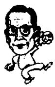

<!--
Stage 4A non-destructive cleaned source. Text comes from full-book MinerU Markdown.
JSON supplies page/block/layout evidence; DOCX supplies images only.
No translation, prose rewriting, OCR correction, factual correction, or unattended footnote recovery.
-->

<!-- FB-P120 | input-pdf-page=120 | printed-page=Unknown -->

<!-- FB-H-CH14 | source-page=FB-P120 -->
# 14 Pony（小马）汽车和东洋电视台

<!-- FB-I030 | source-page=FB-P120 | json-block=1 | bbox=165:327:202:385 -->

<!-- CH14-P001 -->
我不知道别人是不是将我当成经营着一个世界级大企业的资本家来凭价，我从

<!-- FB-I031 | source-page=FB-P120 | json-block=3 | bbox=404:323:444:387 -->

<!-- CH14-P002 -->
不认为我自己是资本家，我只是一个富有的劳动者而已，一个通过劳动来创造财富的劳动者而已。

<!-- CH14-P003 -->
——郑周永

<!-- FB-P121 | input-pdf-page=121 | printed-page=108 -->

<!-- CH14-P004 -->
从平凡走向辉煌

<!-- CH14-P005 -->
1967 年的新年，政府把新年的出口目标定为 3 亿美元。当时一杯咖啡 40 韩元，一斤牛肉 200 韩元。

<!-- CH14-P006 -->
朴正熙总统的年初国情咨文的标题是：“全面向工业国家迈进”，如同军队檄文题目，宣告准备向工业国家进发。这表明韩国也要生产出高附加值的产品向国外出口。

<!-- CH14-P007 -->
说起来是后话了，按照朴正熙总统设计的路，20年后的1987年，韩国的电子产品出口额达到100亿美元，1992年达到200亿美元。

<!-- CH14-P008 -->
朴正熙总统 1967 年发表电子工业强国宣言 25 年后，韩国电子产品出口额累积已经达到 1330 亿美元，终于成为电子工业强国。

<!-- CH14-P009 -->
那年的4月份，李秉哲的韩国蔚山肥料工厂竣工，5月份，韩国第六届总统选举，朴正熙以超出在野党候选人金大中110万票的票数再次当选。另外，在那一年，第一次公布了韩国全国寄生虫感染的报告，表明全国国民80%的人感染了蛔虫、鞭虫、条虫等11种寄生虫。在这一年还有一件奇异的事情，就是忠清南道九凤矿山的矿工杨昌善在被埋16天后获救。当时的救援事件通过电台广播，韩国全国的人都在为杨昌善紧张，后来这个事件被排成了话剧《脱险记》。

<!-- CH14-P010 -->
当时有新的事情等待着郑周永。那年的2月份，现代汽车成立，郑周永开始涉足汽车领域。

<!-- CH14-P011 -->
对于郑周永从事汽车生产业的背景众说纷纭。1943年，郑周永27岁的时候，开办了阿道汽车修理厂，这可以算作是一个理由。建筑业别人总是欠账，资金不能及时周转，而汽车业却能够是 $100\%$ 的现金交易，有人认为这也是原因。

<!-- CH14-P012 -->
“建筑业由于资金拖欠，不能再干，汽车是现金交易，所以需要从事汽车制造业。”这是郑周永对时任汽车工业协会理事长的尹准模说的话。

<!-- CH14-P013 -->
郑周永在很早的时候就积累了相当多关于汽车的知识，汽车出了毛病，他甚至可以打开机器盖儿，查出到底出了什么毛病。但是制造汽车和修理汽车是完全不同的。汽车内部由2.5万个零部件构成，如果想要生产，则需要具备能够直接生产其中大部分零部件的能力。当时在韩国，只有“新进工业”和“新国家汽车（株）”在生产汽车。

<!-- CH14-P014 -->
“新进工业”在1964年生产了215辆汽车，1965年生产了106辆，到了1966年，由于接受了日本丰田汽车的技术扶持，生产出了3117辆。当时大部分的汽车零部件都是从国外进口的。那时，“新国家汽车（株）”经历了磕磕绊绊之后， $100\%$ 进口日本尼桑汽车生产的蓝鸟汽车零部件组装，实际和日本产汽车没有什么区别。其余的汽车，说得极端一点，只有外壳是韩国生产的。

<!-- FB-P122 | input-pdf-page=122 | printed-page=109 -->

<!-- CH14-P015 -->
1966 年，韩国汽车的国产率是 21%，除了轮胎和电池外，都是些小部件。当时韩国几乎不具备生产汽车零部件的能力。

<!-- CH14-P016 -->
当时美国的福特公司想要打入韩国的汽车市场。那年的4月，美国福特汽车公司担任国际事务的副总经理来到韩国洽谈。当时的现代，连和福特公司洽谈的资格都没有获得。因为从福特的角度来看，现代不过是一家和汽车毫无关系的建筑公司。福特公司代表和韩国几家汽车企业接触后回了美国。

<!-- CH14-P017 -->
郑周永的弟弟郑仁永当时正在为丹阳 $^{①}$ 水泥厂的扩大在美国争取贷款，郑周永指示他和福特公司缔结技术合同之后回国，这是一个十分突然的指示。

<!-- CH14-P018 -->
郑仁永前往福特汽车公司，先介绍了郑周永曾经经营过汽车修理厂，之后说服了他们同现代进行洽谈。福特公司同意把现代加入洽谈对象的名单中。为了选择合作伙伴，福特公司随后进行了细致的调查，甚至动用了驻韩美国大使馆情报机关的力量。调查结果表明，现代和郑周永的信用度排名第一。

<!-- CH14-P019 -->
福特公司方面再次派负责国际事务的副经理来到韩国进行面谈。这次和郑周永的会谈时间预期为四天。可是会谈只进行了两个小时就结束了。因为郑周永对汽车的发动机构造，从变速器到制动器，一万多个零部件的名称都一一进行了说明，美方代表感觉到没有再多考察的必要了。

<!-- FB-F025 | source-page=FB-P122 | marker=① | status=manual-review-required -->

<!-- FB-P123 | input-pdf-page=123 | printed-page=110 -->

<!-- CH14-P020 -->
福特方面到韩国的第二天就和现代汽车签署了技术支持协议，当时的合资比例是现代占21%，福特占79%。郑周永随后在蔚山开始建设现代汽车厂。

<!-- CH14-P021 -->
福特公司创建三年后生产出第一辆汽车，而现代只用了一年就生产出了最早的考蒂纳（CORTINA）汽车，那是在1968年。

<!-- CH14-P022 -->
考蒂纳汽车生产出来后马上投入市场，广告模特是电影演员夏明中①。随后，生产出了卡车和公共汽车，也就是福特20M及福特R-192公共汽车。

<!-- CH14-P023 -->
郑周永一边经营汽车，一边考虑尽早摆脱进口福特的零部件，实现汽车国产化。当时韩国汽车部件的30%是国产的，可是主要的零部件都是依靠进口。实现零部件国产化不但对国家有利，而且对郑周永本人也是非常有好处的。因为当时进口零部件的价格占车价的70%，而组装的费用不过占9%。从郑周永的角度来看，如果实现部件国产化，经济上的收益将会更大。所以郑周永对此非常关心。可是福特汽车方面只对韩国组装汽车感兴趣，韩国汽车零部件的国产化是他们不愿意看到的，他们只想付出9%的组装费。

<!-- CH14-P024 -->
郑周永在协议期限一结束就向福特公司方面提出要将合资资金的比例由原来的21%对79%提升为50%对50%。福特公司接受了这个建议。

<!-- CH14-P025 -->
可是，得到什么时候才能实现零部件国产化呢？郑周永很想生产出大部分零部件都是出自韩国的汽车，然后通过福特的销售网经销现代产的汽车。可是，要想操作起来非常困难。

<!-- FB-F026 | source-page=FB-P123 | marker=① | status=manual-review-required -->

<!-- FB-P124 | input-pdf-page=124 | printed-page=111 -->

<!-- CH14-P026 -->
发动机是汽车最主要的组成部分，生产发动机是和生产汽车紧密相联系的。福特不可能传授生产发动机的技术秘密。现代和福特就开办发动机工厂问题坐到了谈判桌前，谈判气氛非常紧张，最终只谈到了财务、出口和经营等问题，根本没有涉及实质的内容。

<!-- CH14-P027 -->
郑周永不想继续同福特合作了。因为他已经看到了福特这个跨国公司的本质。福特从来不想向现代提供出口的销路，甚至连帮助现代的想法都没有。

<!-- CH14-P028 -->
那么该怎么办？郑周永决定通过自行开发技术，独立研制生产出自己的汽车，哪怕要花时间和经费。他认为那是突破韩国狭小的国内市场，开拓海外市场的惟一方法。100%的国产汽车。郑周永又开始了一次挑战。

<!-- CH14-P029 -->
可是如果在当时想要和进口的外国车竞争，必须具备年产5万辆的能力和1亿美元的投资，这在当时来说是一个天文数字。所有的下属都因为风险强烈反对。

<!-- CH14-P030 -->
因为当时的现代建设一整年的营业额不过50亿韩元，现代汽车的资金不过17亿韩元，韩国全年不过生产2万辆汽车。下属们的反对是有道理的。

<!-- CH14-P031 -->
何去何从？在这类问题上，郑周永总是选择冒险的一面。不甘于静坐等待，而更喜欢向前冲解决问题。

<!-- CH14-P032 -->
在这点上，他常常喜欢说一句话：“尝试过再说。”

<!-- CH14-P033 -->
当时，韩国政府从政策上大力扶持化学重工业。根据政府的分析，要想生活得更好，比起轻工业，应该着重发展重工业。当时化学重工业的总指挥是青瓦台经济方面二号人物吴原哲。

<!-- CH14-P034 -->
政府把汽车工业作为发展化学重工业的一环，公布了对汽车产业的政策，提出要大量生产小型汽车的计划。政府之所以对大量生产汽车如此关心是因为韩国每年进口汽车零部件花去了大量美元。1966年，用于进口汽车零部件的支出是329万美元，1967年增长三倍达到913万美元，1968年2298万美

<!-- FB-P125 | input-pdf-page=125 | printed-page=112 -->

<!-- CH14-P035 -->
元，1969年为4258万美元。如滚雪球一样，三年的时间里增长了13倍，

<!-- CH14-P036 -->
当时的美元非常宝贵，就连公务员到其他国家出差，都要由朴正熙总统直接从保险柜里支取美元。所以，面对日益提高的汽车零部件进口费，政府再也坐不住了。政府大量生产汽车的计划就是在这样的背景下酝酿出来的。现代提出了以独资的形式年产五万辆的计划书。当时韩国国内汽车总数不过17万辆，在这种情况下，即使每年能够生产出五万辆，卖给谁呢？

<!-- CH14-P037 -->
现代几年前和福特合作生产出的考蒂纳汽车，在当时每个月不过能售出500辆左右。那么五万辆的话……

<!-- CH14-P038 -->
现代提交年产五万辆的计划书在当时是很出人意料的，可是郑周永却不这么想，他认为五万辆不过是最基本的数字，因为他已经看出国内市场狭小，他已经把目光投向了海外市场。

<!-- CH14-P039 -->
韩国政府出自工业强国的角度，对汽车生产予以扶持，答应提供最大限度的税金减免。借这个机会，郑周永定了四点方针，推出了年产五万辆汽车的汽车工厂建设计划书。他特有的倔强性格又一次得到发挥。

<!-- CH14-P040 -->
1. 开发已有的汽车，以出口产品作为主要的开发对象。

<!-- CH14-P041 -->
2. 不接受外国企业的资本援助。

<!-- CH14-P042 -->
3. 建设汽车工厂，生产的汽车完全实现国产化。

<!-- CH14-P043 -->
4. 工厂的规模按照具有国际竞争水平的标准来建立。

<!-- CH14-P044 -->
他把和福特合作时候的感受全部写到了方针里面。特别是不接受外国企业的资本援助的第二条。郑周永开始着手准备工作。

<!-- CH14-P045 -->
1973 年 9 月，新汽车的设计以 100 万美元的价格交付给一家意大利的设计公司，内部设计是乔治亚男，车体设计是曼托凡尼。乔治亚男是位奇才，曾经为联邦德国的大众公司设计了高尔夫、帕萨特、海风（Scirocco）、意大利的阿尔法－罗密欧，日本的五十铃等，被人称为米开朗基罗第二。发动机是和英国 BLMC 签署的协议。

<!-- FB-P126 | input-pdf-page=126 | printed-page=Unknown -->

<!-- CH14-P046 -->
郑周永决心完全独资生产出自己的汽车，于1974年1月正式开始建厂，一座年产汽车5.6万辆的大规模汽车制造工厂。他完全投入到了国产车的开发中。

<!-- CH14-P047 -->
听到现代生产汽车的消息之后，GMK（大宇汽车的前身）的首席副经理（H.W. 本基）笑着说：“现代用固有的模式开发生产汽车是根本不可能的。”他的话并非没有道理。欧洲和美国的汽车制造技术已经拥有了近百年的历史，绝非一日之功。以现代的历史要想生产汽车并出口汽车，难免引人发笑。

<!-- CH14-P048 -->
1974 年 10 月 30 日现代在都灵国际汽车博览会上第一次展出了独立研制的产品 Pony 和跑车型 Pony。都灵国际汽车博览会是全世界新车亮相的地方。Pony，也就是小马，这个名字是通过公开征名确定的。博览会上，福特、奔驰、雪铁龙、标志、丰田、本田、菲亚特、莫斯科维奇等 16 个国家的 65 家公司共展出了 245 辆汽车。首次出品亮相的 Pony 在那里意外地获得了极高的人气。300 余位记者和汽车专家为看 Pony 蜂拥而至。参加博览会的郑周永的弟弟郑世永（前现代汽车社长）接受采访，应接不暇。

<!-- CH14-P049 -->
Pony 之所以能够获得如此众多的瞩目是因为设计优良，属于节能型的经济用车；另外还因为是韩国自行生产出的第一款汽车。由此，韩国在亚洲成了继日本之后，世界上第 16 个具有自行生产汽车能力的国家。

<!-- CH14-P050 -->
在海外获得了好评的 Pony，在国内市场也受到了大众的瞩目。上市的第一年就把 GMK 的卡米纳，起亚的贝丽莎甩在后面，占领了市场的 43%。那年的 6 月首次向厄瓜多尔出口了六辆，从此走向世界。之后，又开拓了非洲和中东市场。第一年出口了 1 万辆。到了 70 年代末，韩国的汽车市场急速发展。从原来的年产五万辆增加到年产 10 万辆。

<!-- CH14-P051 -->
到了 1982 年，开发出了 Pony2。Pony2 一上市，在国内就售出了四万辆。郑周永开始把目光投向加拿大。1983 年 11 月，1500 辆 Pony2 运往加拿大。突然之间订单增加。这是因

<!-- FB-P127 | input-pdf-page=127 | printed-page=114 -->

<!-- CH14-P052 -->
为价格便宜、性能优良的缘故。第一年向加拿大售出了2.5万辆，第二年，即1986年，售出了八万辆。原本由日本掌握的加拿大市场被Pony2占据了首位。

<!-- CH14-P053 -->
现代又把目光投向了汽车王国美国。1985年已经在美国设立了销售法人，以此来构筑全美地区的销售网，采取大规模的推销活动。现代在美国三大电视台以“和谐之车”的醒目标题打出广告。这以前，电视上几乎从来没有出现过韩国企业的广告。在美韩侨兴奋异常。都以为自己祖国的经济还在步履蹒跚地前进，没有想到居然能够在美国的电视上看到韩国的汽车广告，看到韩国产的汽车打入美国市场，很多人甚至激动地流下了眼泪。

<!-- CH14-P054 -->
6·25 战争后依靠援助物资生活的穷国，居然可以生产并出口汽车。美国人也都用惊异的目光注视着韩国。

<!-- CH14-P055 -->
打入美国市场后四个月，销量就突破了五万辆。第一年，即1986全年共售出17万辆。

<!-- CH14-P056 -->
那一年，现代的 Excel 车销量处于日本的日产和本田之后，居第三位。1987 年现代 Excel 车在美国售出了 26 万辆。日产 24 万，本田 17 万辆，Corona 销售了 12 万辆。此后，现代在美国汽车的占有率上一直保持着 5% 的份额。

<!-- CH14-P057 -->
时至今日，韩国每年向美国、日本、德国、法国出口300万辆以上的汽车，成了世界第五大汽车生产国家，已经赶超了最开始制造汽车的英国和意大利。韩国，成了汽车大国。在这方面，郑周永功不可没。

<!-- CH14-P058 -->
郑周永乘坐小型飞机在韩国半岛的上空盘旋。他手里拿着望远镜，用它俯视着韩国的山河。他从首尔出发，无数次往返于大田、荣洞、金泉、大邱、釜山的上空。这都是为了京釜高速公路的工程。

<!-- CH14-P059 -->
这条准备连接首尔和釜山长达429公里的高速公路是国家的一个重大项目。朴正熙总统为了实现韩国的第二个经济开发计划，决定修建京釜高速公路。

<!-- FB-P128 | input-pdf-page=128 | printed-page=115 -->

<!-- CH14-P060 -->
朴总统一直很关心高速公路。1964年应联邦德国总统海因里希·吕布克的邀请，朴正熙总统访问联邦德国，曾经往返于波恩到科隆的20公里的奥图班（高速公路）。那时，朴总统曾经两次要求在半路停车，下车来考察路面、隔离带和公路交叉点等，并且仔细询问德国的陪同官员有关高速公路的事宜。幸运的是那位官员是经济学家出身，对高速公路了解得很多。他展开地图向朴正熙总统详细说明联邦德国的高速公路网。“德国的高速公路网是以西柏林为中心，向全国辐射，30分钟之内可以到达任何一个地方。”朴正熙总统详细地询问了修建高速公路的管理方法，工程所需时间，筹募资金的办法，需要投入的设备和人员等问题。

<!-- CH14-P061 -->
在他和德国总理艾哈德会谈的时候再次提到了奥图班问题。艾哈德总理在联邦德国经济复苏——出现“莱茵河奇迹”时担任经济部长，是一位非常有名的总理。艾哈德总理说到奥图班对于德国经济的发展起到了巨大的作用，并且说每次途经奥图班就会从心里油然产生对高速公路的敬意。朴正熙总统完全理解和认同艾哈德总理的感受。

<!-- CH14-P062 -->
当时的韩国，在朴正熙总统访德之前，正因为交通运输跟不上，经济增长和物价水平受到不良的影响。朴正熙总统感觉到要想实现高速的经济发展，就必须建设高速公路。

<!-- CH14-P063 -->
随后，政府就建设高速公路发表了以下见解：

<!-- CH14-P064 -->
1. 首尔、京畿道、忠清道、庆尚道的人口占韩国的63%，首尔至釜山这一带占国民生产总值的66%，工业生产总值的81%，修建京釜高速公路的目的在于联接这些地区，提供交通便利，为经济增长提供必要的条件。

<!-- CH14-P065 -->
2. 当时韩国 81% 的汽车行驶在首尔至釜山地区的道路上。

<!-- CH14-P066 -->
3. 首尔至釜山的铁路运输负担很重，应该通过公路运输来缓解压力。

<!-- CH14-P067 -->
4. 釜山、仁川两个港口城市担当了韩国 55% 的海运，通过高速公路连接两地，可提高进出口的有效性。

<!-- FB-P129 | input-pdf-page=129 | printed-page=116 -->

<!-- CH14-P068 -->
然而，修建公路比想像的要投入更多的经费。从日本连接东京和名古屋之间的京名高速公路来看，每公里投入了8亿元，如果以此来计算的话，首尔至釜山之间438公里（当时的推测距离）需要3500亿元的投资。这个数字比当时一年国家预算1643亿元的两倍还要高，也就是说工程耗费巨大，让人望而生畏。可是又无法放弃。

<!-- CH14-P069 -->
那么，如何能以低廉的造价造出高速公路呢？为了计算出京釜高速公路到底需要多少费用，朴正熙总统把曾经在泰国修建过公路，并在越南也做过工程的郑周永召唤到了青瓦台。另外他还向各个政府部门下达了同样的指示，要求各个部门计算出京釜高速公路需要的工程费用。

<!-- CH14-P070 -->
因为从来没有过修建告诉公路的经验。建设部估算的结果是650亿元，首尔市政府估算180亿元，陆军工兵参谋室估算为490亿元，现代建设估算为380亿元，经济企划院放弃计算，财务部估算为330亿元。

<!-- CH14-P071 -->
由于郑周永具有在泰国修建高速公路的经验，所以他有信心计算出所需的资金。他通过1：50000比例的地图观察了地形之后，直接乘坐小型飞机前往现场勘查，判断出施工不存在太多困难。当时手里还有从泰国拿来的工程示意书。

<!-- CH14-P072 -->
朴正熙总统拿到这些参差不齐的报价，把最低180亿元和最高的650亿元中间的315亿元和380亿元进行了比较，最后判断300亿元比较符合实际。另外，在此基础上加了10%的后备资金，一共是330亿元。这是日本京名高速公路费用的1/10。

<!-- CH14-P073 -->
一公布要修建高速公路，各种批评纷纷而至：政策向有钱人倾斜；政府只关心庆尚道的经济发展；是否为时尚早，等等。做大事时总会意见不统一，众说纷纭的。可是，这些都没有动摇朴正熙总统修建高速公路的意志。因为当时韩国的货运正在日益增大，这时候需要一条交通大动脉为经济的发展服务。郑周永也有同感。郑周永有在泰国和越南施工的经验，朴

<!-- FB-P130 | input-pdf-page=130 | printed-page=117 -->

<!-- CH14-P074 -->
正熙总统非常信任他。

<!-- CH14-P075 -->
参加工程的有三焕、大林、三扶、极东等13家建筑公司。现代建设负责全部429公里中的133公里。是从首尔到乌山的105公里，从大田到沃川的28公里。负责的部分大概是全长的2/5，但是从大田到沃川的地段是京釜高速公路施工最为困难的一段。

<!-- CH14-P076 -->
1968 年 2 月 1 日，在京釜高速公路的第一个收费站附近传来了爆破声。那是工程的开工典礼。朴正熙总统和郑周永都非常兴奋。

<!-- CH14-P077 -->
郑周永决心：开工后用最短的时间完成工程，绝不出现质量低下的工程。因为工程款紧张，所以不得不在最短的时间内完成。

<!-- CH14-P078 -->
京釜高速公路一开工，郑周永亲临现场，住在工地监工。由于工程的战线长，巡视下来常常会睡眠不足，他就在颠簸的吉普车上闭会儿眼。

<!-- CH14-P079 -->
京釜高速公路最为艰难的地段是沃川的隧道工程。因为沃川面①寿山里和永同郡蓉山面庙金里之间的4公里坐落着小白山脉。需要从小白山脉穿过去，开凿一条隧道。挖掘了20米左右，一下子塌方了。事发突然，连逃跑都来不及。那个地方的地质属于非常松软的泥土层，很容易塌方。塌方导致3名民工死亡，一名受伤。山上常有石头落下。有的时候地下水能像喷泉一样涌出，把挖隧道的工人们冲走。工程的进度一天不过2米，地形不好的时候不过30厘米。

<!-- CH14-P080 -->
工程是艰苦卓绝的。这一段又是全部工程中最艰苦的一段。距离工期结束只剩两个月了，隧道的全部工程上行线共590米，下行线共530米，上行线还有240米需要挖掘。如果按一天2米的速度计算，需要挖120天。工程陷入困境。

<!-- CH14-P081 -->
建设部部长每周都从首尔亲临工程现场，土建局局长每四天过来一趟，郑周永干脆就住在了工地。因为朴正熙总统不断督促，始终在焦急地等待消息。

<!-- FB-F027 | source-page=FB-P130 | marker=① | status=manual-review-required -->

<!-- FB-P131 | input-pdf-page=131 | printed-page=118 -->

<!-- CH14-P082 -->
郑周永做出了决定。这个时候不能再考虑公司是否有利润了，最重要的是尽快完成工程。只要是工程所需的设备，不问价格高低一律购进。一共购进了总值800万美元的重型装备。当时韩国的重型装备一共是1400台，郑周永为了完成高速公路的工程购进了1900台。买人的新型设备越多，公司的收支就会越不平衡，但是已经不是考虑这些的时候了。终于，本来需要三个月的工程用了25天就完成了。

<!-- CH14-P083 -->
1970 年 6 月 27 日晚上 11 点，在隧道的南端，“万岁”的声音响彻云霄。京釜高速公路的最后一段，难度最大的一段隧道终于打通。这段工程一共历时 290 天，由此全长 429 公里的京釜高速公路终于全线竣工。429 公里的公路共投入了 429 亿元。相当于 1 公里 1 亿元。虽然比政府最初 330 亿元的预算多出了 100 亿元，但不过是日本的京名高速公路投入的 1/8 而已。

<!-- CH14-P084 -->
1970年7月7日，开工两年零五个月后，京釜高速公路竣工。世界上最低的造价，最快的时间内完成的工程，累计共投入了900万人，165台设备。在竣工典礼上，朴正熙总统，各部的部长、副部长，各施工公司的代表以及工程现场指挥全部到场。朴正熙总统向这些工程现场的指挥们授勋。指挥们不住地流泪，为了这条公路，两年来风雪无阻，始终把生命安危置之度外。特别是郑周永现代建设负责的隧道工程，前后共出现了13次的塌方，很多人失去了生命。

<!-- CH14-P085 -->
朴正熙总统也是感慨万千。他把香槟酒洒到公路的路面上，向施工人员表示谢意。

<!-- CH14-P086 -->
为了这条国家的交通大动脉，共有77人失去了生命。这条路，是用韩国人的血和汗，乃至生命，以及许多像郑周永一样的企业家的精神建出来的。在秋风岭一段高速公路的纪念碑上有这样一段话：“这是穷我国之财力、物力、人力建造出的高速公路，在世界高速公路的建筑史上用最短时间建成的公路。”

<!-- FB-P132 | input-pdf-page=132 | printed-page=119 -->

<!-- CH14-P087 -->
由此，韩国人的距离大大拉近。实现了在首尔吃过早餐，可以到釜山去吃午餐的神话。这对于那个年代的人来说本来是不可想像的一件事情。因为那之前从首尔到大田坐公共汽车还需要八个小时。

<!-- CH14-P088 -->
京釜高速公路工程的完工，郑周永和现代功不可没。的确如此，他们负责的是全部公路的1/3，并且还担负了全程施工最为艰难的路段。

<!-- CH14-P089 -->
通过这件事，韩国社会“只要做，就一定能行”的自信大大加强。原本定在1980年的出口额100亿美元，人均收入1000美元的目标提前了两年完成。

<!-- CH14-P090 -->
通过成功修建京釜高速公路，郑周永赢得了政府的绝对信任。之后，韩国政府的发电站、大坝和各种基础设施的工程都在等待着他。

<!-- CH14-P091 -->
李秉哲在 1965 年创办了《中央日报》，于 1966 年创办了东洋电视台。

<!-- CH14-P092 -->
当时在西小门建设的《中央日报》，东洋电视台的建筑物共有五层。现在想起来，尽管是一座五层的楼，在当时却是最漂亮、汇聚了尖端技术的建筑。

<!-- CH14-P093 -->
在 20 世纪 60 年代中期的时候，站在西小门的大街上，看着两边的建筑群，很多韩国人都涌起一股自豪的感情。

<!-- CH14-P094 -->
外国的总统来韩国访问的时候，学生们会到道路两边，手晃太极旗和对方国家的国旗，表示对对方国家元首来到韩国访问的热烈欢迎。那个时候，学生们最多去的地方就是西小门大街。

<!-- CH14-P095 -->
每当外国的总统和朴正熙总统乘坐的专车驶入西小门大街的时候，学生们都会一起晃动两国的国旗，从屋顶往下洒欢迎的彩纸屑。笔者也曾经有过去欢迎德国吕布克总统等国家元

<!-- FB-P133 | input-pdf-page=133 | printed-page=120 -->

<!-- CH14-P096 -->
首，晃动小国旗的经历。

<!-- CH14-P097 -->
大韩民国高层建筑物最多的一条路就是西小门。就是在西小门，东洋电视台建成了。

<!-- CH14-P098 -->
东洋电视台，也就是 TBC 的建立，改变了韩国广播电视的局面。因为当时的韩国除了 KBS $^{①}$ 之外，再无其他的电视台。由于只有一家电视台，观众们没有可以选择的空间。

<!-- CH14-P099 -->
从 TBC 压倒性的收视率来看，节目是非常吸引观众的。当时 TBC 的人气节目之一是《秀秀秀》节目。现在已经去世了的郭奎锡，当时他主持的《秀秀秀》是在周六播出，当时万人空巷，都在家里电视机前看这个节目。那个时候电视机还非常少，一到了播放有意思电视节目的时候，全都聚到有电视机的人家去看电视。

<!-- CH14-P100 -->
从东洋电视台建立的1966年开始，韩国的电视机大幅度增长。曾经参加过越南战争的军人和技术工作者回国后带来了美国产的天擎或混频电视机，日本的三洋电视机。当电视里转播金基洙拳击比赛或金一摔跤比赛的时候，有电视机的家庭就会变得人山人海，小区里的人都会过来观看。可是，当时即使是在首尔，一个小区里有电视机的也不过一两家而已。看不到电视节目的孩子们都到“电视店”去看。当时有“电视店”，花两三元钱就可以看到金基洙拳击比赛和金一摔跤比赛。每当有比赛的时候，“电视店”也会拥挤不堪。

<!-- CH14-P101 -->
当时东洋电视台的节目除了《秀秀秀》以外，还有几个热门节目：《蓝眼睛的儿媳妇》，《穿草鞋来》，《思母曲》，等等。

<!-- CH14-P102 -->
之后，1969年韩国文化电视台开办后，收视率的竞争更加激烈。但是东洋电视台的收视率仍居首位。

<!-- CH14-P103 -->
在开办东洋电视台的前一年，李秉哲创办了《中央日报》。《中央日报》的创办，也是报业的一次前进。

<!-- FB-F028 | source-page=FB-P133 | marker=① | status=manual-review-required -->

<!-- FB-P134 | input-pdf-page=134 | printed-page=121 -->

<!-- CH14-P104 -->
当郑周永在京釜高速公路为国家的建设奋斗的时候，李秉哲正在文化产业方面前进。

<!-- CH14-P105 -->
装运着李秉哲的白糖、毛纺织品等生活必需品的卡车也在郑周永修建的公路上奔驰。

<!-- CH14-P106 -->
当时的韩国热火朝天。高速公路已经修好，另一方面船舶、钢铁等重工业也需要开始上马，生产人民生活所需的必需品的轻工业也需要发展。

<!-- CH14-P107 -->
日本在 1868 年的时候有明治维新，之后在长崎修建制铁工厂的同时，在神户等地也修建了纤维纺织业，也就是同时发展轻重工业。以此为模板，韩国也是两边齐头并进。

<!-- FB-P135 | input-pdf-page=135 | printed-page=Unknown -->

<!-- TODO(QA): parser/instruction leakage candidate; preserve pending visual review. -->

<!-- CH14-P108 -->
The OCR result should be empty, as the image contains only a stylistic horizontal line which must be ignored according to Rule 2. No text or placeholder characters should be output.
