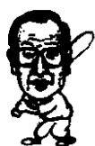
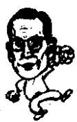

<!--
Stage 4A non-destructive cleaned source. Text comes from full-book MinerU Markdown.
JSON supplies page/block/layout evidence; DOCX supplies images only.
No translation, prose rewriting, OCR correction, factual correction, or unattended footnote recovery.
-->

<!-- FB-P162 | input-pdf-page=162 | printed-page=Unknown -->

<!-- FB-H-CH17 | source-page=FB-P162 -->
# 17 先想后做和先做后想

<!-- FB-I036 | source-page=FB-P162 | json-block=1 | bbox=166:321:204:379 -->

<!-- CH17-P001 -->
把“事业”看成是围棋的话，李秉哲是布局的高手。他从一开始就设计好企业的蓝图一步步前进，很少有大的失误。

<!-- FB-I037 | source-page=FB-P162 | json-block=3 | bbox=405:320:445:383 -->

<!-- CH17-P002 -->
而郑周永则是那种从一开始就进攻的类型。他喜欢冒险。胜则完胜，败则惨败。

<!-- CH17-P003 -->
布局高手李秉哲基础牢靠，而进攻高手郑周永后劲十足。

<!-- CH17-P004 -->
所以从事业上来看，李秉哲很少有失败的时候。而郑周永初期显得力量薄弱，随着时间的推移则越来越强，直至成功。

<!-- FB-P163 | input-pdf-page=163 | printed-page=150 -->

<!-- CH17-P005 -->
李秉哲在经营企业过程中凡事都喜欢做周详的事前调查，之后再开始。而郑周永，正如在朱拜勒港工程中体现出来的，他倾向于用独一无二的想像力和突破力、超强的魄力实现自己的目标。

<!-- CH17-P006 -->
李秉哲比起想像力来，更倾向于逻辑思维能力，比起突破力来更倾向于慎重。

<!-- CH17-P007 -->
1975 年 5 月，李秉哲在《首尔经济新闻》上的“商界回眸”栏目发表文章，总结自己办企业的心得。

<!-- CH17-P008 -->
“办企业的着眼点首先要放在国家和人民是否需要，之后再考虑收益、资金、人力、技术等，做自己力所能及的事情。”

<!-- CH17-P009 -->
这就是李秉哲的企业观。就像他自己说的一样，在开始做事之前总是喜欢深思熟虑，反复考察。制好了蓝图之后再去实现。他勾勒企业前景的能力是非凡的。他知道如果蓝图不设计好，企业的整体都会受到影响的。

<!-- CH17-P010 -->
“在经营过程中，最为重要的是事前的准备和企划。如果是因为事先没有考虑周全，使得资金周转陷入窘境，销路受阻，那只能说是经营者缺乏能力。我本人在不动产方面蒙受损失，就是因为未能从一开始就‘经营’好。还有一点就是应该知道自己能力的范围，不应该超越这个范围。”

<!-- CH17-P011 -->
李秉哲说的是当时如果已经知道经营的真谛，就不会做那些冤枉的投资。他的理论是：如果一开始就没有筹划好资金的计划和销售的计划，那就不能称之为一个成功企业。

<!-- CH17-P012 -->
可是郑周永的看法与此不一致。

<!-- CH17-P013 -->
“生活的方方面面都是值得肯定的。无论在朝着什么目标前进的时候只要努力就意味着成功。”

<!-- CH17-P014 -->
郑周永是一个乐天派。就像他不顾弟弟郑仁永和其他很多高参的反对，毅然进军中东市场，就跟他乐观的性格有关。

<!-- CH17-P015 -->
他对于进军中东持乐观态度，他知道，当时的关键问题就在于“石油，美元”。他把打入中东市场作为自己最大的目标。并且，积极努力地去实现这个目标，以求获得更多大型工

<!-- FB-P164 | input-pdf-page=164 | printed-page=151 -->

<!-- CH17-P016 -->
程的机会。

<!-- CH17-P017 -->
李秉哲是那种非常谨慎的人。而郑周永总是“没问题。”如果找不到解决问题的办法，他再另找出路。

<!-- CH17-P018 -->
他就像一个艺术家一样，为了企业更新的发展空间，他创造性地推进很多事情的完成。

<!-- CH17-P019 -->
如果从艺术的角度来看，李秉哲倾向于那种逻辑性的风格，而郑周永接近客观性的风格。李秉哲“静”，郑周永“动”。

<!-- CH17-P020 -->
所谓的以企业理论作为铺垫，可以在上面建成艺术的金字塔。

<!-- CH17-P021 -->
这样看来，李秉哲具有水平的思考模式，而郑周永具有垂直的思考模式。水平和垂直的相交，呈现的就是牢固、美丽的三角形金字塔。

<!-- CH17-P022 -->
韩国经济无法缺少李秉哲和郑周永正是因为他们的水平和垂直的结合。李秉哲通过生产生活用品，达到了水平层面上的大众化。反之，郑周永通过建筑业实现了结构上的空间化。这两个构造给韩国人的生活带来了翻天覆地的变化。

<!-- CH17-P023 -->
把 “事业” 看成是围棋的话，李秉哲是布局的高手。他从一开始就设计好企业的蓝图一步步前进，很少有大的失误。

<!-- CH17-P024 -->
而郑周永则是那种从一开始就进攻的类型。他喜欢冒险。胜则完胜，败则惨败。

<!-- CH17-P025 -->
布局高手李秉哲基础牢靠，而进攻高手郑周永后劲十足。

<!-- CH17-P026 -->
所以从事业上来看，李秉哲很少有失败的时候。而郑周永初期显得力量薄弱，随着时间的推移则越来越强，直至成功。

<!-- FB-P165 | input-pdf-page=165 | printed-page=Unknown -->

<!-- TODO(QA): no Markdown/JSON semantic payload; blank-page visual confirmation required. -->
