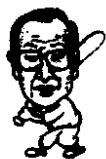
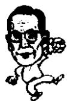

<!--
Stage 4A non-destructive cleaned source. Text comes from full-book MinerU Markdown.
JSON supplies page/block/layout evidence; DOCX supplies images only.
No translation, prose rewriting, OCR correction, factual correction, or unattended footnote recovery.
-->

<!-- FB-P178 | input-pdf-page=178 | printed-page=Unknown -->

<!-- FB-H-CH19 | source-page=FB-P178 -->
# 19 对属下的爱与培养

<!-- FB-I040 | source-page=FB-P178 | json-block=1 | bbox=169:330:207:387 -->

<!-- CH19-P001 -->
优秀的企业家都是卓越的人才管理者。因为企业是由人组成的，人创办企业，

<!-- FB-I041 | source-page=FB-P178 | json-block=3 | bbox=408:327:448:388 -->

<!-- CH19-P002 -->
企业由人来实现，人和企业相辅相成。所以要想发展企业，就必须要有优秀的人才。而发掘培养优秀的人才就是企业家分内的事情。

<!-- CH19-P003 -->
优秀的企业家选拔人才是独具慧眼的，也就是说拥有发掘人才的能力。而且还懂得挖掘人的潜力、造就出色人才的方法。

<!-- FB-P179 | input-pdf-page=179 | printed-page=166 -->

<!-- CH19-P004 -->
优秀的企业家都是卓越的人才管理者。因为企业是由人组成的，人创办企业，企业由人来实现，人和企业相辅相成。所以要想发展企业，就必须要有优秀的人才。而发掘培养优秀的人才就是企业家分内的事情。

<!-- CH19-P005 -->
优秀的企业家选拔人才是独具慧眼的，也就是说拥有发掘人才的能力。而且还懂得挖掘人的潜力、造就出色人才的方法。

<!-- CH19-P006 -->
1989 年，郑周永访问苏联的时候，接到了首尔总部的紧急来电。

<!-- CH19-P007 -->
“会长，有一个不好的消息。”从首尔那边传来紧张不安的声音。

<!-- CH19-P008 -->
“不好的消息？”郑周永刹那间吃了一惊。

<!-- CH19-P009 -->
郑周永在苏联每天都做简单的笔记。晚上要做长距离的火车，虽然处于非常疲惫的状态，却无法好好入睡。并且非常思乡，甚至眼前总浮现首尔的家和苹果、梨等食物。就在这时接到了来自首尔的电话。

<!-- CH19-P010 -->
“KAL（大韩航空）的飞机在利比亚首都的黎波里机场坠毁了。”

<!-- CH19-P011 -->
“什么？你说什么？”郑周永的脸一下变白了。飞机失事会有很多死伤者。

<!-- CH19-P012 -->
“咱们公司的金润圭专务等八个人乘坐的就是这架飞机。现在死伤者的名单还没有出来。”

<!-- CH19-P013 -->
“什么？金润圭？”

<!-- CH19-P014 -->
郑周永在离开首尔之前接到现代建设专务金润圭的报告，说要前往会见利比亚电力部部长，商谈有关发电站工程贷款的事宜。放下电话，郑周永用手支住额头。

<!-- CH19-P015 -->
当时利比亚机场大雾弥漫。由于无法看清前方，飞机撞上了机场的建筑物，断为两截。可是后来又接到来自首尔总部的电话报告，事件一共有70余人死亡，30余人受伤，万幸的是金润圭还活着。

<!-- FB-P180 | input-pdf-page=180 | printed-page=167 -->

<!-- CH19-P016 -->
“立即把金润圭等现代所有受伤的职员接回首尔，到首尔中央医院接受治疗。”

<!-- CH19-P017 -->
郑周永深知此时的失事现场和附近的医院一定乱不堪言。估计连给病人输血用血液都不够，于是下达了这条指示。

<!-- CH19-P018 -->
在苏联抓紧完成日程安排后，他匆匆忙忙地提前回国。在金浦机场一下飞机，郑周永就直奔首尔中央医院。

<!-- CH19-P019 -->
“会长，您在苏联吃了不少苦吧？”郑周永一进病房的门，身着病号服在门前等候的金润圭向他施大礼。

<!-- CH19-P020 -->
“唉，你这是干什么？润圭，你毫发无损吗？”郑周永紧紧地握住了金润圭的手。

<!-- CH19-P021 -->
“一点事都没有，运气还不错。”金润圭简单向郑周永说了自己九死一生的经历。

<!-- CH19-P022 -->
飞机坠落的时候，他失去了一会儿知觉之后醒来。睁开眼睛之后发现自己一个人在橄榄树下。飞机的机体在远处冒着黑烟。令人无法置信的是：他居然还系着安全带坐在椅子上。当飞机折为两截的时候，他在椅子上被甩到了橄榄树下。身上居然一点损伤也没有。他之所以上了受伤者名单是因为还需要进一步进行仔细的检查。

<!-- CH19-P023 -->
“嗯，我以为你在出事的时候自己跳出来的呢。你的胆子一向不小啊。”郑周永笑着说。

<!-- CH19-P024 -->
“会长，发电站工程贷款的事情成功了。”

<!-- CH19-P025 -->
“哦？怎么回事？”

<!-- CH19-P026 -->
“身体一点事也没有，总在医院躺着让人都快发疯了。而且我还背负着见利比亚电力部部长的任务。但是医院规定患者不能外出。趁别人不注意，我换上了现代建设的工作服，跑去见利比亚的电力部部长。他见到我大吃一惊说。刚刚经历了飞机失事，身体还没有康复，您怎么到我这里来了？他让我躺在沙发上谈话。可能躺在沙发上谈成协议的除了我再没有别人了吧。”

<!-- CH19-P027 -->
“呵呵，干得好。你身体一点事都没有还在医院躺着干什

<!-- FB-P181 | input-pdf-page=181 | printed-page=168 -->

<!-- CH19-P028 -->
么？正好我明天要去日本，你跟我一起走。”

<!-- CH19-P029 -->
于是金润圭和郑周永一起去了日本。去日本完成工作之后，郑周永和金润圭一起去温泉休养，一起喝酒旅行。

<!-- CH19-P030 -->
在回韩国的飞机上郑周永说：“润圭啊，我当时一直担心你出事。现在可是放心了。通过这次的日本旅行，看来你一点问题都没有了。怎么可能从飞机上掉下来一点事儿都没有呢？几天前去医院看你的时候，看你一下子跳起来行礼，感觉是受到巨大的冲击后一时恢复的正常。比起在医院躺着，出来散散心对精神创伤的治疗作用更大，所以带你来了日本。”

<!-- CH19-P031 -->
郑周永一边说，一边放心地握住了金润圭的手。

<!-- CH19-P032 -->
李秉哲也曾经有过因为教导职员有方而感慨的经历。

<!-- CH19-P033 -->
4·19 军事政变之后，韩国进入第二共和国时期。政府决定清查 3·15 赔选和非法敛财人员。为此，三星也受到了调查。调查组对三星的课长、常务、专务等一一询问偷税漏税的问题。李秉哲也随后生平第一次经历了问讯调查。

<!-- CH19-P034 -->
“如果要在三星找出一个偷漏税的主犯，那个人是谁？”检察官问李秉哲。

<!-- CH19-P035 -->
“那是明摆着的事，我是三星的最高经营者，主犯当然是我了。”

<!-- CH19-P036 -->
检察官半晌无语。其他公司接受调查的时候，大部分都是互相推卸责任。公司干部和老板互相指责。三星并不是这个样子，完全没有想到李秉哲说自己是主犯。

<!-- CH19-P037 -->
“我在这一段时间已经调查了好几家公司，不推卸责任，全部承认自己是主谋的公司只有三星。您真是教导有方啊。”

<!-- CH19-P038 -->
听了检察官的话，李秉哲感到非常欣慰。他受到了鼓舞，对检察官说：“到底这种不偷漏税不行的形势是谁造成的呢？如果是那种通过不正当手法致富的企业，受到人民的谴责和制裁是理所当然的事情。可是我对天盟誓，我们并不是昧良心去偷漏税，因为知道那是违法的行为。但是，我认为作为企业家最大的职责是对企业负责，发展扩大再生产。要是一个企业家经营不善，使得自己的企业亏损倒闭，我看这对社会的危害绝不亚于偷税漏税。企业亏损的话会对以银行为首的方方面面造成损失，使得职员失业，这更是无法谅解的错误。那属于资源浪费，企业家的失职。”

<!-- FB-P182 | input-pdf-page=182 | printed-page=169 -->

<!-- CH19-P039 -->
接着他说出了几点非偷漏税不可的理由。从当时的税率来看，法人税是35%，企业所得税是15%，产品税方面，以化纤为例是30%，以外再加上营业税、附加税，等等，合在一起的话，把收入的全部都纳税还是不够。当时就是这样一种畸形的高纳税制度。听了李秉哲的话，检察官也一时无语。

<!-- CH19-P040 -->
郑周永是那种始终非常信任部下的人。而遵守人才至上主义的李秉哲对部下奖罚分明。

<!-- CH19-P041 -->
郑周永通过广泛的人际交流来学习管理的方法。“广泛的人际交流使我保持幽默，不被偏见蒙蔽，用热情去面对人生，增进和别人的共识，通过和别人的交流，人会变得从善如流。通过交流，我学到了很多东西，成为我企业经营的动力。企业是为人而办的团体。需要一颗不自私自利、明大理的心。需要一颗孜孜不倦，潜心向学的心。只有具备了这些，企业才能够有发展……”

<!-- CH19-P042 -->
郑周永通过广泛的交际磨练了看人的眼力，用人的能力。他常亲往建设现场向部下讲解。

<!-- CH19-P043 -->
他曾经对下属这样说过：“在建筑工地获得我的训练并学到东西的人，无论走到哪里做什么都能做好，这就是我的信条。”

<!-- CH19-P044 -->
另外他在管理方面还强调以下几点：“自己从上司那里获得了一些指示，或者是在开完会议之后，由于自己一个人不能单独完成任务，这个时候需要的是正确的传达和协作。由此可见，企业需要上下协调好才能够运转顺利。不能准确地传达上级的命令，那么这个企业就要患上动脉硬化了。”

<!-- CH19-P045 -->
郑周永还有与众不同的一点就是能够做到《论语》中说

<!-- FB-P183 | input-pdf-page=183 | printed-page=170 -->

<!-- CH19-P046 -->
的“不耻下问”。不在乎对方是否年纪比自己小，社会地位比自己低，都可以张口问自己不知道的东西。所以他一直强调，哪怕是上司，如果自己不清楚，不明白的时候一定要虚心向下属询问、学习。

<!-- CH19-P047 -->
郑周永的管理方法很朴素。而李秉哲的管理模式更具体系化。

<!-- CH19-P048 -->
“人才第一、以人为本是我长久以来在三星坚持的信条和理念。企业家培养人才要不遗余力。企业家对培养人才的渴望和热诚在职员心里生根、发芽，这样的企业才会有无限的发展空间。”

<!-- CH19-P049 -->
在李秉哲看来，不能培养出人才的企业家是失败的。他认为企业家一部分责任就是在于为企业、社会和国家培养优秀的人才。甚至说如果做不到这一点，就如同犯罪。此外，他认为，所谓的培养人才并不是简单地把一些优秀的人才聚集在一起，还要培养他们的向心力，作为企业家的领导能力和人格魅力。

<!-- CH19-P050 -->
“如果说国家的发展依靠卓越的政治家的话，企业的发展就要寄托在优秀的企业家身上。三星的发展完全在于聘用了很多优秀的人才。三星是韩国国内第一个采取公开招聘的私营企业，通过人事管理提高对社会的贡献。要是没有所有职员的团结奋斗和内心的使命感，企业的发展就无从谈起。”

<!-- CH19-P051 -->
李秉哲一直强调，培养人才才是百年大计。所以他认为必须为职员们提供最大限度的生活保障和福利。

<!-- CH19-P052 -->
东方有这样一句格言：十年树木，百年树人。这也说明了企业的成败在于人，优秀的人才决定了企业的前途。

<!-- CH19-P053 -->
所以员工一进入公司，为了他们能够长久工作，他给员工们提供了公平的提升机会和公正的报酬待遇。

<!-- CH19-P054 -->
另外，不管是社长还是普通的职员，如果具有领导才能的话，他会安排很多工作，以供他们充分发挥自己的能量。
