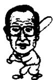
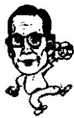

<!--
Stage 4A non-destructive cleaned source. Text comes from full-book MinerU Markdown.
JSON supplies page/block/layout evidence; DOCX supplies images only.
No translation, prose rewriting, OCR correction, factual correction, or unattended footnote recovery.
-->

<!-- FB-P204 | input-pdf-page=204 | printed-page=Unknown -->

<!-- FB-H-CH24 | source-page=FB-P204 -->
# 24 李秉哲和郑周永的节俭

<!-- FB-I050 | source-page=FB-P204 | json-block=1 | bbox=163:329:201:387 -->

<!-- CH24-P001 -->
郑周永前去和金正日国防委员长会面也只是戴一顶礼帽，穿着破旧的夹克和一

<!-- FB-I051 | source-page=FB-P204 | json-block=3 | bbox=402:328:441:390 -->

<!-- CH24-P002 -->
双穿了十几年的皮鞋突破了南北的坚壁。郑周永一辈子也没有听到过别人对他服饰的赞美，可是对于韩国人来说，他的形象比穿任何高档服装都更为高大，是一位宛如父亲、受人爱戴的企业家。

<!-- FB-P205 | input-pdf-page=205 | printed-page=192 -->

<!-- CH24-P003 -->
那些有钱的人都是经历过勤俭节约的。实际上李秉哲和传闻不同，也有他节俭的一面。

<!-- CH24-P004 -->
有一次在高尔夫球场上，李秉哲在前面一个人刚刚打过球的位置上捡起来一个球座。旁边的球童一看，那个球座的一边已经破损，十分破旧。李秉哲捡起来，把上面沾的泥土弹掉，擦干净之后很是珍惜地放到裤兜里面。脸上露出很是满意的表情。这一切都被旁边的球童看在眼里。李秉哲有些不好意思地一笑。“生活就得节约啊。”说完后向下一个位置走去。

<!-- CH24-P005 -->
一个新的球座不过一两千块钱，捡到那么旧的一个，脸上都显露出非常满意，并放在兜里。球童在旁边看着这些非常感动。

<!-- CH24-P006 -->
李秉哲在高尔夫球场向下一个点走的时候，球童在旁边拉着车，如果出现斜坡很难上去，他总是和球童一起拉车。这可以看得出李秉哲做人的品质。

<!-- CH24-P007 -->
郑周永在生活中也非常吝啬。

<!-- CH24-P008 -->
到了高尔夫球场，他掏出球座。球童在旁边一看，那是一个不知道使用了多长时间的极为破旧的球座。可是郑周永还是使用它击球，在回家的时候不忘拿走。

<!-- CH24-P009 -->
在郑周永去世的时候，他在清云洞的家向世人展示，房间中铺着的是白布。他经常向职员们说自己的家里从来就没有铺过豪华的地毯。在他去世后，人们看到他的家果然就像他说的一样。

<!-- CH24-P010 -->
房间里铺的不是地毯，而是一块白布，洗得非常干净，上面密密麻麻打着补丁。他房间里面的电视机也足以让人吃惊。不知道是什么时候出品的破旧金星电视。就是到了一般的工薪家庭也不会再有人看这样的电视。

<!-- CH24-P011 -->
在他的房间里还有一样引人注目的东西，就是一双穿了22年的皮鞋。一双实在穿得太久，表面全是坑的黑皮鞋。那就是大韩民国首富郑周永的生活。

<!-- FB-P206 | input-pdf-page=206 | printed-page=193 -->

<!-- CH24-P012 -->
人们如果听说了郑周永皮鞋的故事，就知道他在成为财阀之后的日子是何等节俭。

<!-- CH24-P013 -->
郑周永的脚很大，穿不了买来的鞋。必须要订做，所以他对于皮鞋非常爱惜，直到穿破为止。

<!-- CH24-P014 -->
有一天，韩国奥林匹克委员会的 K 顾问和郑周永一道参加一个国际会议，同坐一架飞机。很巧两个人座位相邻。

<!-- CH24-P015 -->
郑周永经常是睡眠不足，所以在坐车坐飞机的时候就会睡觉。那天也是一坐到座位上就开始熟睡。

<!-- CH24-P016 -->
K 顾问一眼看见了座位下郑周永脚上的皮鞋。“啊？怎么会这样？”

<!-- CH24-P017 -->
K 顾问惊讶地嘴都合不上了，擦擦眼睛再去看，郑周永皮鞋两侧大脚趾的位置上各有一个洞。不好直接问郑周永，但是凭他的判断，那双鞋最起码也穿了15年以上。

<!-- CH24-P018 -->
郑周永的一双鞋，都是要穿10年以上。

<!-- CH24-P019 -->
他的节俭在坐车上也可窥一斑。他不论什么时候都是喜欢乘坐现代生产的汽车。

<!-- CH24-P020 -->
有一次，S 医院的名誉院长 K 博士前往出版中心 19 层参加 M 博士的出书纪念会。纪念会结束后搭乘电梯的时候，郑周永一个人走上电梯。身为大集团的会长，身边一个随从都没有带。

<!-- CH24-P021 -->
到了一层大厅，K博士问郑周永：“您的车牌号是多少？我叫人开过来。”

<!-- CH24-P022 -->
K 博士当时叫自己的车，想顺便叫郑周永的车过来。可是郑周永坚决不用。“不必了，还是我自己来吧。”

<!-- CH24-P023 -->
大约过了七八分钟，K博士的车先来了。他考虑不能比郑会长先走，所以又等了一会儿。可是等了好久，郑周永的车还没有来。

<!-- CH24-P024 -->
“您的车牌号是？我再找人叫一次吧。”K博士又问。

<!-- CH24-P025 -->
“还是我自己来吧。”郑周永大步走向大厦警卫，请他用广播叫一遍自己的车。

<!-- CH24-P026 -->
又等了三四分钟，一辆车停到了大厅前，出人意料的是一

<!-- FB-P207 | input-pdf-page=207 | printed-page=194 -->

<!-- CH24-P027 -->
辆明星 $^{①}$ （Stellar），郑周永立刻坐上去。

<!-- CH24-P028 -->
就在那时，警卫跑过来，大喊：“喂，谁让你把车停到这儿了？”

<!-- CH24-P029 -->
警卫刚才没有看到郑周永上车，他怕其他会长们的外国车开过来，所以才对胆敢停在大厅前的这辆明星表示抗议。

<!-- CH24-P030 -->
意识到怎么回事的 K 博士跑过来对警卫喊道：“喂，你知道车里坐的是谁吗？这是现代集团的郑周永会长。看清楚了客人再说话，光看车大喊大叫怎么行？”

<!-- CH24-P031 -->
那时警卫才看到车里面坐的是郑周永，非常惶恐。

<!-- CH24-P032 -->
这虽然是一个生活的小片段，可是看得出郑周永乘坐自己现代集团生产的车，是用自己的脸作为宣传公司移动的广告牌。

<!-- CH24-P033 -->
有一次郑周永去滑稽演员李周一开的夜总会喝酒。他像别人一样点了最低消费（五瓶啤酒，一盘下酒菜），看了一会儿歌手的歌舞。之后他起身准备离去。还剩了两瓶啤酒没有喝。他到前台结账，说还剩下两瓶啤酒不应该计算进去。

<!-- CH24-P034 -->
可是夜总会说这是“最低消费”的标准，不管喝还是没有喝都是要付钱的。郑周永坚持没有喝就不付钱。虽然夜总会非常为难，但最终还是按照郑周永的意思没有把两瓶啤酒的价钱计算在内。

<!-- CH24-P035 -->
绝不浪费一分钱，这就是郑周永。由此可见郑周永的朴素与节俭。

<!-- CH24-P036 -->
第一毛纺龟尾工厂的李光夏（52岁）接受到了一道命令。命令来自李秉哲会长，要求开发研制出“世界上最好的衣料”。在那之前，第一毛纺经过30余年的发展历程，已经得到了韩国国内的广泛认可。李秉哲的目标投向了世界的最高水平。

<!-- CH24-P037 -->
李秉哲会长生前是韩国经济界人士当中最时髦的人，年轻的时候穿的就是最高级的英国产纯毛服装。他的衣着是非常讲究的。

<!-- FB-F046 | source-page=FB-P207 | marker=① | status=manual-review-required -->

<!-- FB-P208 | input-pdf-page=208 | printed-page=195 -->

<!-- CH24-P038 -->
第一毛纺把任务交给了李光夏，马上开始着手准备。李光夏自1968年进入公司，20年来始终从事羊毛鉴别选定工作，堪称这个领域的第一人。

<!-- CH24-P039 -->
为了生产出世界上最优质的衣料，他首先从选定羊毛开始。他首先把羊毛中质量最好的羊肩部的毛选取下来，之后开始用手一根根选其中质量最好的毛。选择的标准是在通常18.5微米的羊毛中，只选出最细的16.5微米的羊毛。李光夏从三吨的羊毛中最终选出了200磅。选取的时间花了10天。通过手指的感觉来选取好羊毛是一项艰难的工作。

<!-- CH24-P040 -->
他把这 200 磅毛纺成了线，那就是 100 纱支的衣料，所谓 100 纱支指的是一克羊毛可以拉到 100 米的长度。那是比幼小蜘蛛吐出的丝更细的线。

<!-- CH24-P041 -->
100 纱支线的开发在世界上是第三个国家，前面两个开发出来的是时装大国意大利和日本。这堪称是第一毛纺的壮举。

<!-- CH24-P042 -->
接下来，挑战的是 130 纱支。也就是研制 14.5 微米的世界最细的毛。130 纱支的衣料出来之后，受到了羊毛质地最好的澳大利亚的高度赞扬。

<!-- CH24-P043 -->
澳大利亚的羊毛市场在世界上是要求最苛刻的，羊毛的种类上就足足分了917种之多。同样粗细的羊毛都要分成七个等级，就是在那里，130纱支的衣料获得了认可。130纱支感觉轻柔、温暖、透气性强，堪称世界最高级的布料。秉承李秉哲的指示，李光夏开发出了世界上最高水平的130纱支。

<!-- CH24-P044 -->
1987 年，李秉哲不顾 77 岁的高龄，抱着把自己创建的公司都建成世界超一流公司的理念事必躬亲。

<!-- CH24-P045 -->
李秉哲平日里喜欢穿颜色漂亮的凯西米裤子的美洲式休闲装。色彩感非常卓越的李秉哲穿的是当时非常罕见的粉红色T恤衫，他的美感直接影响到了第一毛纺的技术开发。

<!-- FB-P209 | input-pdf-page=209 | printed-page=196 -->

<!-- CH24-P046 -->
而郑周永会长对于穿着毫不在意。这或许和他的经营的范围有关，造船和重工业，过分重视衣着会影响到工作。而且他为人简朴，对于衣着不想花太多心思。

<!-- CH24-P047 -->
一件夹克，他一穿就是十几年，就是衣襟坏了也无所谓。他惟一一件赶时髦的东西就是他的帽子。在他越过板门店访问朝鲜的时候，电视里面出现的总是他头戴礼帽的画面。只有礼帽，他拥有十几顶。手套和皮夹克他都是一直用到破，只有礼帽显得略微奢侈。

<!-- CH24-P048 -->
郑周永前去和金正日国防委员长会面也只是戴一顶礼帽，穿着破旧的夹克和一双穿了十几年的皮鞋突破了南北的坚壁。郑周永一辈子也没有听到过别人对他服饰的赞美，可是对于韩国人来说，他的形象比穿任何高档服装都更为高大，是一位宛如父亲、受人爱戴的企业家。
