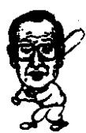

<!--
Stage 4A non-destructive cleaned source. Text comes from full-book MinerU Markdown.
JSON supplies page/block/layout evidence; DOCX supplies images only.
No translation, prose rewriting, OCR correction, factual correction, or unattended footnote recovery.
-->

<!-- FB-P210 | input-pdf-page=210 | printed-page=Unknown -->

<!-- FB-H-CH25 | source-page=FB-P210 -->
# 25 两位巨人的最后时日

<!-- FB-I052 | source-page=FB-P210 | json-block=1 | bbox=191:325:230:385 -->

<!-- CH25-P001 -->
来到世上非我所愿心中尚有无数企盼努力寻觅我之所无苦苦求索回首往事都如梦幻似水流年心中多憾时光飞逝无法回返劝君勿令年轮空转

<!-- FB-I053 | source-page=FB-P210 | json-block=3 | bbox=377:324:418:387 -->

<!-- FB-P211 | input-pdf-page=211 | printed-page=198 -->

<!-- CH25-P002 -->
从白天开始下着淅淅沥沥的细雨。李秉哲的健康状况很不好。他原本1.67米，体重57公斤，体型匀称。从年轻的时候开始身体就非常好。可是到了晚年他接受了一次胃癌手术，一次脑手术。这时他77岁。年纪已经很大了。

<!-- CH25-P003 -->
他的晚年是在梨泰院1洞135-26度过的，占地300余坪，里面有一座面积100多坪的传统韩式房屋，还有两座附属建筑。他的家是韩国正统的房屋“韩屋”。李秉哲酷爱“韩屋”，这是根据他的指示建成的。这座建筑物在李秉哲会长去世的三年前由三宇综合设计和三星建设担任设计施工完成的。

<!-- CH25-P004 -->
这座“韩屋”在李秉哲会长去世之后，李健熙会长取名为“承志园”。取意为秉承父亲的意志。李健熙会长现在最常读的书就是《湖岩经营哲学》。或许是由于这个原因，他对于父亲的理解是与众不同的。

<!-- CH25-P005 -->
比起三星总部28层的办公室，李健熙会长主要在承志园工作。接待客人和办公都在这里。

<!-- CH25-P006 -->
今年承志园进行了大规模的修缮工程，改建成了拥有最尖端科技的住宅。施工的标准是位于美国西雅图微软公司总裁比尔·盖茨的私人住宅。比尔·盖茨的住宅于2000年7月完工，历时七年，房屋里配置着最尖端的技术。拥有无人保安系统，声音识别装置，超高速的通信网络。并且客人只要身上带有记载着个人信息的别针，不管走到家里的哪一个地方都可以享受喜欢的音乐、香气和影像。空调也是由电脑控制，室内的温度自动调节，并配置无人保安系统。

<!-- CH25-P007 -->
这是未来家庭住宅的网络系统。只是承志园的外观依旧保持了“韩屋”的原汁原味，没有做任何改动。

<!-- CH25-P008 -->
在家庭网络系统尚未安装时，李秉哲在这里教授孙子们《论语》。他本人博览了从小说到史书的大量丛书，其中《论语》是让他感触最深的一部。他认为只有《论语》的内容包涵了人需要具有的所有美德。《论语》的内容包括了有助于每个人人格的形成、修养的提高、人际关系的维护的内容，乃至全部的伦理道德和规范。他一边从事经营，一边随时思考《论语》的精神，并且付诸实践。他出身于大儒之家，《论语》是他从小学习并身体力行的真理。

<!-- FB-P212 | input-pdf-page=212 | printed-page=199 -->

<!-- CH25-P009 -->
李秉哲头脑中，认为如果想要成为企业家，首先要态度端正，品行端正。这也是李秉哲亲自教授孙子们《论语》的原因。

<!-- CH25-P010 -->
除了和孙子们共处以外，他一有空余时间就前往高尔夫球场。可是在他去世之前，体力已经衰弱得无法打心爱的高尔夫球了。尽管如此，他还是去高尔夫球场。虽然不能打，可是他喜欢一边喝茶，一边欣赏自己亲手设计制造的安阳高尔夫球场的气氛。

<!-- CH25-P011 -->
李秉哲对安阳高尔夫球场情有独钟。因为那里是李秉哲倾注心血创造出的作品之一。那里的草坪中芝也是他亲自开发研制出的。最开始种的是金莎，可是经过仔细的观察发现，金莎的生长状况并不好，难捱严冬和雨季。他又进口了美国和日本的草坪，到了后来，干脆要求实验室直接培植出适应韩国气候和土壤条件的草坪。那就是中芝。就连安阳高尔夫球场的树都是他亲手一棵一棵挑选的。最开始种的是生长速度快的松柏，可是发现和高尔夫球场的布局气氛不相符。结果把500多棵树全部挖走，从全国各地精选外观好看的树移植到安阳高尔夫球场。为了让这些树成长，找来了腌制泡菜剩下的白菜叶作肥料。高尔夫球场里的花开始种植的是“百日红”，因为长势不好，后来全部换成了水仙花。每一草每一木每一花都是李秉哲的心血。李秉哲就像对待自己的事业一样用心设计。他这样做，是出于他作为大财阀会长的个人爱好吗？并非如此。这是因为他无论做什么事情都要做到最好、质量第一的信念。

<!-- CH25-P012 -->
安阳高尔夫球场留下了李秉哲很多美好的回忆。他人生中的最后一个秋天，球场金黄色的草坪迎风荡漾。满眼秋色。看到草坪尽是黄色，李秉哲非常伤感。他的大女儿仁熙在一旁守护他，看到父亲如此感到非常心疼。她吩咐职员把黄色的草坪

<!-- FB-P213 | input-pdf-page=213 | printed-page=200 -->

<!-- CH25-P013 -->
全部用颜料染成绿色。就像美国作家欧·亨利短篇小说《最后一片树叶》中的情节一样，想给予父亲希望。

<!-- CH25-P014 -->
李秉哲最后一次到安阳高尔夫球场是他去世前的20天。他在那天下午4点半左右抵达球场。由于时近初冬，暮色已经降临。那天，李秉哲很想打高尔夫球。旁边的人匆忙为其准备好了器具，他去第一号球台。当时他已经几乎攥不住球杆了。第一击抡空了。他从来是一握球杆便无需摆姿势直接击球的高手，可是那天不是那样。高尔夫球水平虽然高，但是他的体力已经完全跟不上了。第二击。球只前行了10米便停了下来。他平日击球距离通常都是230码左右，此时已经判若两人。他让站在旁边的高尔夫球选手起打。那位也打了一杆，两个人一起走向下一个球洞。从这一杆开始，两个人开始正式进入比赛。暮色更浓，都已经无法看清球了。可是李秉哲还是坚持继续。他们走向三号球洞，一直打到了3杆洞的第四个球洞。这对于一位77岁的老人来说是超负荷的。可是李秉哲仍然兴致很高，一直打到了8号球洞。天色已经完全黑了下来，得开着灯才能继续比赛。看不见球的时候，高尔夫球场里的四辆球车、三辆摩托车以及李秉哲乘坐的汽车就紧紧跟随，打开前车灯照亮。开着车灯到了第八号和第九号球洞。李秉哲终究还是留下了遗憾。因为他的体力再也无法支持了。他坐着球场会馆前面的球车绕了三圈。心中感慨万千。

<!-- CH25-P015 -->
从父亲那里获得了300担的遗产，他从经营粮食加工厂开始的企业人生非常坎坷。生产星标面条时，和家人一起睡在窄小房子里；6·25战争爆发时，生活在敌人的统治下；逃难时在釜山创办了“第一制糖”。5·16军事政变后被视为非法敛财者，宣布把自己的全部财产上交国家；之后品尝了把自己辛苦缔造的“韩国”肥料交与国家的苦楚。他在韩国的创业实属千辛万苦。

<!-- CH25-P016 -->
1980 年春天，全斗焕新军部把他的 TBC 东洋电视台充公。走过了无数沟沟坎坎，生生不息奋斗了整整 50 年。可是他在苦难中建立了数十家企业。估计当时那些想法如同走马灯一样掠过他的头脑。遗憾的高尔夫球结束了，之后李秉哲再也没有到过高尔夫球场。

<!-- FB-P214 | input-pdf-page=214 | printed-page=201 -->

<!-- CH25-P017 -->
离开安阳高尔夫球场20天后，1987年11月19日，李秉哲走完了77年的人生道路。他经营企业长达50年。由他直接建立或收购的企业有“第一制糖”（1953年），“第一毛纺”（1954年），“东洋生命①”（1957年），“安国火灾海上保险”（1958年），新世界百货商场（1962年），三星文化财团（1965年），“全州造纸”（1965年），“中央开发”（1966年），韩国综合医院（1966年），中央日报·东洋电视台（1966年），三星电子（1969年），三星SDI（1970年），“第一合成纤维”（1972年），三星电器（1973年），三星Corning（1973年），新罗饭店（1973年），三星石油化学（1974年），三星重工业（1974年），龙仁自然农园（1975年），韩国工业（1978年），三星半导体通信（1980年）等37家。

<!-- CH25-P018 -->
这位20世纪的经营巨人、世纪巨人离开了人世。他从300担起家。经过50年奋斗留下的遗产，已由他的三儿子李健熙发展成为拥有166家下属公司、103兆9918亿元销售额的世界级集团。

<!-- CH25-P019 -->
无论是李秉哲的人生，还是他的事业都是非常成功的。可即便如此，他也有心事未了。一共有三件事情。调料业中“味风”始终没能打赢“味元”；子女问题；高尔夫。

<!-- CH25-P020 -->
李秉哲的生前，一直以“第一制糖”生产的“味风”未能击败大象集团的“味元”为憾。他曾经无数次鼓励“第一制糖”的职工们齐心协力打败“味元”。可是“味风”没有赶超过“味元”一次。

<!-- CH25-P021 -->
“味元”是日本代表性的调料味精，是直接把日语“味的元”转到韩国语中来使用的。当时没有调料这个概念，使用“味元”这个用语表示调料。从用语上就占据了优势。先入为主，消费者的意识中深深印刻上了不是调料的味元。

<!-- FB-F047 | source-page=FB-P214 | marker=① | status=manual-review-required -->

<!-- FB-P215 | input-pdf-page=215 | printed-page=202 -->

<!-- CH25-P022 -->
当时以李秉哲为首的三星上层们得出的结论是：需要时间的推移才能够打败味元。也就是说，打败“味元”不是当代能够实现的。“味风”想要打赢“味元”，需要现在上小学的孩子们长大之后方有可能。

<!-- CH25-P023 -->
可是那以后的竞争转变成了“口味的战争”，情况虽然有所变化，但是终究没有在李秉哲生前实现他的目标。

<!-- CH25-P024 -->
可是胜利却在另外一个方面实现了。李秉哲的孙子，也就是李健熙的长子李载勇和老对手“味元集团”（现大象集团）创始人的长女结婚。也不知道李秉哲得知和自己一生的对手结成亲家，在地下会有何反应。

<!-- CH25-P025 -->
对于子女问题，不仅仅李秉哲，郑周永也同样头疼。李秉哲共有三个儿子：长子李孟熙，次子李昌熙，三子李健熙。他最终把三星传给了李健熙。当然这个过程是非常复杂的。

<!-- CH25-P026 -->
李秉哲在他的自传《湖岩自传》里面提到他对于后继者问题考虑了很久。《湖岩自传》是在他去世两年前出版发行的。

<!-- CH25-P027 -->
也就是说把三星传给谁，在他去世之前已经做出了决定。

<!-- CH25-P028 -->
他对自己的三个儿子都有过一番评价：“曾经试着把集团的一部分经营权交给长子孟熙，但是时间尚不到六个月，企业经营陷入一片混乱。他自己引咎辞职。”表示了不会把三星传给长子。

<!-- CH25-P029 -->
在这个问题上，李秉哲的长子李孟熙提到：不仅仅是六个月的经营，还有过七年参与经营的经历。由于自己的求功心切导致了人心不齐。三星的职工多达数十万人，非常重视人心。不仅仅是三星，所有的大集团均是如此。李孟熙后来继承了“第一制糖”集团。

<!-- CH25-P030 -->
“次子昌熙不希望管理人数众多、结构复杂的大企业，更

<!-- FB-P216 | input-pdf-page=216 | printed-page=203 -->

<!-- CH25-P031 -->
希望经营规模适中的公司，我决定尊重他本人的选择。”

<!-- CH25-P032 -->
李秉哲的二儿子李昌熙也不是三星的继承人。他后来单独成立了世韩（Saehan）集团。最终三星的继承权落在了李秉哲的三儿子李健熙身上。

<!-- CH25-P033 -->
“（健熙）本人的兴趣和志向在于企业经营，并且能够积极地参与，努力地学习……希望把三星交给他成为集团发展的一个契机，而且我认为把三星交给健熙是一个正确的决定。”最终，三星在李秉哲去世后传给了李健熙。李健熙接过三星后，更大地发展了三星。

<!-- CH25-P034 -->
李秉哲最后一件不顺心的事情是高尔夫。李秉哲一般打球在82~84杆，曾有过三次“一杆入洞”的记录，水平已经非常高。可是并不是每一次都能如此。有时候会打出100杆以上。他和好友之外的人创立了一个叫“水曜会”的高尔夫球组织，主要是商界人士一起打球增进感情的一个聚会。

<!-- CH25-P035 -->
下 1000 元注，边打球边讨论经济话题。由于大家都非常有教养，李秉哲一般都能打出自己的水平，取得好成绩。可是如果和不讲高尔夫礼节的人打球就截然不同了。其中的代表人物是中央信息部长金炯旭和警卫室长朴种圭。朴种圭非常缺乏高尔夫球的应有礼节，而金炯旭则近似一个无赖，他也是一个高尔夫狂。他每天凌晨 5 点钟到高尔夫球场，打完球后 7 点到办公室工作。

<!-- CH25-P036 -->
金炯旭擅长的是侵吞别人的钱。下注打球，如果输了的话，他就让属下打电话说上司找他，把下注的钱拿回去。如果他赢的了话，他第二天就会派人到对方的办公室厚颜无耻地收钱。李秉哲和这些人打球很难打好，因为他非常厌恶这些人品低下的人。这是他的三件心事。

<!-- CH25-P037 -->
郑周永比李秉哲多活了14年。从李秉哲去世的1987年到2001年的14年间，郑周永做了相当多的事情。

<!-- CH25-P038 -->
首先不能不说的是李秉哲去世前三年的瑞山大堤工程。

<!-- FB-P217 | input-pdf-page=217 | printed-page=204 -->

<!-- CH25-P039 -->
1984年2月的一天，郑周永在瑞山A地区的大堤工程现场，全长6400米大堤中270米的一段。郑周永在远远眺望着那里。即使那样远望，水流湍急，让人有种被卷入其中的感觉。就连汽车大小的石墩投下去都毫无痕迹地被卷走。工地上15吨、30吨的卡车满载着沙石钢筋构筑的石墩往下投，可是转眼间就被水流冲走。大堤应该在这里合龙，可是面对着湍急的水流束手无策。

<!-- CH25-P040 -->
郑周永往往在山穷水尽的时候找到出路。他苦思冥想，想出来一个办法。他想起了当时正停泊在蔚山的沃特威尔号船，于是花30亿元从挪威买来这艘准备用于回收废铁的。

<!-- CH25-P041 -->
沃特威尔号长为 322 米，比当时需要合龙的区间长出 50 米，它的重量为 23 万吨，绝不会像一般石墩那样轻易被水流冲走。

<!-- CH25-P042 -->
郑周永马上吩咐把沃特威尔号拖到瑞山。2月25日，沃特威尔号沉在大堤270米的那段区间。同预想的一样，水流未能冲走这个庞然大物，成功了！

<!-- CH25-P043 -->
使用23万吨的废旧轮船，发明了“油轮合龙法”完成了瑞山大堤工程，获得了韩国国内，乃至世界的瞩目。因为这是绝无仅有的特殊施工方法。这样一来节省了230亿元的工程费用，并且大大缩短了工期。不仅如此。得益于大堤建成，韩国的版图得以改变，新增了3300万坪的农田，面积比韩国最大的金堤平原还要大，是汝矣岛面积的33倍。

<!-- CH25-P044 -->
经过最早的制盐工业，1987年开始经营实验性农田。农场里面的牧场（55万坪）养殖了2000余头牛。这里生产的大米足够蔚山市的50万人吃上整整一年。

<!-- CH25-P045 -->
1990 年郑周永同苏联的戈尔巴乔夫总统会晤。在他第一次访苏的时候就提出了开发西伯利亚的构想。郑周永结束访问回国一个月左右，卢泰愚总统访问苏联，两国建交，实现了邦交正常化。

<!-- FB-P218 | input-pdf-page=218 | printed-page=205 -->

<!-- CH25-P046 -->
随着两国外交正常化，郑周永担任了韩苏经纪人协会会长一职，积极开展开发远东西伯利亚地区的天然气油田。

<!-- CH25-P047 -->
从那个时候开始，郑周永就非常关注朝鲜问题。1998年6月16日，郑周永送500头牛跨过板门店访问朝鲜，引起了世界的瞩目。在他作为民间企业家最早访问朝鲜9年之后，又一次带500头牛抵达朝鲜。这是历史上第一次有人跨越已封闭半个世纪之久的板门店大门。目睹他的这一壮举，法国的文化评论家称之为“世界的艺术盛典”。由于他的访问，打破了南北关系的坚冰，呈现出和平的氛围。

<!-- CH25-P048 -->
1998 年 10 月，他作为民间企业家访问朝鲜，同朝鲜最高领导人金正日会晤，当时他提出了金刚山观光计划。对赶牛访朝深感惊讶的人们对于他这个构想更是拍案称绝。

<!-- CH25-P049 -->
之后，郑周永为了南北双方新的发展，多次访问朝鲜。他构想的下一个项目是修建贯穿南北的铁路和横穿西伯利亚的铁路相连。

<!-- CH25-P050 -->
他希望能够奋斗到 120 岁。“我会干到 120 岁。”郑周永会长在去世前两年，接受德国《明镜》时事周刊采访时说了这样一句话。

<!-- CH25-P051 -->
听他所言，可以看出他坚信医生“人可以活到120岁”的话。他之后又说：“我觉得我现在还很年轻，没有到退休的时候。”当时他已经84岁了，可是仍然对工作抱有非常高的热情。

<!-- CH25-P052 -->
记者问他，在剩下的40年里准备做哪些工作。他回答得非常具体：准备打入朝鲜和第三国的建筑市场，轮船分割市场，汽车用音像生产市场，通信领域，西海岸工业园区，等等。

<!-- CH25-P053 -->
最后他提到：将会为统一大业贡献自己的全部力量，待到南北统一之后，他会回到北面的故乡生活。

<!-- CH25-P054 -->
接受《明镜》采访一年多之后，曾说要活到120岁的郑周永健康状况突然恶化。

<!-- FB-P219 | input-pdf-page=219 | printed-page=206 -->

<!-- CH25-P055 -->
2000 年 6 月他访问朝鲜的时候，曾经和金正日国防委员长会谈并畅饮马格利①，长达 4 个半小时。之后，他精神状况急剧下降。对于一位八旬老人，4 个半小时的饮酒实属过度。之后郑周永经常感到疲劳，多次住院。即便如此，在他去世之前两个月，他还去百货商场买面包，和现代百货商场社长李炳规共进河豚午餐。

<!-- CH25-P056 -->
2001 年 3 月初，雪花纷飞。郑周永在清云洞的家中，由于胃痉挛在床上躺了一会儿后，到了院子里还和当时已 73 岁的管家说：“你年纪还小，怎么头发都白了？”

<!-- CH25-P057 -->
“下雪整个世界都变白了，我也不能幸免啊。”管家回答说。郑周永哈哈大笑。

<!-- CH25-P058 -->
几天之后，郑周永的健康急剧恶化。2001年3月22日，郑周永在峨山中央医院走完87年的人生。

<!-- CH25-P059 -->
郑周永会长刚刚去世，他的家人就急忙派人前往三星集团。为了向三星取经，如何办理郑周永会长的葬礼。因为三星曾经于1987年操办过李秉哲会长的葬礼，又于2000年操办过李秉哲会长夫人朴杜乙女士的葬礼，有过两次大型丧礼的经验。虽然两个集团在平日存在竞争关系，可是在办理丧事时却是显露出彼此扶持的美德。现代集团根据三星集团的建议操办郑周永会长的丧礼。

<!-- CH25-P060 -->
在清云洞家中搭建的灵堂，以全斗焕、卢泰愚、金泳三等前总统为首的执政党，在野党代表前来吊唁，朝鲜的金正日国防委员长也派人来献花圈。商界人士中，三星的李健熙会长、LG名誉会长具滋暻和韩进集团名誉会长赵重勋等前来吊唁。

<!-- CH25-P061 -->
灵堂中，郑周永会长的儿子郑梦九、郑梦宪和郑梦准以及数十年来陪他风风雨雨的属下们站立两旁。有前现代建设社长李明博、前现代石油化学会长李铉泰、前现代综合商社会长李春林、前现代产业开发社长沈铉荣、仁川制铁会长朴世勇、前现代建设社长李来炘、现代建设社长金润圭等。他们同郑周永风雨同舟几十年，此时心中的悲痛绝不亚于郑周永的子女。他们的头脑中如同播放电影一样，闪过追随郑周永几十年度过的无数艰难险阻。

<!-- FB-F048 | source-page=FB-P219 | marker=① | status=manual-review-required -->

<!-- FB-P220 | input-pdf-page=220 | printed-page=207 -->

<!-- CH25-P062 -->
李明博头脑中会浮现在那拉提瓦高速公路工程的一幕幕，朴世勇会浮现出为准备朱拜勒港工程竞标材料一个星期连澡都不能洗的艰难历程。金润圭会想起来郑周永前来探望他，“你毫发无损嘛？跟我一起出差去吧。”

<!-- CH25-P063 -->
通过电视看到灵堂的韩国国民们也都悲痛异常，郑周永一直给予4000万的韩国国民勇气和信念，这位巨人的去世令韩国人心痛。

<!-- CH25-P064 -->
那些为国家的美元收入，曾经在炮火纷飞的越战战场，曾经冒零上60度的高温在沙漠地带施工的一代人已经完成了自己的使命，也会在心中祝福郑周永一路走好。似乎为了证明这一切，前来吊唁的人超过2.3万人，花圈排列长达350米。完全是一次国葬。郑周永，他的现代集团共有83家企业，曾经创造1000亿美元（130兆韩元）的出口额，完全可以与美国的通用电气（1100亿美元）、丰田（1150亿美元）等世界大企业并肩。

<!-- CH25-P065 -->
可是郑周永在生活中完全是一个平凡的人。他清云洞家中用过的生活用品远远不如一般人的水平。瘪旧的皮鞋，出了破洞的布钱包，代替地毯的白布，破旧的金星电视机。站在韩国建设最前沿的第一人，郑周永从来不爱惜自己的身体。

<!-- CH25-P066 -->
韩国土地上成长的世界经济巨人，在去世的时候和普通人没有任何区别。

<!-- CH25-P067 -->
来到世上非我所愿

<!-- CH25-P068 -->
心中尚有无数企盼

<!-- CH25-P069 -->
努力寻觅我之所无

<!-- FB-P221 | input-pdf-page=221 | printed-page=208 -->

<!-- CH25-P070 -->
苦苦求索
回首往事都如梦幻
似水流年心中多憾
时光飞逝无法回返
劝君勿令年轮空转

<!-- CH25-P071 -->
这是他最喜欢唱的一首名为《普通人生》的大众歌谣。如同歌词中写的一样，他一生怀着自己的梦想不断拼搏追逐。

<!-- CH25-P072 -->
他亲手缔造了现代建设（1950年）、现代汽车（1967年）、现代水泥（1969年）、现代重工业（1973年）、现代尾浦造船（1975年）、现代电子（1985年）等80余家企业，并担任首尔奥运会申请委员会委员长、全国经济人联合会会长（五连任）、大韩体育会长、韩苏经济协会会长等职务，夜以继日地辛勤工作。

<!-- CH25-P073 -->
他堪称一位勤劳的韩国人。凌晨3点就起床，查看从国外发来的传真一直到5点，之后接电话，会见客人，阅读报纸。7点30分前往公司开始一天的工作。

<!-- CH25-P074 -->
他在乘车的路上，喜欢演唱《日出》、《晨露》、《真是的》、《爱慕》、《邂逅》等大众歌谣。

<!-- CH25-P075 -->
他性如烈火。早上五六点钟进入施工现场，得完完全全确认工程进展顺利后才肯罢休。由于他的性格急躁，他的八个子女当中没有一个没挨过他打的。

<!-- CH25-P076 -->
尽管只是小学毕业，他的英语和日语却能达到交流的程度。即使在他最忙的时候也要带着单词本背诵英语单词。

<!-- CH25-P077 -->
他想在 120 岁时去瑞山劳作。

<!-- CH25-P078 -->
他是韩国20世纪的伟人。
