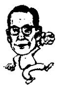

<!--
Stage 4A non-destructive cleaned source. Text comes from full-book MinerU Markdown.
JSON supplies page/block/layout evidence; DOCX supplies images only.
No translation, prose rewriting, OCR correction, factual correction, or unattended footnote recovery.
-->

<!-- FB-P222 | input-pdf-page=222 | printed-page=Unknown -->

<!-- FB-H-CH26 | source-page=FB-P222 -->
# 26 王子之乱和接班人们

<!-- FB-I054 | source-page=FB-P222 | json-block=1 | bbox=174:318:213:377 -->

<!-- CH26-P001 -->
想法成为行动，行动发展成为习惯，习惯发展成为品性。品性将决定一个人的。

<!-- FB-I055 | source-page=FB-P222 | json-block=3 | bbox=413:319:456:381 -->

<!-- CH26-P002 -->
——郑周永

<!-- FB-P223 | input-pdf-page=223 | printed-page=210 -->

<!-- CH26-P003 -->
郑周永生前是一位事业有成的企业家。身为一个毫无立锥之地的贫农家庭的儿子，却一直做到拥有超过83家企业，销售额超过130兆韩元记录的企业家，不能不说是一个大成功。但是，和李秉哲一样，他也没能很圆满地解决子女问题。

<!-- CH26-P004 -->
曾任仁川制铁集团社长的长子郑梦弼死于交通事故。然后，随着郑周永健康状况的恶化，次子郑梦九会长和五子郑梦宪会长为了集团的继承权展开了激烈的斗争。

<!-- CH26-P005 -->
在这个过程当中，实质上一直经营着现代汽车的郑周永的弟弟郑仁永及其长子郑梦奎有意在管理权上松手。与此同时，计划将现代分离成为几个集团：包括起亚汽车在内的现代汽车集团交给郑梦九会长；以现代电子为首的现代建设、现代综合商社、现代证券等交给郑梦宪会长；而现代重工业等三个公司则托付给郑梦准顾问。

<!-- CH26-P006 -->
此时，郑周永会长在内心也进行了一场激烈的斗争。有一段时间，因为现代的投资信贷出现资金不足的问题，使得母公司现代建设的流动性问题凸显出来，集团整体陷入危机。郑周永会长打出了父子三人（梦九、梦准）同时从公司一线退下来的牌。但最终，现代还是以梦九、梦宪、梦准兄弟三人为中心将集团分离开来。

<!-- CH26-P007 -->
身为代长子的郑梦九领导的现代汽车集团除了现代汽车、起亚汽车、现代摩比斯（Hyundai Mobis）三大支柱企业以外，还拥有仁川制铁、现代海斯高（Hyundai Hysco）、三美特殊钢铁、现代金融（Hyundai Capital）、现代宇宙航空等11个公司，在韩国经济界排名第五。郑梦宪旗下的现代电子（现代Hynix）、现代证券等大大小小23个公司，在金融监督院2000年度发布的经营业绩榜上以61兆8974亿韩元的销售额排在全国第二位。

<!-- CH26-P008 -->
郑梦准领导的现代重工业集团去年也达到了6兆6000亿韩元的销售额，其中纯利润超过151亿韩元。

<!-- CH26-P009 -->
除此以外，郑周永的六子郑梦允担任现代信贷金融公司的

<!-- FB-P224 | input-pdf-page=224 | printed-page=211 -->

<!-- CH26-P010 -->
会长，其弟郑梦一则担任该公司的社长。

<!-- CH26-P011 -->
三星公司在 1987 年李秉哲会长故去之后，长子李孟熙将最大的财团独立、次子李昌熙创建世韩机电公司、女儿李仁熙创办韩索（Hansol）集团，现代也经历了同样的过程。

<!-- CH26-P012 -->
但是在 2000 年度金融监督院发布的财务年表上，李健熙会长的三星公司仍然高居第一位。由此可见，李健熙会长的经营能力是相当优秀的。

<!-- CH26-P013 -->
现在，现代的郑周永会长去世还不过短短几个月的时间，随着时间的流逝，现代集团的真实面目将逐渐浮出水面。

<!-- CH26-P014 -->
虽然从表面上来看，五子郑梦宪会长是现代的正统接班人，但实际上现代的母企业——现代建设已经不由郑梦宪会长掌控，而且现代 Hynix 也面临着相当大的困境，最终将何去何从，这也是世人瞩目的焦点。

<!-- CH26-P015 -->
与此相反，郑梦九会长领导的现代汽车集团现在还算比较稳定。

<!-- CH26-P016 -->
李健熙会长 1987 年末从父亲手中接过三星的经营权，算起来已经有 14 个年头了。三星经营方式的改变，可以说是从 1993 年的法兰克福宣言开始的。所谓的新经营便是李健熙会长的杰作。他使用了“除了老婆和孩子，一切都要变”这样标新立异的话语率先喊出了事态的严重。

<!-- CH26-P017 -->
由于三星现状以及世纪末变化所带来的危机感，常使我有后脊发凉的感觉……再这样下去的话三星将不只是丢掉一两个公司，而是可能面临破产危险。在这样的心情下，尤其是1992年的夏天到冬天这段时间，我的体重骤降了十多公斤。这就是李健熙会长当时发表“新经营”宣言时的心情。

<!-- CH26-P018 -->
“从我开始变起”，这是1993年三星在危机重重中宣布实行“新经营”的真实写照。这次改变的结果是：三星让人们看到了一个崭新的面貌。

<!-- CH26-P019 -->
经过三次的调整，三星完成了对旗下所属的小公司进行整

<!-- FB-P225 | input-pdf-page=225 | printed-page=212 -->

<!-- CH26-P020 -->
顿，实施早上班早下班的出勤制度（早七晚四），开设消费者文化院，改革人事、教育制度，建立社会服务团体，女职员制服自由化，支援中小企业，以及构筑海外合成生产基地（英国、墨西哥等）等的新举措。尤其是早上7点上班，下午4点下班的新出勤制度，给韩国企业文化吹来了一股清风，使得其他企业感到了全新的刺激。三星在和消费者之间出现矛盾时所采取的“站在消费者立场上”的态度，也得到了广大消费者的认可。现在的三星正在追求“质量经营”。

<!-- CH26-P021 -->
李秉哲在 1995 年 2 月的洛杉矶战略会议上宣布：自己将“只负责半导体、汽车以及社会服务等三个方面的工作，剩余部分将完全交由专业人士负责。”此后，三星的各种文件里再也没有了会长裁决这一栏。

<!-- CH26-P022 -->
虽然是李健熙会长领导着年销售额高达103兆韩元的三星集团，但是实际上他并没有做出过多少裁决。各公司的经营策略都由该公司的社长自行定夺。这便是使三星成功运转的经营哲学。但是，绝不能凭此就说李健熙会长只是在混日子而已。半导体投资等肩负着集团兴亡的重要决定当然还是由他来定夺的。

<!-- CH26-P023 -->
因为没有太多的具体事宜需要他来裁决，所以他并不经常去三星总公司第二十八层的办公室。而主要是在个人办公室“承志园”办公。

<!-- CH26-P024 -->
李健熙会长感兴趣的领域很多。高尔夫、小轿车、录像、花卉、饮食、电影、电视剧、经济纪录片、珍岛狗和读书等等，都是他所关心的。正因为这样，他在每个经营领域都有一个私人秘书。

<!-- CH26-P025 -->
他先对必要的事项进行广泛的调查分析，再经过一定的思考和构想，最后会随时将旗下公司的会长社长们叫到自己位于梨泰院洞的个人办公地“承志园”来一起讨论。有时他们可能会讨论一个白天，有时甚至会一直讨论到天亮。一句话，这种会谈是随时都可能发生的。讨论的主题主要是21世纪企业的经营方向、大企业的作用、尖端技术动向等话题，但并不局限于此。除了这些，他还会谈一些更多样化的细节问题，由此可见，李健熙会长是非常缜密而且平易近人的。当然，讨论是在一个不用系领带的自由气氛中进行的，大家无所顾忌，畅所欲言。只是因为李健熙会长本人滴酒不沾，所以并不会预备酒席。

<!-- FB-P226 | input-pdf-page=226 | printed-page=213 -->

<!-- CH26-P026 -->
现在他所做的事情主要有以下三件：

<!-- CH26-P027 -->
一是生产出一流的产品；二通过一流的产品缔造超一流的三星企业；三是为在千变万化的时代里生存而进行战略研究。为了这个目标，他潜心钻研、全面思考。获得这些钻研和思考的参考资料的途径，有可能是看电影，有可能是看经济纪录片，有可能是读书。也有可能是拆汽车部件或者把珍岛狗登录上保护动物名单。还有可能是将有参考价值的影像资料拷贝发放给整个公司的员工。比如说如何养殖一条价值3000万韩元金鱼的录像带，或者关于一盆价值过亿的盆栽的DVD。他还曾将日本作家栗良平的童话《一碗面条》发放给全体社员。这可不仅仅是业余兴趣，这是三星集团使职员们保持清醒的一种手段，也达到了给“生产出一流产品”的企业文化提供土壤的效果。

<!-- CH26-P028 -->
他一共观看收集了一万五千多盘录像带，有时候发给社长，有时候发到部长级别，有时候发到科长级别，甚至有时发放给职员。坚持这样做是为了给职员们打预防针，让他们保持警醒。

<!-- CH26-P029 -->
他还将高尔夫超越了个人爱好的范畴，纳入到自己的投资计划中去。日后成为世界顶尖女子高尔夫选手的朴世莉，便是由三星投资赞助的。她成名之后，三星的品牌用投资最少的钱，得到了最大的回报。

<!-- CH26-P030 -->
李健熙会长的爱好是骑马和打高尔夫。他几乎每周都会在安阳高尔夫球场一天骑三四个小时的马；大概两个月一次，他会登上草地球场打高尔夫，但是平常是在练习场里打球。

<!-- CH26-P031 -->
他所推崇的养生之道是从先父李秉哲会长那里传承下来的。虽然他不喝酒，但是每天要抽三到四包烟。

<!-- FB-P227 | input-pdf-page=227 | printed-page=Unknown -->

<!-- TODO(QA): no Markdown/JSON semantic payload; blank-page visual confirmation required. -->
